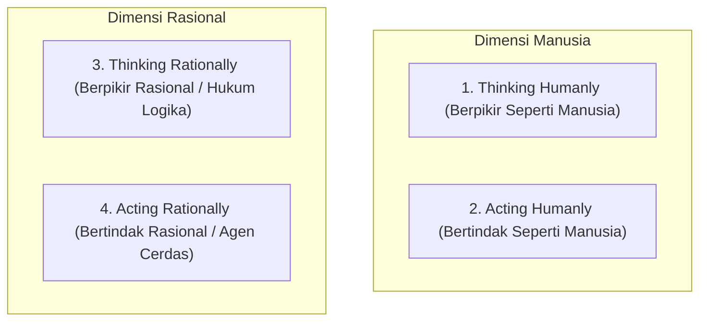
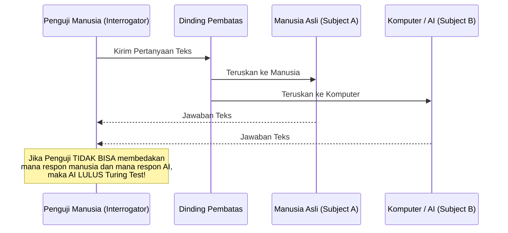

# 1. Konsep Dasar Kecerdasan Buatan (Artificial Intelligence)

Navigasi: [[Konsep_Kecerdasan_Buatan]] | Modul Berikutnya: [[02_Intelligent_Agent_dan_Problem_Solving]]

---

**Kecerdasan Buatan (Artificial Intelligence / AI)** adalah cabang ilmu komputer yang berfokus pada pembuatan sistem komputer yang mampu melakukan tugas-tugas yang membutuhkan kecerdasan manusia, seperti pemecahan masalah, persepsi visual, pengenalan suara, dan pengambilan keputusan.

---

## 1.1. Empat Sudut Pandang Definisi AI

Secara historis, definisi Kecerdasan Buatan dikelompokkan ke dalam 4 kuadran pendekatan:

| Pendekatan | Karakteristik Utama | Ujian / Standar Pengukuran |
| :--- | :--- | :--- |
| **Acting Humanly** | Komputer bertindak seperti manusia hingga tidak dapat dibedakan. | **Uji Turing (Turing Test)** ciptaan Alan Turing (1950). |
| **Thinking Humanly** | Memodelkan proses kerja otak dan kognitif manusia. | Ilmu Kognitif & Pemodelan Jaringan Saraf. |
| **Thinking Rationally**| Menggunakan kaidah hukum logika matematika (*Silogisme*). | Logika Proposisi & First-Order Logic (FOL). |
| **Acting Rationally** | Agen bertindak untuk mencapai hasil terbaik (*Rational Agent*). | **Agen Berbasis Tujuan & Utilitas (Standard Modern AI).** |

---

## 1.2. Uji Turing (Turing Test)

**Uji Turing** diajukan oleh Alan Turing pada tahun 1950 untuk menjawab pertanyaan *"Apakah mesin dapat berpikir?"*. 

---

Navigasi: [[Konsep_Kecerdasan_Buatan]] | Modul Berikutnya: [[02_Intelligent_Agent_dan_Problem_Solving]]
