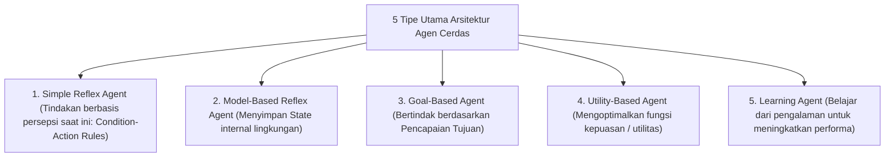

# 2. Intelligent Agent, Arsitektur Agen, dan Problem Solving

Navigasi: Modul Sebelumnya: [[01_Konsep_Kecerdasan_Buatan]] | [[Konsep_Kecerdasan_Buatan]] | Modul Berikutnya: [[03_Algoritma_Pencarian_Uninformed_Search]]

---

## 2.1. Konsep Dasar Agen dan Struktur PEAS

**Agen (Agent)** adalah segala sesuatu yang dapat mengamati lingkungannya melalui **Sensor** dan bertindak terhadap lingkungan tersebut melalui **Aktuator**.

```mermaid
flowchart LR
    Environment["Lingkungan (Environment)"] -->|Persepsi (Percepts)| Sensors["Sensor (Kamera, Sonar, Keyboard)"]
    Sensors --> AgentProgram["Program Agen (Arsitektur & Logika)"]
    AgentProgram --> Actuators["Aktuator (Roda, Layar, Tangan Robot)"]
    Actuators -->|Tindakan (Actions)| Environment
```

### 🛠️ Merancang Agen dengan Kerangka Kerja PEAS:
Sebelum membangun agen kecerdasan buatan, kita wajib mendefinisikan spesifikasi **PEAS**:

- **P (Performance Measure)**: Kriteria objektif pengukur keberhasilan kinerja agen.
- **E (Environment)**: Lingkungan fisik atau digital tempat agen beroperasi.
- **A (Actuators)**: Perangkat yang digunakan agen untuk melakukan tindakan.
- **S (Sensors)**: Perangkat pengumpul informasi data input dari lingkungan.

### 💡 Contoh Spesifikasi PEAS: Taksi Otonom (Autonomous Taxi)
- **Performance Measure**: Keselamatan penumpang, kecepatan sampai tujuan, kenyamanan, efisiensi bahan bakar, mematuhi hukum lalu lintas.
- **Environment**: Jalan raya, lampu lalu lintas, pejalan kaki, kondisi cuaca.
- **Actuators**: Setir kemudi, pedal gas, rem, klakson, sinyal sein.
- **Sensors**: Kamera, LiDAR, Radar, GPS, Odometer, Accelerometer.

---

## 2.2. Karakteristik Sifat Lingkungan Agen (Environment Properties)

1. **Fully Observable vs Partially Observable**: Apakah sensor agen dapat mengamati seluruh keadaan lingkungan secara penuh (misal: Catur) atau hanya sebagian saja (misal: Poker, Taksi Otonom)?
2. **Deterministic vs Stochastic**: Apakah keadaan lingkungan berikutnya ditentukan secara pasti oleh tindakan agen (Catur) atau mengandung ketidakpastian/acak (Kocok Dadu, Cuaca)?
3. **Episodic vs Sequential**: Apakah tindakan agen saat ini mempengaruhi keputusan di masa depan (Sequential) atau berdiri sendiri secara terpisah (Episodic)?
4. **Static vs Dynamic**: Apakah lingkungan dapat berubah saat agen sedang berpikir (Dynamic) atau tetap diam hingga agen bertindak (Static)?
5. **Discrete vs Continuous**: Apakah jumlah state dan tindakan terbatas jelas (Catur) atau tak terbatas kontinu (Kemudi Mobil)?
6. **Single Agent vs Multi-Agent**: Apakah agen beroperasi sendirian (Sudoku) atau berinteraksi dengan agen lain secara kompetitif/kooperatif (Catur, Sepakbola)?

---

## 2.3. Arsitektur dan Tipe Agen



---

## 2.4. Problem Solving Agent dan Ruang Keadaan (State Space)

**Problem-Solving Agent** adalah agen berbasis tujuan (*goal-based agent*) yang memutuskan apa yang harus dilakukan dengan mencari urutan tindakan yang mengarah ke status tujuan (*goal state*).

### 🧩 4 Komponen Formulasi Masalah (Problem Formulation):
1. **Initial State (Keadaan Awal)**: Status awal di mana agen memulai pencarian (misal: Berada di Kota Arad).
2. **Actions (Tindakan)**: Himpunan tindakan legal yang dapat dieksekusi dari status tertentu (misal: `GoTo(Zerind)`, `GoTo(Sibiu)`).
3. **Transition Model / Result(s, a)**: Fungsi yang mengembalikan status hasil setelah tindakan $a$ dieksekusi pada status $s$.
4. **Goal Test (Uji Tujuan)**: Fungsi yang menentukan apakah status saat ini merupakan status tujuan (misal: `IsState == Bucharest`).
5. **Path Cost (Biaya Jalur)**: Fungsi yang memberikan bobot biaya numerik untuk setiap jalur (misal: Jarak kilometer antar kota).

---

Navigasi: Modul Sebelumnya: [[01_Konsep_Kecerdasan_Buatan]] | [[Konsep_Kecerdasan_Buatan]] | Modul Berikutnya: [[03_Algoritma_Pencarian_Uninformed_Search]]
