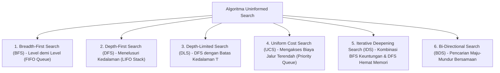

# 3. Algoritma Pencarian Uninformed Search (Searching Part-1)

Navigasi: Modul Sebelumnya: [[02_Intelligent_Agent_dan_Problem_Solving]] | [[Konsep_Kecerdasan_Buatan]] | Modul Berikutnya: [[04_Algoritma_Pencarian_Informed_Search_dan_Heuristic]]

---

**Uninformed Search (Blind Search / Pencarian Buta)** adalah kelompok algoritma pencarian yang tidak memiliki informasi tambahan mengenai jarak atau perkiraan estimasi ke status tujuan (*goal state*), selain informasi yang diberikan dalam formulasi masalah.

---

## 3.1. Enam Algoritma Uninformed Search Utama

---

## 3.2. Penjelasan Detail Setiap Algoritma

### 1. Breadth-First Search (BFS)
- **Mekanisme**: Membuka seluruh simpul (*node*) pada level kedalaman tertentu sebelum berpindah ke simpul pada level berikutnya menggunakan antrean **FIFO (Queue)**.
- **Keunggulan**: Dijamin menemukan solusi (*Complete*) dan memberikan solusi terpendek (*Optimal*) jika biaya tiap langkah sama.

### 2. Depth-First Search (DFS)
- **Mekanisme**: Menelusuri jalur cabang terdalam terlebih dahulu hingga mencapai simpul daun atau jalan buntu sebelum melakukan *backtracking* menggunakan tumpukan **LIFO (Stack)**.
- **Keunggulan**: **Sangat hemat memori** ($O(bm)$ dibanding BFS $O(b^d)$).

### 3. Depth-Limited Search (DLS)
- **Mekanisme**: Variasi DFS yang diberi pembatasan batas kedalaman maksimum $l$ (*depth limit*) untuk mencegah DFS terjebak dalam loop tak terbatas pada graph dengan kedalaman tak terhingga.

### 4. Uniform Cost Search (UCS)
- **Mekanisme**: Menjelajahi simpul berdasarkan biaya jalur terendah $g(n)$ dari *Initial State* menggunakan **Priority Queue**. UCS merupakan bentuk umum dari Algoritma Dijkstra dalam AI.

### 5. Iterative-Deepening Search (IDS)
- **Mekanisme**: Menjalankan DLS secara berulang-ulang dengan menaikkan batas kedalaman $l$ secara bertahap ($l = 0, 1, 2, 3, \dots$).
- **Keunggulan**: Menggabungkan kelebihan BFS (**Complete & Optimal**) dengan kelebihan DFS (**Hemat Memori**). Merupakan algoritma uninformed search yang paling direkomendasikan.

### 6. Bi-Directional Search (BDS)
- **Mekanisme**: Menjalankan dua pencarian secara bersamaan: satu maju dari *Initial State* dan satu mundur dari *Goal State*, hingga kedua pencarian bertemu di tengah.

---

## 3.3. Perbandingan Komprehensif Algoritma Uninformed Search

Definisi Notasi:
- $b$: Faktor cabang (*branching factor*).
- $d$: Kedalaman simpul tujuan dangkal (*depth of shallowest goal*).
- $m$: Kedalaman maksimum dari ruang keadaan (*maximum depth*).
- $l$: Batas kedalaman (*depth limit*).

| Algoritma | Completeness (Lengkap?) | Time Complexity (Waktu) | Space Complexity (Memori) | Optimality (Optimal?) |
| :--- | :---: | :---: | :---: | :---: |
| **BFS** | ✅ Ya (jika $b$ terbatas) | $O(b^d)$ | $O(b^d)$ (Sangat Boros) | ✅ Ya (jika step cost sama) |
| **DFS** | ❌ Tidak (bisa infinite loop) | $O(b^m)$ | $O(bm)$ (Sangat Hemat) | ❌ Tidak |
| **DLS** | ❌ Tidak (jika $l < d$) | $O(b^l)$ | $O(bl)$ | ❌ Tidak |
| **UCS** | ✅ Ya (jika cost $> 0$) | $O(b^{1 + \lfloor C^* / \epsilon \rfloor})$ | $O(b^{1 + \lfloor C^* / \epsilon \rfloor})$ | ✅ Ya (Berdasarkan Biaya $g(n)$) |
| **IDS** | ✅ Ya (jika $b$ terbatas) | $O(b^d)$ | $O(bd)$ (Hemat Memori) | ✅ Ya (jika step cost sama) |
| **BDS** | ✅ Ya (jika $b$ terbatas) | $O(b^{d/2})$ | $O(b^{d/2})$ | ✅ Ya (jika step cost sama) |

---

Navigasi: Modul Sebelumnya: [[02_Intelligent_Agent_dan_Problem_Solving]] | [[Konsep_Kecerdasan_Buatan]] | Modul Berikutnya: [[04_Algoritma_Pencarian_Informed_Search_dan_Heuristic]]
