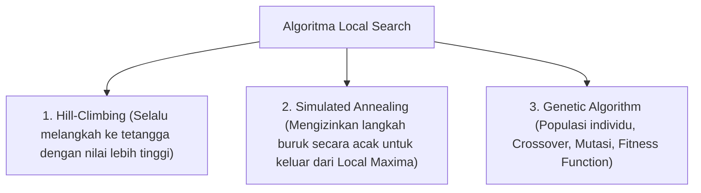

# 4. Algoritma Pencarian Informed Search dan Heuristic (Searching Part-2)

Navigasi: Modul Sebelumnya: [[03_Algoritma_Pencarian_Uninformed_Search]] | [[Konsep_Kecerdasan_Buatan]] | Modul Berikutnya: [[05_Machine_Learning_Supervised_Naive_Bayes]]

---

**Informed Search (Heuristic Search)** memanfaatkan pengetahuan spesifik domain berupa **Fungsi Heuristik $h(n)$** yang memperkirakan estimasi biaya dari simpul saat ini $n$ menuju status tujuan terdekat.

---

## 4.1. Algoritma Pencarian Berbasis Heuristik Utama

### 1. Greedy Best-First Search (GBFS)
- **Fungsi Evaluasi**: $f(n) = h(n)$
- **Mekanisme**: Membuka simpul yang tampak paling dekat dengan tujuan berdasarkan nilai heuristik murni $h(n)$.
- **Sifat**: Sangat cepat, namun **tidak menjamin keoptimalan** dan dapat terjebak dalam loop.

### 2. Algoritma A* Search (A-Star)
- **Fungsi Evaluasi**: $f(n) = g(n) + h(n)$
  - $g(n)$: Biaya nyata yang sudah ditempuh dari simpul awal ke simpul $n$.
  - $h(n)$: Estimasi biaya heuristik dari simpul $n$ ke tujuan.
- **Syarat Keoptimalan A* Search**:
  - **Admissible Heuristic**: Nilai $h(n)$ tidak boleh *overestimate* (tidak pernah lebih besar dari biaya asli sebenarnya).
  - **Consistent (Monotone) Heuristic**: Untuk setiap simpul $n$ dan tetangganya $n'$, nilai $h(n) \le c(n, a, n') + h(n')$.

---

## 4.2. Algoritma Pencarian Lokal (Local Search)

Digunakan ketika jalur perjalanan tidak penting, dan tujuan utamanya adalah mencari lokasi status solusi terbaik (*optimization problems*).

---

## 4.3. Pencarian Berlawanan (Adversarial Search / Game Playing)

Digunakan dalam permainan dua pemain dengan informasi sempurna (seperti Catur atau Tic-Tac-Toe):

- **Algoritma Minimax**: Memaksimalkan keuntungan pemain sendiri (MAX) dan meminimalkan keuntungan lawan (MIN).
- **Alpha-Beta Pruning**: Teknik pemangkasan cabang pohon keputusan yang tidak mempengaruhi hasil akhir untuk menghemat waktu komputasi secara signifikan.

---

Navigasi: Modul Sebelumnya: [[03_Algoritma_Pencarian_Uninformed_Search]] | [[Konsep_Kecerdasan_Buatan]] | Modul Berikutnya: [[05_Machine_Learning_Supervised_Naive_Bayes]]
