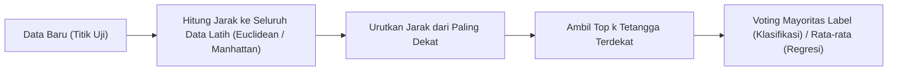
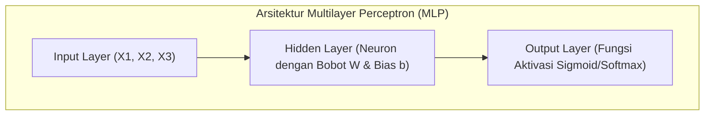
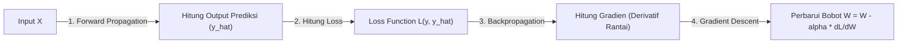

# 6. Pembelajaran Mesin Supervised: k-NN dan Jaringan Saraf Tiruan (ANN)

Navigasi: Modul Sebelumnya: [[05_Machine_Learning_Supervised_Naive_Bayes]] | [[Konsep_Kecerdasan_Buatan]] | Modul Berikutnya: [[07_Machine_Learning_Unsupervised_Learning]]

---

## 6.1. Algoritma k-Nearest Neighbors (k-NN)

**k-NN** adalah algoritma supervised learning berbasis instansi (*instance-based / lazy learning*) yang mengklasifikasikan data baru berdasarkan mayoritas label dari $k$ tetangga terdekatnya di dalam ruang vektor.

### 📏 Rumus Jarak Euclidean (Euclidean Distance):
$$d(p, q) = \sqrt{\sum_{i=1}^{n} (p_i - q_i)^2}$$

> [!TIP]
> **Pemilihan Nilai $k$**:
> - Nilai $k$ ganjil (3, 5, 7) direkomendasikan untuk menghindari hasil voting seri pada masalah klasifikasi biner.
> - Nilai $k$ terlalu kecil ($k=1$) rentan terhadap *overfitting* dan *noise*. Nilai $k$ terlalu besar dapat menyebabkan *underfitting*.

---

## 6.2. Jaringan Saraf Tiruan (Artificial Neural Networks - ANN)

**ANN** adalah model pembelajaran mesin terinspirasi dari struktur dan cara kerja jaringan saraf biologis otak manusia.

### 🧩 Komponen Utama Perceptron & ANN:

1. **Bobot ($W$) dan Bias ($b$)**: Parameter terlatih yang mengontrol kekuatan sinyal masukan:
   $$z = \sum_{i=1}^{n} w_i x_i + b$$
2. **Fungsi Aktivasi ($\sigma$)**: Memasukkan sifat non-linearitas sehingga jaringan sanggup mempelajari pola kompleks:
   - **Sigmoid**: $\sigma(z) = \frac{1}{1 + e^{-z}}$ (Output 0 s.d. 1).
   - **ReLU (Rectified Linear Unit)**: $f(z) = \max(0, z)$ (Paling populer untuk Deep Learning).
   - **Softmax**: Digunakan pada Output Layer untuk klasifikasi multi-kelas (probabilitas 0 s.d. 1).

---

## 6.3. Pelatihan ANN: Forward & Backpropagation

> [!NOTE]
> **Keterkaitan dengan Riset Edge AI**:
> Model ANN dan Deep Learning berskala besar yang dilatih pada modul ini dapat dikompresi (Quantization & Pruning) agar sanggup berjalan di perangkat mikro fasilitas 3T. Lihat penjelasan lengkapnya pada [[../../../Riset_Edge_AI_3T/edge-ai-untuk-3t|Riset Edge AI 3T]].

---

Navigasi: Modul Sebelumnya: [[05_Machine_Learning_Supervised_Naive_Bayes]] | [[Konsep_Kecerdasan_Buatan]] | Modul Berikutnya: [[07_Machine_Learning_Unsupervised_Learning]]
