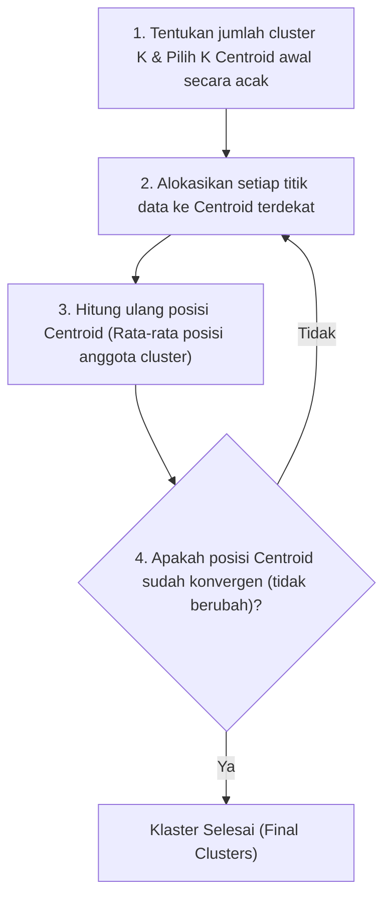

# 7. Pembelajaran Mesin Unsupervised: Clustering dan Reduksi Dimensi

Navigasi: Modul Sebelumnya: [[06_Machine_Learning_Supervised_kNN_dan_Artificial_Neural_Network]] | [[Konsep_Kecerdasan_Buatan]] | Modul Berikutnya: [[08_Reasoning_Representasi_Pengetahuan_dan_Fuzzy_Logic]]

---

**Unsupervised Learning (Pembelajaran Tak Terawasi)** adalah cabang Machine Learning di mana algoritma menemukan pola, struktur tersembunyi, atau pengelompokan alami di dalam data **tanpa menggunakan label target ($y$)**.

---

## 7.1. Algoritma Klasterisasi: K-Means Clustering

**K-Means** adalah algoritma klasterisasi berbasis partisi yang membagi dataset menjadi $K$ kelompok (*clusters*) tak tumpang tindih berdasarkan titik pusat (*Centroid*).

### 📈 Penentuan Jumlah Cluster Optimal ($K$) dengan Metode Elbow:
Metode Elbow memplot nilai **Inertia (Within-Cluster Sum of Squares / WCSS)** terhadap variasi nilai $K$. Titik sikut (*elbow point*) menunjukkan nilai $K$ paling optimal.

---

## 7.2. Hierarchical Clustering

**Hierarchical Clustering** membangun hirarki pengelompokan data bertingkat dalam bentuk diagram pohon yang disebut **Dendrogram**.

- **Agglomerative (Bottom-Up)**: Dimulai dengan setiap titik data sebagai klaster mandiri, kemudian secara bertahap menggabungkan pasangan klaster terdekat hingga tersisa satu klaster besar.
- **Divisive (Top-Down)**: Dimulai dari satu klaster besar tunggal yang secara bertahap dipecah menjadi klaster-klaster kecil.

---

## 7.3. Reduksi Dimensi: Principal Component Analysis (PCA)

**PCA** adalah teknik reduksi dimensi linier yang mengompresi dataset berdimensi tinggi (banyak fitur) menjadi komponen utama (*Principal Components*) berdimensi rendah tanpa kehilangan informasi variansi data secara signifikan.

### Manfaat Utama PCA:
1. **Mempercepat Waktu Pelatihan Model**: Mengurangi beban komputasi model AI.
2. **Visualisasi Data**: Mengompresi fitur $N$-dimensi menjadi 2D atau 3D agar dapat di-plot dalam grafik.
3. **Menghilangkan Multikolinearitas**: Menghapus korelasi antar fitur yang berlebihan.

---

Navigasi: Modul Sebelumnya: [[06_Machine_Learning_Supervised_kNN_dan_Artificial_Neural_Network]] | [[Konsep_Kecerdasan_Buatan]] | Modul Berikutnya: [[08_Reasoning_Representasi_Pengetahuan_dan_Fuzzy_Logic]]
