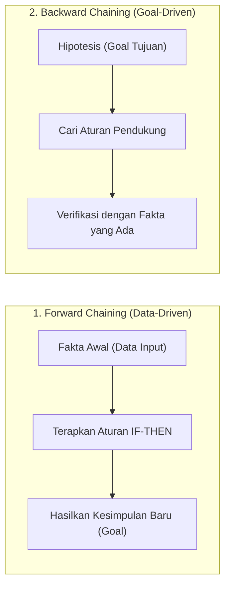
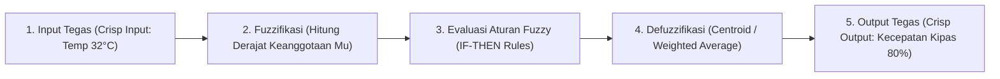

# 8. Reasoning, Representasi Pengetahuan, dan Logika Samar (Fuzzy Logic)

Navigasi: Modul Sebelumnya: [[07_Machine_Learning_Unsupervised_Learning]] | [[Konsep_Kecerdasan_Buatan]]

---

## 8.1. Representasi Pengetahuan dan Logika

Untuk dapat melakukan penalaran (*reasoning*), agen AI membutuhkan mekanisme penyimpan pengetahuan (*Knowledge Base*) menggunakan logika formal.

1. **Propositional Logic (Logika Proposisi)**: Representasi kalimat menggunakan fakta biner True/False ($P \land Q \rightarrow R$).
2. **First-Order Logic (FOL)**: Logika terstruktur ekspresif yang merepresentasikan objek, atribut, dan relasi menggunakan kuantifikasi ($\forall x, \exists y$).

---

## 8.2. Mesin Inferensi (Inference Engine)

Mesin inferensi menarik kesimpulan fakta baru dari pengetahuan yang tersimpan:

- **Forward Chaining**: Berjalan maju dari fakta-fakta yang diketahui menuju ke pencapaian kesimpulan/tujuan.
- **Backward Chaining**: Berjalan mundur dari hipotesis tujuan untuk memverifikasi apakah fakta-fakta pendukungnya terpenuhi.

---

## 8.3. Logika Samar (Fuzzy Logic) dan Sistem Inferensi Fuzzy (FIS)

Logika Boolean konvensional bersifat **Crisp** (hanya bernilai tegas `0` atau `1`). **Logika Samar (Fuzzy Logic)** mengizinkan derajat keanggotaan bertahap bernilai antara $0.0$ hingga $1.0$ ($\mu(x) \in [0, 1]$) untuk memodelkan ketidakpastian dunia nyata.

### ⚙️ Tiga Metode Utama Sistem Inferensi Fuzzy (FIS):

| Metode FIS | Karakteristik Konsekuen Aturan (THEN) | Metode Defuzzifikasi |
| :--- | :--- | :--- |
| **Tsukamoto** | Setiap aturan direpresentasikan oleh himpunan fuzzy dengan fungsi keanggotaan monoton. | *Weighted Average* (Rata-rata terbobot $z$). |
| **Sugeno** | Konsekuen berupa persamaan konstanta atau fungsi linier ($z = ax + by + c$). | *Weighted Average* ($z = \frac{\sum w_i z_i}{\sum w_i}$). |
| **Mamdani** | Konsekuen berupa himpunan fuzzy umum. Menggunakan operasi MAX-MIN / MAX-DOT. | *Centroid* (Titik Pusat Massis / Area). |

---

Navigasi: Modul Sebelumnya: [[07_Machine_Learning_Unsupervised_Learning]] | [[Konsep_Kecerdasan_Buatan]]
