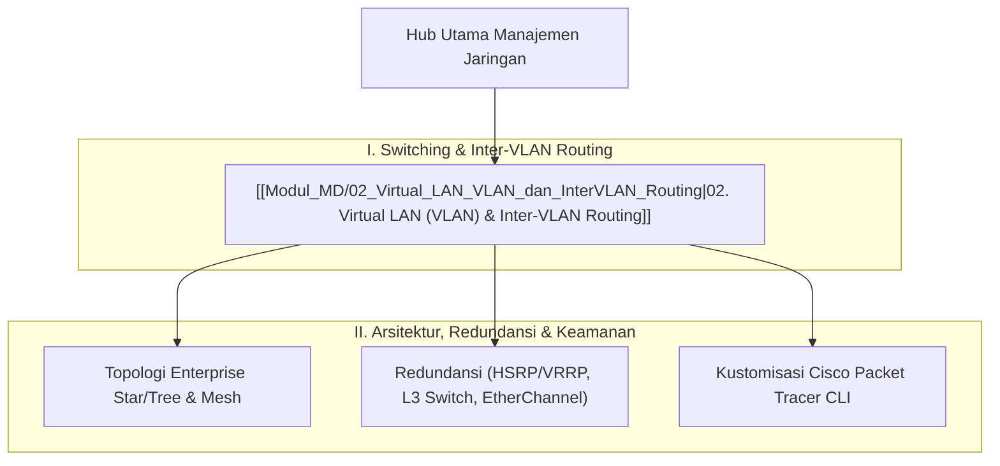

# Panduan Komprehensif Konsep Manajemen Jaringan (Network Management Hub)

Dokumen ini merupakan berkas utama (*Knowledge Hub*) yang memetakan modul pembelajaran **Manajemen Jaringan (Network Management & Cisco Advanced Networking)**. Seluruh materi disusun secara sistematis dan dikorelasikan dengan [[../08_Jaringan_Komputer/Konsep_Jaringan_Komputer|Jaringan Komputer Cisco CCNA]], [[../07_Sistem_Operasi/Konsep_Sistem_Operasi|Sistem Operasi & Linux Server]], serta [[../../Riset_Edge_AI_3T/edge-ai-untuk-3t|Riset Edge AI 3T]].

> [!NOTE]
> Seluruh modul pada hub ini saling terhubung secara dua arah (*bidirectional links*) menggunakan Obsidian Wiki-Links `[[...]]`.

---

## 🗺️ Peta Pembelajaran Manajemen Jaringan (Mindmap)

---

## 📚 Daftar Modul Pembelajaran Manajemen Jaringan

### Part I: Switching & Inter-VLAN Routing
1. **[[Modul_MD/02_Virtual_LAN_VLAN_dan_InterVLAN_Routing]]**: 
   - Konsep VLAN (Virtual LAN) di OSI Layer 2 untuk mengatasi *Flat Network* & *Excessive Broadcast*.
   - Standar Tagging IEEE 802.1Q pada *Trunk Ports*.
   - Konfigurasi **Router-on-a-Stick** di OSI Layer 3 (Sub-Interface & Encapsulation dot1Q).
   - Static Routing antar-router cabang.
   - Analisis Topologi Mesh, *Overlapping Subnet Conflict*, *Single Point of Failure (SPoF)*, serta Solusi Redundansi Enterprise (**L3 Switch SVI, HSRP/VRRP, EtherChannel/LACP**).
   - Kustomisasi CLI Terminal Dark Mode & Workspace Cisco Packet Tracer.

---

## 🔗 Hubungan Antar Berkas Catatan Utama

- 🔗 **[[../08_Jaringan_Komputer/Konsep_Jaringan_Komputer|Jaringan Komputer Cisco CCNA Hub]]**: Dasar pengalamatan IPv4, Subnetting, MAC Address, ARP, dan Model OSI.
- 🔗 **[[../07_Sistem_Operasi/Konsep_Sistem_Operasi|Sistem Operasi & Linux Server]]**: Konfigurasi interface jaringan, IP Aliasing/VLAN Tagging pada Linux Server (`8021q`), dan Docker Network Drivers.

---
*Hub catatan ini dapat dipelajari secara bertahap melalui navigasi tautan `[[...]]` pada setiap modul.*
