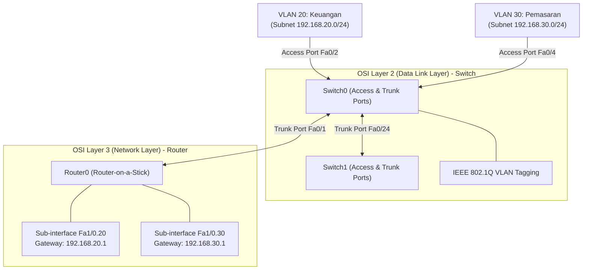

# Virtual LAN (VLAN), Inter-VLAN Routing, dan Arsitektur Topologi Jaringan Cisco

Catatan ini menyajikan rangkuman komprehensif mengenai **Virtual LAN (VLAN)**, teknik **Inter-VLAN Routing (Router-on-a-Stick)**, konfigurasi **Cisco IOS CLI**, analisis **Model Referensi OSI (Layer 2 vs Layer 3)**, serta solusi desain **Topologi Mesh & Redundansi Enterprise**. 

Materi ini disintesis dari modul praktikum `2. Virtual Lan (VLAN).pdf` (referensi: *A Practical Guide to Advanced Networking, 3rd Edition* oleh Jeffrey S. Beasley & Piyasat Nilkaew) dan dikorelasikan dengan [[../../08_Jaringan_Komputer/Konsep_Jaringan_Komputer|Modul Jaringan Komputer Cisco CCNA]].

---

## 🗺️ Peta Konsep VLAN & Inter-VLAN Routing



---

## 1. Konsep Dasar Topologi & Perangkat Jaringan Cisco

### A. Hirarki Topologi Enterprise
Dalam arsitektur jaringan Cisco Enterprise, topologi disusun secara hierarkis untuk menjamin kemudahan skala (*scalability*) dan keandalan (*redundancy*):
1. **Topologi Star / Tree (Hirarkis):** 
   - **Access Layer:** Tempat perangkat pengguna (*End Devices* seperti PC, Laptop, IP Phone) terhubung langsung ke Switch Access.
   - **Distribution Layer:** Memutus *broadcast domain*, menerapkan kebijakan keamanan (*ACL*), dan melakukan *Inter-VLAN routing*.
   - **Core Layer:** Tulang punggung (*backbone*) jaringan berkecepatan tinggi yang meneruskan paket antar-gedung/lokasi tanpa membebankan pemrosesan paket yang rumit.
2. **Topologi Mesh:**
   - Setiap node memiliki jalur redundan (*multi-link*) ke node lain untuk mencegah kegagalan total (*Single Point of Failure*). Jika satu link terputus, lalu lintas dialihkan secara otomatis (*failover*).

### B. Peran Perangkat Jaringan berdasarkan Model OSI
* **Switch (Layer 2 - Data Link Layer):**
  - Menghubungkan perangkat dalam satu subnet/LAN logis yang sama berbasis **MAC Address**.
  - Secara bawaan (*default*), switch Layer 2 meluruskan (*forwarding*) *frame* broadcast ke seluruh port (kecuali port asal).
* **Router (Layer 3 - Network Layer):**
  - Menghubungkan subnet/VLAN yang berbeda atau menghubungkan jaringan lokal ke jaringan luar (**WAN / Internet**) berbasis **IP Address**.
  - Router berfungsi membatasi dan mengisolasi *broadcast domain*.

> [!NOTE]
> Untuk pendalaman fungsi OSI Layer, silakan merujuk pada catatan [[../../08_Jaringan_Komputer/Modul_MD/02_Model_Referensi_OSI_Layer_dan_TCPIP|Model Referensi OSI Layer dan TCP/IP]] dan [[../../08_Jaringan_Komputer/Modul_MD/03_Lapisan_Fisik_dan_Data_Link_Ethernet|Lapisan Fisik & Data Link Ethernet]].

---

## 2. Analisis Layer OSI & Pengaruhnya pada VLAN

### A. Mengapa VLAN Dibutuhkan? (Permasalahan *Flat Network*)
Pada jaringan tradisional tanpa VLAN (*Flat Network*), seluruh port pada switch Layer 2 berada dalam **satu Broadcast Domain yang sama**:
* **Masalah Excessive Broadcast:** Ketika suatu PC mengirimkan paket broadcast (misalnya **ARP Request** dari [[../../08_Jaringan_Komputer/Modul_MD/07_Resolusi_Alamat_ARP_dan_Neighbor_Discovery|Protokol ARP]]), switch akan memancarkan paket tersebut ke seluruh PC di jaringan.
* **Dampak Performa:** Setiap PC terpaksa memproses *frame* broadcast tersebut hingga ke CPU hanya untuk memeriksa apakah IP tujuan sesuai dengannya. Hal ini menurunkan performa perangkat dan memadati lalu lintas jaringan (*network congestion*).

```
[ Flat Network Tanpa VLAN ]
PC0 (192.168.20.21) ---+
PC1 (192.168.20.22) ---+---> [ Switch L2 ] === (Satu Broadcast Domain) ===> ARP Broadcast membanjiri semua PC!
PC2 (192.168.30.31) ---+
```

### B. Peran OSI Layer 2 (Data Link Layer) pada VLAN
VLAN membagi satu switch fisik menjadi beberapa *broadcast domain* logis secara independen di **Layer 2**:
* **Frame Tagging (IEEE 802.1Q):** Saat paket melewati port *Trunk*, header Ethernet disisipi **VLAN Tag** berukuran 4-byte yang berisi **VLAN ID** (misal ID 20 untuk Keuangan, ID 30 untuk Pemasaran).
* **Isolasi Layer 2:** Switch tidak akan meneruskan *frame* dari VLAN 20 ke port yang dialokasikan untuk VLAN 30, meskipun PC terhubung pada switch fisik yang sama.

### C. Peran OSI Layer 3 (Network Layer) pada Inter-VLAN Routing
Karena VLAN secara ketat mengisolasi lalu lintas di Layer 2, PC pada VLAN 20 (`192.168.20.0/24`) **tidak dapat berkomunikasi** dengan PC pada VLAN 30 (`192.168.30.0/24`) meskipun berada di subnet yang berbeda tanpa bantuan **Layer 3**:
* **Kebutuhan Gateway:** PC pada VLAN 20 harus mengirimkan paket ke **Default Gateway** (IP sub-interface Router di Layer 3).
* **Proses Routing:** Router menerima *frame* bertag 802.1Q di Layer 2, melepas tag tersebut (*decapsulation*), memeriksa IP Header di Layer 3, menentukan *next-hop* / interface tujuan, lalu membungkus kembali paket (*re-encapsulation*) dengan VLAN Tag tujuan (VLAN 30) sebelum dikirimkan kembali ke switch.

---

## 3. Tutorial Konfigurasi Lengkap Cisco IOS CLI

Berikut adalah tahapan praktikum konfigurasi VLAN, Trunking, Router-on-a-Stick, dan Static Routing pada Cisco Packet Tracer.

---

### Langkah 1: Menambahkan & Menamai VLAN pada Switch (`Switch0`)

Masuk ke CLI Switch, aktifkan mode konfigurasi global, lalu buat ID dan nama VLAN.

```text
Switch> enable
Switch# configure terminal
Switch(config)# vlan 20
Switch(config-vlan)# name Keuangan
Switch(config-vlan)# exit
Switch(config)# vlan 30
Switch(config-vlan)# name Pemasaran
Switch(config-vlan)# exit
Switch(config)# exit
```

> [!TIP]
> **Catatan Penamaan VLAN:**
> * Penamaan VLAN bersifat opsional (dapat di-skip). Jika tidak diberi nama, Cisco IOS akan secara otomatis menamainya `VLAN0020` atau `VLAN0030`.
> * Untuk menghapus VLAN tertentu, gunakan perintah: `Switch(config)# no vlan <id_vlan>` (contoh: `no vlan 20`).
> * Verifikasi daftar VLAN dengan perintah: `Switch# show vlan`.

---

### Langkah 2: Alokasi Port Switch ke Mode Access (`Access Ports`)

Port *Access* menghubungkan switch langsung ke *End Device* (PC/Laptop) dan hanya membawa lalu lintas dari satu VLAN tertentu (tanpa tag 802.1Q).

```text
Switch# configure terminal
Switch(config)# interface fastEthernet 0/2
Switch(config-if)# switchport mode access
Switch(config-if)# switchport access vlan 20
Switch(config-if)# exit

Switch(config)# interface fastEthernet 0/3
Switch(config-if)# switchport mode access
Switch(config-if)# switchport access vlan 20
Switch(config-if)# exit

Switch(config)# interface fastEthernet 0/4
Switch(config-if)# switchport mode access
Switch(config-if)# switchport access vlan 30
Switch(config-if)# exit
```

---

### Langkah 3: Konfigurasi Mode Trunk pada Interkoneksi Switch (`Trunk Ports`)

Port *Trunk* digunakan untuk menghubungkan switch-ke-switch (`Switch0` ke `Switch1`) atau switch-ke-router (`Switch0` ke `Router0`) agar dapat membawa lalu lintas **banyak VLAN sekaligus** menggunakan enkapsulasi IEEE 802.1Q.

#### Pada `Switch0` (Menuju `Switch1` di port `Fa0/24` & Menuju `Router0` di port `Fa0/1`):
```text
Switch0> enable
Switch0# configure terminal
Switch0(config)# interface fastEthernet 0/24
Switch0(config-if)# switchport mode trunk
Switch0(config-if)# exit

Switch0(config)# interface fastEthernet 0/1
Switch0(config-if)# switchport mode trunk
Switch0(config-if)# exit
```

#### Pada `Switch1` (Menuju `Switch0` di port `Fa0/24`):
```text
Switch1> enable
Switch1# configure terminal
Switch1(config)# interface fastEthernet 0/24
Switch1(config-if)# switchport mode trunk
Switch1(config-if)# exit
```

---

### Langkah 4: Konfigurasi Router-on-a-Stick (Inter-VLAN Routing)

Router-on-a-Stick menggunakan **satu interface fisik router** yang dipecah menjadi beberapa **sub-interface logis** (contoh: `Fa1/0.20`, `Fa1/0.30`). Masing-masing sub-interface dikaitkan dengan ID VLAN dan IP Address yang bertindak sebagai **Default Gateway**.

#### A. Aktifkan Interface Fisik Router (`Router0`):
```text
Router0> enable
Router0# configure terminal
Router0(config)# interface fastEthernet 1/0
Router0(config-if)# no shutdown
Router0(config-if)# exit
```

#### B. Konfigurasi Sub-Interface VLAN 20 & VLAN 30 pada `Router0`:
```text
Router0(config)# interface fastEthernet 1/0.20
Router0(config-subif)# encapsulation dot1Q 20
Router0(config-subif)# ip address 192.168.20.1 255.255.255.0
Router0(config-subif)# exit

Router0(config)# interface fastEthernet 1/0.30
Router0(config-subif)# encapsulation dot1Q 30
Router0(config-subif)# ip address 192.168.30.1 255.255.255.0
Router0(config-subif)# exit
```

#### C. Contoh Tambahan Konfigurasi Sub-Interface pada `Router1` (VLAN 40 & 50):
```text
Router1> enable
Router1# configure terminal
Router1(config)# interface fastEthernet 1/0
Router1(config-if)# no shutdown
Router1(config-if)# exit

Router1(config)# interface fastEthernet 1/0.40
Router1(config-subif)# encapsulation dot1Q 40
Router1(config-subif)# ip address 192.168.40.1 255.255.255.0
Router1(config-subif)# exit

Router1(config)# interface fastEthernet 1/0.50
Router1(config-subif)# encapsulation dot1Q 50
Router1(config-subif)# ip address 192.168.50.1 255.255.255.0
Router1(config-subif)# exit
```

> [!IMPORTANT]
> **Penjelasan Perintah Sub-Interface Router:**
> * `interface Fa1/0.20`: Membuat/masuk ke sub-interface logis `.20` dari interface fisik `Fa1/0`.
> * `encapsulation dot1Q 20`: Mengaktifkan enkapsulasi protokol IEEE 802.1Q dan mengasosiasikannya dengan **VLAN ID 20**.
> * `ip address 192.168.20.1 255.255.255.0`: Menentukan alokasi IP Gateway untuk perangkat di VLAN 20.
> * **Perintah Hapus Sub-Interface:** `Router(config)# no interface fastEthernet 1/0.20`
> * **Perintah Hapus IP Sub-Interface:** `Router(config-subif)# no ip address`
> * **Verifikasi Status IP Router:** `Router# show ip interface brief`

---

### Langkah 5: Konfigurasi Static Routing Antar-Router (`Router0` $\leftrightarrow$ `Router1`)

Agar router cabang (`Router1`) dapat menjangkau seluruh subnet VLAN di `Router0`, kita menambahkan **Static Route** di Layer 3.

Sintaks Umum:
`Router(config)# ip route <network_tujuan> <netmask_desimal> <next_hop_ip>`

#### A. Setting IP Point-to-Point antar Router:
* `Router0` Interface `Fa0/0`: `192.168.1.1 255.255.255.0`
* `Router1` Interface `Fa0/0`: `192.168.1.2 255.255.255.0`

#### B. Konfigurasi Static Route pada `Router1` menuju Subnet VLAN di `Router0`:
```text
Router1> enable
Router1# configure terminal
Router1(config)# ip route 192.168.20.0 255.255.255.0 192.168.1.1
Router1(config)# ip route 192.168.30.0 255.255.255.0 192.168.1.1
Router1(config)# exit
```

> [!TIP]
> * **Verifikasi Tabel Routing:** `Router1# show ip route` (Rute static akan ditandai dengan kode `S`).
> * **Menghapus Static Route:** `Router1(config)# no ip route 192.168.20.0 255.255.255.0 192.168.1.1`

---

## 4. Desain Topologi Mesh & Permasalahan Lapangan

### A. Mesh di Level End-Device (PC)
* **Keterbatasan Perangkat:** Port bawaan PC di Packet Tracer bertipe *single-port* (`FastEthernet0`).
* **Solusi Simulasi:** Jika ingin menghubungkan PC secara direct *mesh/peer-to-peer*, perlu digunakan perangkat **Server-PT** yang menyediakan slot ekspansi modul Ethernet tambahan.
* **Praktik Lapangan:** Di dunia nyata, topologi mesh **tidak dibangun antar-PC**, melainkan pada infrastruktur jaringan terpusat (**Switch** atau **Router**).

### B. Mesh di Level Switch/Router & Tantangan Implementasi

```
[ Konflik IP jika Banyak Trunk dari Switch Mesh ke 1 Router ]

      +------------+  (Trunk Fa0/1)  +------------+
      |  Switch A  |-----------------|  Switch B  |
      +------------+                 +------------+
            \                               /
             \ (Trunk Fa0/2)               / (Trunk Fa0/3)
              \                           /
               +-------------------------+
               | Router0 (Beda Fa Physical)|
               +-------------------------+
               !!! Overlapping Subnet !!!
```

1. **Kelemahan Sambungan Banyak Trunk ke 1 Router Fisik:**
   - Jika beberapa switch yang saling membentuk segitiga mesh terhubung langsung melalui port trunk fisik yang berbeda ke 1 router, router akan mengalami **Konflik Subnet Overlapping**.
   - Router Cisco tidak mengizinkan sub-interface pada interface fisik yang berbeda dipasangi alamat IP / subnet VLAN yang sama.
2. **Bahaya Single Point of Failure (SPoF):**
   - Pada Router-on-a-Stick standar, jika switch utama penghubung router mengalami kegagalan (*down*), maka seluruh VLAN di gedung tersebut akan kehilangan akses *default gateway* ke jaringan luar.

### C. Solusi Redundansi Standar Enterprise

| No | Teknologi | Mekanisme & Keunggulan |
| :--- | :--- | :--- |
| 1 | **Multilayer Switch (L3 Switch)** | Menggunakan **Switched Virtual Interface (SVI)** (`interface vlan 20`) untuk menangani Inter-VLAN Routing berkecepatan tinggi langsung di switch core/distribution tanpa *router bottleneck*. |
| 2 | **First Hop Redundancy (HSRP / VRRP)** | Menggabungkan 2 Router fisik untuk berbagi satu **Virtual IP Default Gateway** (Active-Standby). Jika Router Utama mati, Router Backup mengambil alih secara instan tanpa mengganggu koneksi pengguna. |
| 3 | **EtherChannel / LACP (IEEE 802.3ad)** | Menggabungkan beberapa link kabel fisik switch-to-switch menjadi **satu link logis redundan** dengan agregasi bandwidth lebih besar dan perlindungan failover jika salah satu kabel putus. |

---

## 5. Tips Kustomisasi Workspace Cisco Packet Tracer

Untuk meningkatkan kenyamanan dan estetika visual saat mengerjakan lab Cisco Packet Tracer:

### A. Dark Mode Terminal CLI Cisco IOS
1. Buka menu **Options** $\rightarrow$ **Preferences** (atau tekan shortcut `Ctrl + R`).
2. Pilih tab **Font**.
3. Pada bagian **CLI / Router IOS**, ubah:
   - **Background Color:** Hitam (`#000000`)
   - **Text Color:** Hijau Muda (`#00FF00`) atau Putih (`#FFFFFF`)

### B. Dark Workspace Canvas (Mengurangi Silau)
1. Klik tombol **Set Tiled Background Image** (ikon gambar di toolbar kanan atas, atau tekan `Shift + I`).
2. Pilih file gambar pola abu-abu gelap atau hitam.
3. Canvas workspace akan berubah menjadi gelap sehingga nyaman untuk bekerja jangka panjang.

---

## 🔗 Keterkaitan dengan Berkas Catatan Lainnya

Catatan modul ini terhubung erat secara dua arah (*bidirectional links*) dengan berkas catatan utama di vault:

* 🔗 [[../../08_Jaringan_Komputer/Konsep_Jaringan_Komputer|Master Hub Jaringan Komputer Cisco]]
* 🔗 [[../../08_Jaringan_Komputer/Modul_MD/02_Model_Referensi_OSI_Layer_dan_TCPIP|Model Referensi OSI Layer dan TCP/IP]]
* 🔗 [[../../08_Jaringan_Komputer/Modul_MD/03_Lapisan_Fisik_dan_Data_Link_Ethernet|Lapisan Fisik & Data Link Ethernet]]
* 🔗 [[../../08_Jaringan_Komputer/Modul_MD/05_Lapisan_Jaringan_Pengalamatan_IPv4_dan_Subnetting|Lapisan Jaringan Pengalamatan IPv4 & Subnetting]]
* 🔗 [[../../08_Jaringan_Komputer/Modul_MD/07_Resolusi_Alamat_ARP_dan_Neighbor_Discovery|Resolusi Alamat ARP & Neighbor Discovery]]
* 🔗 [[../../08_Jaringan_Komputer/Modul_MD/10_Konfigurasi_Perangkat_Keamanan_dan_Troubleshooting|Konfigurasi Perangkat, Keamanan, & Troubleshooting]]
* 🔗 [[../../07_Sistem_Operasi/Konsep_Sistem_Operasi|Sistem Operasi & Linux Server]]

---
*Catatan ini disusun untuk memenuhi kurikulum Manajemen Jaringan & Cisco CCNA Networking.*
