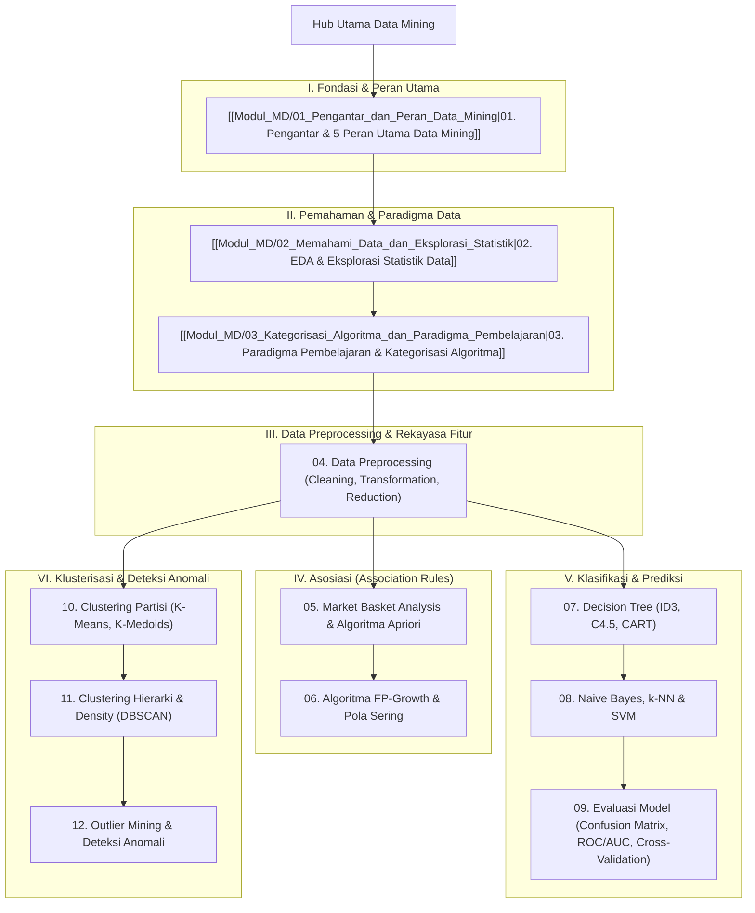

# Panduan Komprehensif Konsep Data Mining (Data Mining Hub)

Dokumen ini merupakan berkas utama (*Knowledge Hub*) yang memetakan seluruh modul pembelajaran **Data Mining (Penambangan Data & Penemuan Pengetahuan / KDD)**. Seluruh materi disusun secara bertahap dan sistematis berdasarkan catatan perkuliahan, serta dikorelasikan dengan [[../03_Basis_Data/Konsep_Basis_Data|Basis Data (DBMS & Data Warehouse)]], [[../09_Kecerdasan_Buatan/Konsep_Kecerdasan_Buatan|Kecerdasan Buatan (Machine Learning)]], [[../02_Struktur_Data_dan_Algoritma/Konsep_Struktur_Data_dan_Algoritma|Struktur Data & Algoritma]], dan [[../../Riset_Edge_AI_3T/edge-ai-untuk-3t|Riset Edge AI 3T]].

> [!NOTE]
> Seluruh modul pada hub ini saling terhubung secara dua arah (*bidirectional links*) menggunakan Obsidian Wiki-Links `[[...]]`. Catatan diperbarui secara berkala dan disinkronkan dengan materi perkuliahan Anda. Berkas dari folder `vault-teman` **dikecualikan 100%**.

---

## 🗺️ Peta Pembelajaran Data Mining (Mindmap)

---

## 📚 Daftar Modul Pembelajaran Data Mining

### Part I: Fondasi & Peran Utama Data Mining
1. **[[Modul_MD/01_Pengantar_dan_Peran_Data_Mining|01. Pengantar dan Peran Utama Data Mining]]** *(Aktif)*:
   - **Definisi Data Mining**: Perspektif Witten et al. (2011), Santosa (2007), dan Han et al. (2011).
   - **5 Peran Utama Data Mining**: Estimasi, Forecasting, Klasifikasi, Klusterisasi, dan Asosiasi.
   - **Ekosistem Library Python**: `pandas`, `numpy`, `matplotlib`, `seaborn`, dan `scikit-learn`.
   - **Implementasi Ringkas Python**: Alur kerja pipeline end-to-end data mining.

---

### Part II: Pemahaman Data & Paradigma Pembelajaran
2. **[[Modul_MD/02_Memahami_Data_dan_Eksplorasi_Statistik|02. Exploratory Data Analysis (EDA) dan Eksplorasi Statistik Data]]** *(Aktif)*:
   - **Definisi & Analogi EDA**: Mengenal data sebelum modeling (Analogi Memasak & Inspeksi Mobil Bekas).
   - **6 Fokus Utama Investigasi EDA**: Struktur data, Missing values, Outliers, Distribusi (Normal/Skewed), Korelasi Pearson, dan Statistik deskriptif (*Five-number summary* & IQR).
   - **Hands-on Dataset Iris**: Membedah batas fungsional antara investigasi pasif **murni EDA** vs **Data Preprocessing** (`StandardScaler`).

3. **[[Modul_MD/03_Kategorisasi_Algoritma_dan_Paradigma_Pembelajaran|03. Kategorisasi Algoritma dan Paradigma Pembelajaran Data Mining]]** *(Aktif)*:
   - **4 Paradigma Pembelajaran**:
     1. **Supervised Learning** 👨‍🏫 (Ada label/guru $\rightarrow$ Klasifikasi, Regresi, Forecasting).
     2. **Unsupervised Learning** 🚶‍♂️ (Tanpa label/ruangan gelap $\rightarrow$ Clustering, Reduksi Dimensi, Deteksi Anomali).
     3. **Semi-Supervised Learning** 🎯 (Hibrida $D_L + D_U \rightarrow$ Solusi hemat biaya anotasi industri, Pseudo-labeling).
     4. **Association-Based Learning** 🔗 (Pola belanja itemset $\rightarrow$ Aturan IF-THEN, Support, Confidence, Lift).
   - **Panduan Praktis**: Diagram alur pohon keputusan (*Decision Flowchart*) pemilihan algoritma dan analisis 3 skenario industri nyata.

---

### Part III s.d. VI: Modul Lanjutan *(Roadmap Perkuliahan)*
*Modul berikut akan dilengkapi secara berkala seiring berjalannya materi perkuliahan Anda:*
- **Modul 04**: Data Preprocessing Lanjutan (Pembersihan Missing Values, Deteksi Noise, Normalisasi Min-Max/Z-Score, Reduksi Dimensi PCA).
- **Modul 05 & 06**: Association Rule Mining, Market Basket Analysis, Algoritma Apriori & FP-Growth.
- **Modul 07, 08 & 09**: Supervised Learning (Decision Tree, Naive Bayes, k-NN, SVM, Random Forest, Evaluasi Model & Cross-Validation).
- **Modul 10, 11 & 12**: Unsupervised Clustering (K-Means, DBSCAN) dan Deteksi Outlier/Anomali.

---

## 🔗 Hubungan Antar Berkas Catatan Utama

- 🔗 **[[../03_Basis_Data/Konsep_Basis_Data|Basis Data (DBMS)]]**: Sumber data operasional OLTP yang diintegrasikan ke Data Warehouse/Data Lake sebelum proses penambangan data.
- 🔗 **[[../09_Kecerdasan_Buatan/Konsep_Kecerdasan_Buatan|Kecerdasan Buatan (AI)]]**: Landasan algoritma Machine Learning (Supervised & Unsupervised Learning) yang diadaptasi dalam Data Mining untuk volume data besar.
- 🔗 **[[../02_Struktur_Data_dan_Algoritma/Konsep_Struktur_Data_dan_Algoritma|Struktur Data & Algoritma]]**: Struktur pohon (Tree) dan graf (Graph) yang digunakan dalam FP-Tree, Decision Tree, serta optimasi pencarian klaster.
- 🔗 **[[../../Riset_Edge_AI_3T/edge-ai-untuk-3t|Riset Edge AI 3T]]**: Pemanfaatan reduksi dimensi, pembersihan data citra medis, dan seleksi fitur penting sebelum kompresi model AI portabel.

---
*Hub catatan ini dapat diakses secara berkala melalui navigasi tautan `[[...]]` pada setiap modul.*
