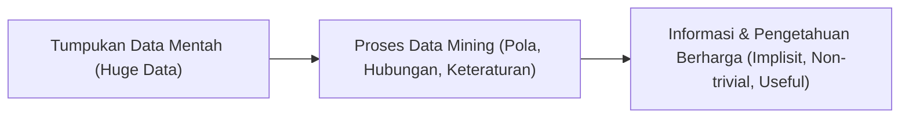
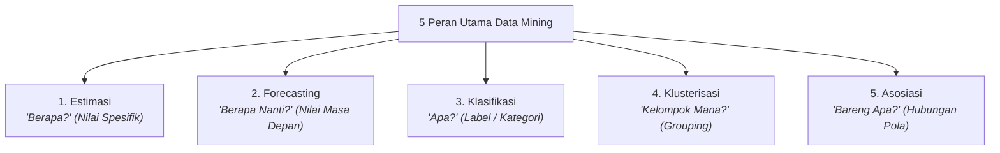
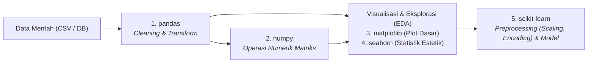

# 1. Pengantar dan Peran Utama Data Mining

Navigasi: [[Konsep_Data_Mining]] | Modul Berikutnya: [[02_Memahami_Data_dan_Eksplorasi_Statistik]]

---

## 1.1. Definisi Data Mining

Secara umum, **Data Mining** (penambangan data) adalah disiplin ilmu yang menjembatani basis data, statistika, dan *machine learning* untuk mengekstrak pengetahuan berharga dari tumpukan data berukuran masif.

Beberapa definisi otoritatif menurut para ahli:

1. **Witten et al. (2011)**:
   > *"Melakukan ekstraksi untuk mendapatkan informasi penting yang sifatnya implisit dan sebelumnya tidak diketahui, dari suatu data."*

2. **Santosa (2007)**:
   > *"Kegiatan yang meliputi pengumpulan, pemakaian data historis untuk menemukan keteraturan, pola dan hubungan dalam set data berukuran besar."*

3. **Han et al. (2011)**:
   > *"Extraction of interesting (non-trivial, implicit, previously unknown and potentially useful) patterns or knowledge from huge amount of data."*



### 🔍 Unsur Kunci dari Definisi:
- **Non-trivial & Implisit**: Informasi yang ditemukan bukan sekadar fakta dangkal yang mudah dilihat secara kasat mata (seperti kueri SQL biasa), melainkan pola tersembunyi yang kompleks.
- **Previously Unknown**: Pola yang dihasilkan memberikan wawasan (*insights*) baru yang sebelumnya belum disadari oleh pengambil keputusan.
- **Potentially Useful**: Pengetahuan tersebut dapat ditindaklanjuti (*actionable*) untuk strategi bisnis, efisiensi operasional, maupun sains.

---

## 1.2. Lima Peran / Tugas Utama Data Mining

Dalam implementasinya, permasalahan di dunia nyata dikelompokkan ke dalam **5 tugas (metode) utama**:



### 📊 Ringkasan Cepat 5 Peran:

| No | Metode | Pertanyaan Kunci | Tipe Target Output | Paradigma Pembelajaran | Contoh Singkat |
| :--- | :--- | :--- | :--- | :--- | :--- |
| 1 | **Estimasi** | *"Berapa?"* | Numerik / Kontinu (saat ini) | Supervised Learning | Mengestimasi IPK atau berat badan |
| 2 | **Forecasting** | *"Berapa nanti?"* | Deret Waktu (*Time-Series*) | Supervised / Sequence Learning | Meramalkan harga saham besok |
| 3 | **Klasifikasi** | *"Apa?"* | Kategori / Kelas Diskrit | Supervised Learning | Menentukan status kredit: Layak/Tidak |
| 4 | **Klusterisasi** | *"Kelompok mana?"* | Himpunan Klaster (*Cluster ID*) | Unsupervised Learning | Segmentasi pelanggan toko |
| 5 | **Asosiasi** | *"Bareng apa?"* | Aturan Pasangan (*Rules*) | Unsupervised / Itemset Mining | Analisis belanja: Beli Roti $\rightarrow$ Selai |

---

## 1.3. Model dan Algoritma untuk Tiap Metode

Berikut adalah model komputasi dan algoritma yang umum digunakan untuk masing-masing metode data mining:

---

### 1. Estimasi (*Estimation*)
- **Pertanyaan Panduan**: *"Berapa?"* (nilai spesifik saat ini berdasarkan nilai variabel input).
- **Target**: Nilai numerik kontinu.

#### 🛠️ Model & Algoritma yang Dapat Digunakan:
1. **Linear Regression (Regresi Linier)**:
   - *Simple Linear Regression*: Memodelkan hubungan linier antara 1 variabel bebas ($X$) dan 1 variabel terikat ($Y$).
   - *Multiple Linear Regression*: Menggunakan banyak variabel bebas ($X_1, X_2, \dots, X_n$).
2. **Artificial Neural Network (ANN / Backpropagation for Regression)**:
   - Jaringan saraf tiruan dengan fungsi aktivasi linier pada layer output untuk menghasilkan nilai kontinu.
3. **Support Vector Regression (SVR)**:
   - Varian SVM yang mencari hyperplane batas toleransi margin ($\epsilon$-tube) untuk memprediksi angka kontinu.
4. **Regression Tree (CART - Regression)**:
   - Pohon keputusan yang daun akhirnya berupa nilai rata-rata numerik, bukan label kategori.
5. **k-Nearest Neighbors Regression (k-NN Regresi)**:
   - Memprediksi nilai target numerik dengan merata-ratakan nilai dari $k$ tetangga terdekat.

> [!TIP]
> **Contoh Kasus Estimasi**:
> - Mengestimasi persentase lemak tubuh berdasarkan lingkar pinggang, usia, dan tinggi badan.
> - Mengestimasi lama waktu pengiriman paket berdasarkan jarak, berat barang, dan kondisi lalu lintas.

---

### 2. Forecasting (*Peramalan Deret Waktu*)
- **Pertanyaan Panduan**: *"Berapa nanti?"* (nilai masa depan berdasarkan data historis terurut waktu).
- **Target**: Nilai kontinu berbasis urutan temporal (*time-series sequence*).

#### 🛠️ Model & Algoritma yang Dapat Digunakan:
1. **ARIMA & SARIMA (Autoregressive Integrated Moving Average)**:
   - Metode statistik klasik yang memperhitungkan tren stasioner dan musiman (*seasonality*).
2. **Exponential Smoothing (Metode Holt-Winters)**:
   - Pembobotan eksponensial untuk data masa lalu yang memiliki pola tren dan musiman.
3. **Recurrent Neural Networks (RNN), LSTM, & GRU**:
   - Arsitektur deep learning yang memiliki mekanisme memori gerbang (*gates*) untuk menangkap dependensi jangka panjang data sekuensial.
4. **Facebook Prophet**:
   - Model aditif yang dirancang untuk menangani deret waktu bisnis dengan pola hari libur dan anomali tren.
5. **Temporal Convolutional Networks (TCN)**:
   - Menggunakan konvolusi 1D kausal dan terdilatasi untuk pemrosesan deret waktu berkecepatan tinggi.

> [!TIP]
> **Contoh Kasus Forecasting**:
> - Meramalkan volume permintaan listrik nasional pada bulan depan.
> - Meramalkan harga penutupan saham perbankan untuk 7 hari ke depan.
> - Meramalkan curah hujan harian untuk musim tanam berikutnya.

---

### 3. Klasifikasi (*Classification*)
- **Pertanyaan Panduan**: *"Apa?"* (menentukan kelas, kategori, atau label diskrit).
- **Target**: Kategori diskrit (biner: Ya/Tidak, multi-kelas: A/B/C).

#### 🛠️ Model & Algoritma yang Dapat Digunakan:
1. **Decision Tree (Pohon Keputusan)**:
   - **ID3**: Menggunakan metrik *Information Gain*.
   - **C4.5**: Menggunakan metrik *Gain Ratio*.
   - **CART (Classification and Regression Tree)**: Menggunakan metrik *Gini Index*.
2. **Naive Bayes Classifier**:
   - Berbasis Teorema Bayes dengan asumsi independensi bersyarat antar atribut (Gaussian NB, Multinomial NB).
3. **k-Nearest Neighbors (k-NN)**:
   - Algoritma *instance-based* (lazy learner) yang menentukan kelas data berdasarkan voting mayoritas tetangga terdekat.
4. **Support Vector Machine (SVM)**:
   - Mencari *maximum margin hyperplane* pemisah terbaik antar kelas dengan bantuan kernel trick (RBF, Polinomial).
5. **Logistic Regression**:
   - Menggunakan fungsi sigmoid untuk memodelkan probabilitas keanggotaan kelas.
6. **Ensemble Methods**:
   - **Random Forest**: Kumpulan pohon keputusan berbasis *bagging*.
   - **Boosting**: AdaBoost, Gradient Boosting, **XGBoost**, LightGBM, CatBoost.
7. **Neural Network / Deep Learning**:
   - Multi-Layer Perceptron (MLP), Convolutional Neural Network (CNN untuk citra).

> [!TIP]
> **Contoh Kasus Klasifikasi**:
> - Menentukan apakah nasabah kredit masuk kategori **Macet** atau **Lancar**.
> - Mendeteksi apakah email yang masuk adalah **Spam** atau **Bukan Spam**.
> - Mendiagnosis hasil rontgen paru: **Normal**, **Pneumonia**, atau **TBC**.

---

### 4. Klusterisasi (*Clustering*)
- **Pertanyaan Panduan**: *"Kelompok mana?"* (mengelompokkan objek data tanpa label ke dalam cluster berdasarkan kemiripan atribut).
- **Target**: Tidak ada target label awal (*Unsupervised Learning*).

#### 🛠️ Model & Algoritma yang Dapat Digunakan:
1. **Metode Partisi (Partitioning Methods)**:
   - **K-Means**: Mengelompokkan data berdasarkan jarak titik ke titik pusat klaster (*centroid*) terdekat.
   - **K-Medoids / PAM (Partitioning Around Medoids)**: Menggunakan data riil sebagai pusat klaster, lebih kebal terhadap data pencilan (*outliers*).
   - **K-Modes**: Varian K-Means khusus untuk data berskala nominal/kategorikal.
2. **Metode Hierarki (Hierarchical Methods)**:
   - **Agglomerative Clustering**: Pendekatan *bottom-up* yang menggabungkan klaster terdekat secara berulang.
   - **Divisive Clustering**: Pendekatan *top-down* yang memecah satu klaster besar menjadi bagian kecil.
   - Menggunakan representasi visual **Dendrogram**.
3. **Metode Kepadatan (Density-Based Methods)**:
   - **DBSCAN (Density-Based Spatial Clustering of Applications with Noise)**: Menemukan klaster berbentuk arbitrer berdasarkan kerapatan titik dan mampu menyaring *noise*.
   - **OPTICS (Ordering Points To Identify the Clustering Structure)**.
4. **Metode Model & Distribusi Probabilitas**:
   - **Gaussian Mixture Models (GMM)**: Mengasumsikan data berasal dari campuran distribusi Gaussian dengan optimasi *Expectation-Maximization (EM)*.
5. **Self-Organizing Map (SOM)**:
   - Jaringan saraf tiruan unsupervised berbasis kisi (*lattice*) dua dimensi.

> [!TIP]
> **Contoh Kasus Klusterisasi**:
> - **Customer Segmentation**: Mengelompokkan jutaan pelanggan toko online berdasarkan frekuensi belanja dan rata-rata uang yang dikeluarkan.
> - **Klasterisasi Wilayah**: Mengelompokkan kabupaten/kota berdasarkan tingkat kerentanan pangan dan kemiskinan.

---

### 5. Asosiasi (*Association Rule Mining*)
- **Pertanyaan Panduan**: *"Bareng apa?"* (menemukan aturan atau keterkaitan antar atribut yang sering muncul bersamaan dalam satu transaksi).
- **Target**: Hubungan implikasi $A \rightarrow B$ (*Jika membeli A, maka cenderung membeli B*).

#### 🛠️ Model & Algoritma yang Dapat Digunakan:
1. **Algoritma Apriori**:
   - Algoritma pencarian pola frekuensi item (*frequent itemset*) berbasis properti *Apriori*: *"Jika suatu itemset tidak sering muncul, maka seluruh superset-nya pasti tidak sering muncul"*.
   - Menggunakan mekanisme *Join* dan *Prune*.
2. **Algoritma FP-Growth (Frequent Pattern Growth)**:
   - Mengompresi basis data transaksi ke dalam struktur pohon **FP-Tree** (*Frequent Pattern Tree*).
   - Menambang itemset sering langsung dari struktur pohon tanpa perlu membuat calon himpunan (*candidate generation*), jauh lebih cepat dibanding Apriori pada data besar.
3. **Algoritma ECLAT (Equivalence Class Clustering and Transformation)**:
   - Menggunakan format data vertikal (*tid-list*) dan penelusuran *depth-first search* untuk menghitung irisan transaksi.

#### 📐 Tiga Metrik Utama Asosiasi:
$$\text{Support}(A \rightarrow B) = \frac{\text{Jumlah Transaksi Mengandung } A \text{ dan } B}{\text{Total Transaksi}}$$

$$\text{Confidence}(A \rightarrow B) = \frac{\text{Support}(A \cup B)}{\text{Support}(A)} = P(B \mid A)$$

$$\text{Lift}(A \rightarrow B) = \frac{\text{Confidence}(A \rightarrow B)}{\text{Support}(B)}$$
- $\text{Lift} > 1$: Menunjukkan adanya korelasi positif yang kuat antara kejadian $A$ dan $B$.

> [!TIP]
> **Contoh Kasus Asosiasi**:
> - **Market Basket Analysis**: Menata letak barang di rak supermarket (*misal: pembeli roti tawar memiliki tendensi membeli selai kacang atau susu*).
> - **Rekomendasi E-Commerce**: Fitur *"Pengguna yang membeli barang ini juga membeli barang tersebut"*.

---

## 1.4. Contoh Implementasi Sederhana dengan Python

Berikut perbandingan sintaks library data mining standar (`scikit-learn` & `mlxtend`) untuk merepresentasikan perbedaan kelima metode:

```python
# 1. ESTIMASI (Linear Regression)
from sklearn.linear_model import LinearRegression
reg = LinearRegression().fit(X_train, y_continuous_train)
y_est = reg.predict(X_test) # Menghasilkan nilai spesifik: [65.4, 72.1, ...]

# 2. FORECASTING (ARIMA)
from statsmodels.tsa.arima.model import ARIMA
model_arima = ARIMA(time_series_data, order=(1, 1, 1)).fit()
y_forecast = model_arima.forecast(steps=5) # Menghasilkan 5 langkah waktu ke depan

# 3. KLASIFIKASI (Decision Tree)
from sklearn.tree import DecisionTreeClassifier
clf = DecisionTreeClassifier().fit(X_train, y_categorical_train)
y_class = clf.predict(X_test) # Menghasilkan label kelas: ['Lancar', 'Macet', ...]

# 4. KLUSTERISASI (K-Means)
from sklearn.cluster import KMeans
kmeans = KMeans(n_clusters=3, random_state=42).fit(X_unlabeled)
cluster_labels = kmeans.labels_ # Menghasilkan grup cluster: [0, 2, 1, 0, ...]

# 5. ASOSIASI (Apriori via mlxtend)
from mlxtend.frequent_patterns import apriori, association_rules
frequent_itemsets = apriori(df_transaksi, min_support=0.2, use_colnames=True)
rules = association_rules(frequent_itemsets, metric="lift", min_threshold=1.0)
```

---

## 1.5. Ekosistem Library Python Utama untuk Data Mining

Dalam alur kerja (*workflow*) data mining modern, Python merupakan bahasa pemrograman standar berkat dukungan pustaka (*libraries*) yang saling melengkapi dalam memproses data dari tahap mentah hingga siap dimodelkan:



### 📋 Peran Spesifik Masing-Masing Library:

| Library | Fokus / Peran Utama | Fungsi & Fitur Kunci | Kapan Digunakan? |
| :--- | :--- | :--- | :--- |
| **`pandas`** | **Data Cleaning, Missing Values, Transform** | - Membaca data tabular: `pd.read_csv()`, `pd.read_excel()`<br>- Cek missing values: `.isna().sum()`<br>- Tangani data kosong: `.fillna()`, `.dropna()`<br>- Transformasi & filter: `.groupby()`, `.apply()`, `.merge()` | Tahap awal pembersihan data, eksplorasi tabel, dan rekayasa fitur tabular (*DataFrame*). |
| **`numpy`** | **Numerical Operations** | - Operasi array & matriks cepat (*vectorized*): `np.array()`<br>- Aljabar linier, perkalian dot, invers: `np.dot()`, `np.linalg`<br>- Operasi matematika: `np.mean()`, `np.std()`, `np.log()` | Perhitungan matematis berkecepatan tinggi pada level memori tingkat rendah (*C-backend*). |
| **`matplotlib`** | **Visualisasi Dasar (Chart, Plot)** | - Plotting dasar: `plt.plot()`, `plt.scatter()`, `plt.bar()`<br>- Pengaturan canvas: `plt.figure()`, `plt.subplots()`<br>- Label sumbu, legenda, judul: `plt.xlabel()`, `plt.legend()` | Membuat grafik dasar dan mengontrol detail tata letak canvas visualisasi secara mendalam. |
| **`seaborn`** | **Statistical Visualization (Lebih Cantik)** | - Matriks korelasi: `sns.heatmap()`<br>- Sebaran multivariat: `sns.pairplot()`<br>- Deteksi outlier & sebaran: `sns.boxplot()`, `sns.violinplot()`<br>- Distribusi data: `sns.histplot()`, `sns.kdeplot()` | Eksplorasi data statistik (EDA) tingkat lanjut dengan palet warna dan tema yang modern serta estetik. |
| **`scikit-learn`** | **Preprocessing Tools & Model Mining** | - *Feature Scaling*: `StandardScaler` (Z-score), `MinMaxScaler` ($[0,1]$)<br>- *Encoding Kategori*: `OneHotEncoder`, `OrdinalEncoder`<br>- *Data Split*: `train_test_split()`<br>- *Pipeline & Algoritma*: `Pipeline`, Model Klasifikasi/Clustering | Mempersiapkan data sebelum algoritma dijalankan agar skala atribut seimbang dan kategori terbaca angka. |

---

### 💻 Contoh Integrasi Alur Kerja Lengkap (End-to-End Pipeline)

Berikut adalah contoh praktis bagaimana kelima library tersebut bekerja sama secara harmonis dalam sebuah proyek data mining:

```python
import pandas as pd
import numpy as np
import matplotlib.pyplot as plt
import seaborn as sns
from sklearn.model_selection import train_test_split
from sklearn.preprocessing import StandardScaler, OneHotEncoder
from sklearn.compose import ColumnTransformer

# 1. PANDAS: Load data & bersihkan missing values
df = pd.read_csv("dataset_nasabah.csv")
print("Missing values awal:\n", df.isna().sum())

# Mengisi missing value usia dengan nilai median
df['Usia'] = df['Usia'].fillna(df['Usia'].median())

# 2. NUMPY: Operasi numerik & transformasi logaritmik jika data miring (skewed)
df['Log_Pendapatan'] = np.log1p(df['Pendapatan'])

# 3 & 4. SEABORN & MATPLOTLIB: Eksplorasi korelasi data statistik
plt.figure(figsize=(8, 6))
sns.heatmap(df.corr(numeric_only=True), annot=True, cmap='coolwarm', fmt=".2f")
plt.title("Matriks Korelasi Antar Fitur (Seaborn + Matplotlib)")
plt.tight_layout()
plt.show()

# 5. SCIKIT-LEARN: Preprocessing (Encoding variabel kategori & Scaling numerik)
fitur_numerik = ['Usia', 'Log_Pendapatan']
fitur_kategori = ['Status_Pernikahan', 'Pekerjaan']

preprocessor = ColumnTransformer(
    transformers=[
        ('num', StandardScaler(), fitur_numerik),            # Scaling ke mean=0, std=1
        ('cat', OneHotEncoder(drop='first'), fitur_kategori) # One-Hot Encoding
    ]
)

# Pisahkan variabel fitur (X) dan target label (y)
X = df.drop(columns=['Status_Kredit_Macet'])
y = df['Status_Kredit_Macet']

# Split data menjadi Data Latih (80%) dan Data Uji (20%)
X_train, X_test, y_train, y_test = train_test_split(X, y, test_size=0.2, random_state=42)

# Eksekusi preprocessing pada data latih dan data uji
X_train_processed = preprocessor.fit_transform(X_train)
X_test_processed = preprocessor.transform(X_test)

print(f"Bentuk data latih setelah diproses: {X_train_processed.shape}")
```

---

Navigasi: [[Konsep_Data_Mining]] | Modul Berikutnya: [[02_Memahami_Data_dan_Eksplorasi_Statistik]]

