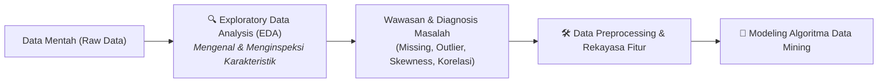
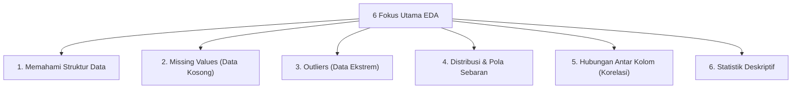
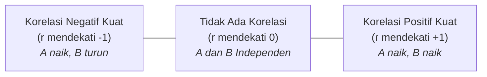
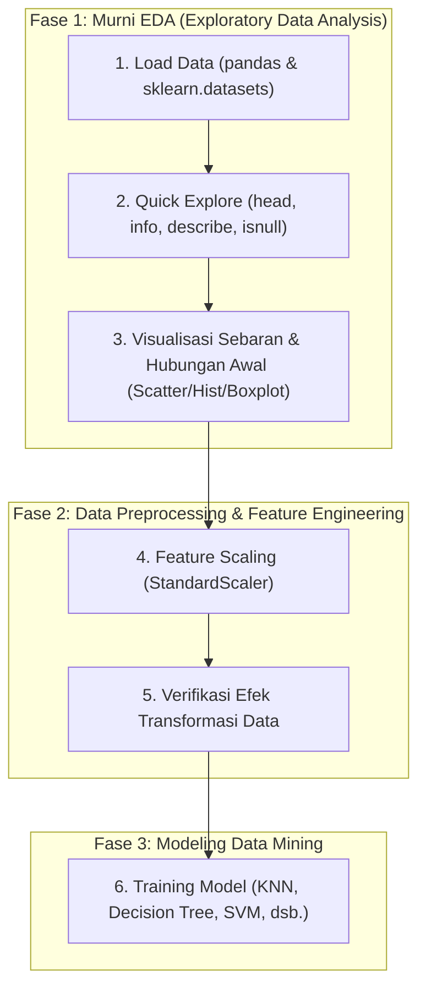

# 2. Exploratory Data Analysis (EDA) dan Eksplorasi Statistik Data

Navigasi: Modul Sebelumnya: [[01_Pengantar_dan_Peran_Data_Mining]] | [[Konsep_Data_Mining]] | Modul Berikutnya: [[03_Kategorisasi_Algoritma_dan_Paradigma_Pembelajaran]]

---

## 2.1. Apa itu Exploratory Data Analysis (EDA)?

**Exploratory Data Analysis (EDA)** adalah proses kritis dalam investigasi awal untuk **mengenal data lebih dalam** sebelum memulai tahap pemodelan (*modeling*). Melalui EDA, kita menemukan struktur data, mendeteksi anomali, menguji hipotesis, dan memeriksa asumsi menggunakan ringkasan statistik serta representasi grafik.



### 🍳 Analogi Dunia Nyata:
1. **Analogi Memasak di Dapur**:
   Sebelum memasak, seorang koki profesional pasti memeriksa bahan terlebih dahulu: *ada bahan apa saja, kondisinya segar atau busuk, berapa banyak takarannya*. Jangan langsung memasak secara membabi-buta! Jika bahan busuk tetap dimasak, masakan pasti rusak (*Garbage In, Garbage Out*).
2. **Analogi Membeli Mobil Bekas (*Pre-purchase Inspection*)**:
   ```text
   EDA = Inspeksi Teliti Sebelum Membeli Mobil:
   ├─ Lihat kondisi fisik (ada baret? bodi lecet?)        → Cek struktur & kolom data
   ├─ Cek kilometer odometer (berapa jauh sudah jalan?)    → Cek statistik & range angka
   ├─ Cek riwayat servis (apakah terawat?)                 → Cek kualitas data
   ├─ Cek kerusakan tersembunyi (ada sparepart hilang?)   → Missing values (data kosong)
   ├─ Lihat keanehan mesin (ada bunyi/getaran abnormal?)  → Deteksi outliers (data ekstrem)
   ├─ Bandingkan harga & performa dengan mobil sejenis    → Analisis korelasi & asosiasi
   └─ Keputusan: Layak dibeli atau butuh perbaikan dulu?   → Keputusan strategi Preprocessing!
   ```

---

## 2.2. Enam Hal Kunci yang Dicari saat EDA

Ketika melakukan EDA, seorang praktisi data mining mencari jawaban atas 6 pertanyaan mendasar:



---

### 1. Memahami Struktur Data
- **Pertanyaan Kunci**: Berapa jumlah baris dan kolom? Apa saja tipe datanya (numerik, teks, tanggal)? Kolom mana yang merupakan fitur (*features*) dan mana yang merupakan target (*label*)?
- **Contoh Kasus (Dataset Iris)**:
  - $150$ baris (sampel 150 bunga iris).
  - $4$ kolom fitur: `sepal_length`, `sepal_width`, `petal_length`, `petal_width` (semua bernilai numerik desimal / *float*).
  - $1$ kolom target: `species` (kategori: *Setosa*, *Versicolor*, *Virginica* atau dikodekan `0, 1, 2`).

---

### 2. Missing Values (Data Kosong)
- **Pertanyaan Kunci**: Apakah ada sel data yang bernilai kosong (`NaN`, `null`, atau kosong)? Di kolom mana saja dan berapa persentasenya?
- **Contoh Kasus**:
  ```text
  sepal_length : 0 missing  ✅ (Lengkap)
  sepal_width  : 5 missing  ⚠️ (Perlu ditangani: imputasi median atau drop baris)
  petal_length : 0 missing  ✅ (Lengkap)
  ```
- **Kenapa Sangat Penting?**
  Mayoritas algoritma data mining (seperti SVM, Neural Network, Linear Regression) akan melempar *error* jika menerima input berupa nilai kosong (`NaN`). Nilai kosong yang tidak ditangani dengan benar akan menurunkan akurasi model secara drastis.

---

### 3. Outliers (Nilai Aneh / Ekstrem)
- **Pertanyaan Kunci**: Apakah ada nilai yang sangat menyimpang jauh dari kelompok data mayoritas? Apakah nilai tersebut berasal dari kesalahan input (*human error*), kerusakan sensor, atau fenomena langka yang nyata?
- **Contoh Kasus**:
  ```text
  Data Sepal Length (cm): [5.1, 4.9, 5.2, 5.0, 150.0]
                                                ↑
                                        ANEH / OUTLIER!
                    (Panjang kelopak bunga 150 cm / 1.5 meter tidak masuk akal,
                     kemungkinan salah ketik dari 1.50 cm)
  ```
- **Kenapa Sangat Penting?**
  Algoritma yang berbasis perhitungan jarak (*distance-based*) seperti **K-Means**, **k-NN**, serta algoritma regresi linier sangat sensitif terhadap outlier. Satu nilai ekstrem dapat menarik titik pusat (*centroid*) atau garis regresi sehingga model menjadi bias.

---

### 4. Distribusi Data (Pola Sebaran)
- **Pertanyaan Kunci**: Bagaimana bentuk kurva sebaran data? Apakah berdistribusi normal (simetris) atau condong/miring (*skewed*) ke kiri atau ke kanan?

```text
1. Distribusi Normal (Simetris):     2. Skewed Kanan (Positive Skew):     3. Skewed Kiri (Negative Skew):
          ╭─────╮                                ╭─╮                                    ╭─╮
        ╭─╯     ╰─╮                            ╭─╯ ╰──╮                              ╭──╯ ╰─╮
      ╭─╯         ╰─╮                        ╭─╯      ╰────╮                    ╭────╯      ╰─╮
  ────┴─────────────┴────                ────┴─────────────┴─────            ─────┴─────────────┴────
      Mean = Median = Modus                    Modus < Median < Mean               Mean < Median < Modus
  (Ideal untuk model parametrik)          (Contoh: Pendapatan, Harga Rumah)        (Contoh: Nilai Ujian Mudah)
```

- **Kenapa Sangat Penting?**
  Jika data memiliki kemiringan ekstrem (*heavy skewness*), model linier dan regresi sering kali kesulitan belajar. Informasi ini memberitahu kita bahwa data membutuhkan **transformasi logaritmik** ($\log(1+x)$) atau transformasi *Box-Cox* sebelum modeling.

---

### 5. Hubungan Antar Kolom (Correlation)
- **Pertanyaan Kunci**: Apakah kolom $A$ berhubungan dengan kolom $B$? Jika nilai $A$ naik, apakah nilai $B$ juga ikut naik (korelasi positif), turun (korelasi negatif), atau tidak memiliki hubungan sama sekali (independen)?
- **Metrik**: Koefisien Korelasi Pearson ($r$) dengan rentang nilai $-1 \le r \le +1$.



- **Contoh Kasus (Dataset Iris)**:
  - `sepal_length` & `petal_length`: **Sangat Berhubungan Positif** ($r \approx 0.87$) ✅ $\rightarrow$ Bunga dengan kelopak luar yang panjang hampir selalu memiliki mahkota yang panjang pula.
  - `sepal_width` & `sepal_length`: **Hubungan Sangat Lemah / Independen** ($r \approx -0.11$) ❌.
- **Kenapa Sangat Penting?**
  Jika ada dua kolom input yang korelasinya mendekati $1.0$ (*Multikolinearitas*), salah satunya bersifat redundan dan dapat dihapus untuk menghemat beban komputasi dan mencegah model *overfitting*.

---

### 6. Statistik Deskriptif (*Five-Number Summary*)
- **Pertanyaan Kunci**: Berapa nilai rata-rata (*mean*), nilai tengah (*median*), nilai terendah (*min*), nilai tertinggi (*max*), dan ukuran variasi sebarannya (*standar deviasi / varians*)?
- **Komponen Five-Number Summary**:
  $$\text{Minimum} \quad \le \quad Q_1 \text{ (Kuartil Bawah)} \quad \le \quad Q_2 \text{ (Median)} \quad \le \quad Q_3 \text{ (Kuartil Atas)} \quad \le \quad \text{Maximum}$$
- **Jangkauan Antar-Kuartil (Interquartile Range / IQR)**:
  $$\text{IQR} = Q_3 - Q_1$$
  $$\text{Batas Bawah Outlier} = Q_1 - 1.5 \times \text{IQR}, \quad \text{Batas Atas Outlier} = Q_3 + 1.5 \times \text{IQR}$$
- **Contoh Kasus**:
  ```text
  sepal_length:
    Count : 150
    Mean  : 5.84 cm
    Std   : 0.83 cm
    Min   : 4.30 cm
    25%   : 5.10 cm (Q1)
    50%   : 5.80 cm (Q2 / Median)
    75%   : 6.40 cm (Q3)
    Max   : 7.90 cm
  ```
- **Kenapa Sangat Penting?**
  Statistik deskriptif memberikan skala rentang angka yang sebenarnya. Kita jadi tahu apakah suatu fitur berskala puluhan (`10 - 100`) sedangkan fitur lain berskala jutaan (`1.000.000 - 10.000.000`), yang menandakan perlunya **Feature Scaling**.

---

## 2.3. Ringkasan Sintaks Python untuk EDA

| Kebutuhan Analisis | Perintah Python / Library | Output & Kegunaan |
| :--- | :--- | :--- |
| **Dimensi Data** | `df.shape` | Menghasilkan tuple `(baris, kolom)` |
| **Pratinjau Data** | `df.head(n)` / `df.tail(n)` | Menampilkan $n$ baris pertama / terakhir |
| **Tipe Data & Non-null** | `df.info()` | Ringkasan tipe kolom, penggunaan memori, dan jumlah non-null |
| **Statistik Deskriptif** | `df.describe()` | Tabel berisi count, mean, std, min, 25%, 50%, 75%, max |
| **Cek Missing Values** | `df.isnull().sum()` | Jumlah nilai kosong per kolom |
| **Persentase Missing** | `(df.isnull().sum() / len(df)) * 100` | Persentase data hilang |
| **Matriks Korelasi** | `df.corr(numeric_only=True)` | Tabel angka korelasi Pearson antar fitur numerik |
| **Visualisasi Korelasi** | `sns.heatmap(df.corr(), annot=True)` | Peta panas visual matriks korelasi |
| **Visualisasi Distribusi** | `df.hist()` / `sns.histplot(df['col'])` | Histogram frekuensi sebaran nilai |
| **Visualisasi Outlier** | `sns.boxplot(data=df)` | Diagram kotak-garis pendeteksi titik outlier |
| **Visualisasi Pasangan Fitur**| `sns.pairplot(df, hue='target')` | Scatter plot matriks multivariat antar seluruh fitur |

---

## 2.4. Praktik Hands-on: Membedah EDA vs Preprocessing (Dataset Iris)

Mari telaah kode eksperimen yang Anda gunakan untuk memahami dengan tepat **mana bagian yang tergolong EDA murni** dan **mana bagian yang sudah mulai menyeberang ke Data Preprocessing**:



### 📝 Penjelasan Detail Kode:

```python
# ==============================================================================
# TAHAP 1: LOAD DATA (Inisialisasi)
# ==============================================================================
import pandas as pd
from sklearn import datasets

# Mengambil dataset Iris bawaan scikit-learn
iris = datasets.load_iris()

# Membentuk DataFrame pandas agar mudah dieksplorasi
df = pd.DataFrame(iris.data, columns=iris.feature_names)
df['target'] = iris.target

# ==============================================================================
# TAHAP 2: EKSPLORASI DATA AWAL (MURNI EDA)
# ==============================================================================
print("--- 5 Baris Pertama ---")
print(df.head())        # Melihat wujud fisik baris & kolom data

print("\n--- Struktur & Tipe Data ---")
print(df.info())        # Memastikan tidak ada missing values dan tipe data benar float

print("\n--- Statistik Deskriptif ---")
print(df.describe())    # Mengetahui range nilai: min, max, mean, dan standar deviasi

print("\n--- Pengecekan Missing Value Eksplisit ---")
print(df.isnull().sum()) # Menghitung apakah ada sel kosong

# ==============================================================================
# TAHAP 3: DATA PREPROCESSING (TRANSISI KE PREPROCESSING)
# ==============================================================================
# PENTING: StandardScaler() di bawah ini SUDAH MASUK ranah Data Preprocessing!
# Mengapa? Karena kode ini BUKAN lagi sekadar mengamati, melainkan sudah
# MENGUBAH / MENTRANSFORMASI nilai asli data agar memiliki mean = 0 dan std = 1.
from sklearn.preprocessing import StandardScaler

scaler = StandardScaler()
# Melakukan standarisasi hanya pada kolom fitur (sepal & petal), target tidak di-scale
X_scaled = scaler.fit_transform(df.iloc[:, :-1])

# ==============================================================================
# TAHAP 4: VISUALISASI HASIL TRANSFORMASI
# ==============================================================================
# Visualisasi scatter plot di sini berfungsi untuk memvalidasi:
# Meskipun rentang nilai berubah ke rentang standar z-score (-2 s.d. +2),
# POLA GEOMETRIS sebaran antar bunga tetap terjaga utuh!
import matplotlib.pyplot as plt

plt.figure(figsize=(7, 5))
plt.scatter(X_scaled[:, 0], X_scaled[:, 1], c=df['target'], cmap='viridis', edgecolor='k')
plt.title("Visualisasi Fitur Iris Setelah Standarisasi (Scaled Data)")
plt.xlabel("Sepal Length (Standardized Z-Score)")
plt.ylabel("Sepal Width (Standardized Z-Score)")
plt.colorbar(label='Target Species')
plt.grid(True, linestyle='--', alpha=0.5)
plt.show()

# ==============================================================================
# TAHAP 5: READY UNTUK MODELING!
# Data siap dimasukkan ke algoritma KNN, SVM, K-Means, atau Decision Tree.
# ==============================================================================
```

> [!NOTE]
> **Klarifikasi Penting Mengenai Kode Anda:**
> - `df.head()`, `df.info()`, `df.describe()` $\rightarrow$ **100% EDA** (kegiatan inspeksi pasif tanpa memodifikasi data).
> - `StandardScaler()` $\rightarrow$ **Data Preprocessing** (tindakan aktif mengubah skala data agar seimbang).
> - `plt.scatter(X_scaled)` $\rightarrow$ **Verifikasi Visual Pasca-Preprocessing** (memastikan proses scaling tidak merusak bentuk distribusi data).

---

## 2.5. Output dan Hasil yang Didapat dari EDA

Setelah menyelesaikan proses EDA, Anda mengantongi dokumen diagnosis lengkap mengenai dataset:

- [x] **Struktur Data Terpetakan**: Paham jumlah sampel ($N=150$), jumlah prediktor ($p=4$), dan sifat target kelas.
- [x] **Kondisi Kualitas Data**: Tahu apakah ada missing values (pada Iris = bersih, 0 missing) atau outliers.
- [x] **Rencana Tindakan Preprocessing**:
  - Jika ada missing $\rightarrow$ tentukan metode imputasi.
  - Jika skala fitur timpang $\rightarrow$ terapkan `StandardScaler` atau `MinMaxScaler`.
  - Jika ada fitur redundan ($r \approx 1.0$) $\rightarrow$ lakukan seleksi fitur atau reduksi dimensi.
- [x] **Kesiapan Model**: Memilih algoritma yang paling cocok berdasarkan sifat sebaran data (linier vs non-linier).

> [!TIP]
> **Kesimpulan Ringkas:**
> **EDA = Mengenal data dulu sebelum masuk modeling.**
> *Ibarat kata pepatah: "Kenali musuhmu sebelum turun ke medan perang!"* 🎯

---

Navigasi: Modul Sebelumnya: [[01_Pengantar_dan_Peran_Data_Mining]] | [[Konsep_Data_Mining]] | Modul Berikutnya: [[03_Kategorisasi_Algoritma_dan_Paradigma_Pembelajaran]]
