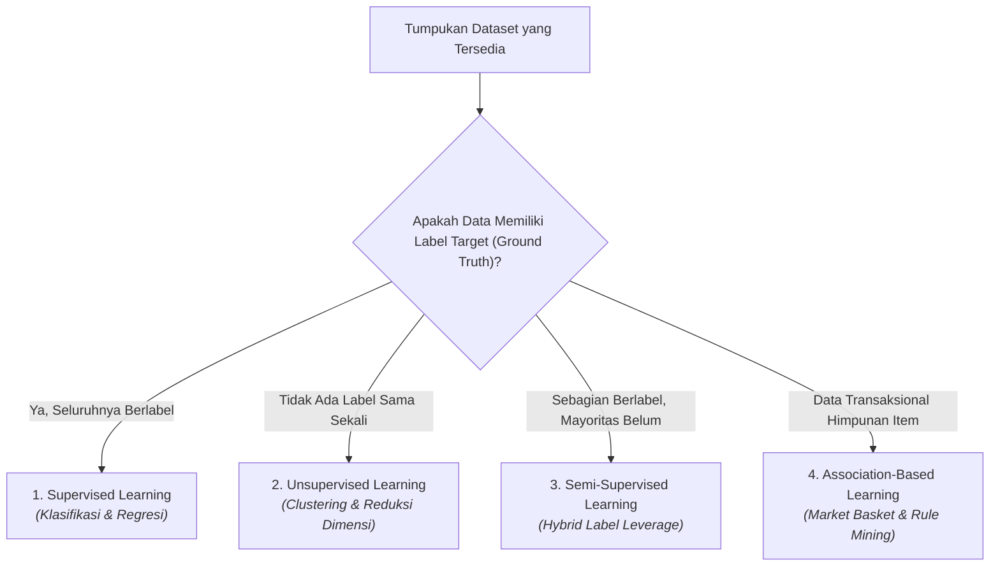
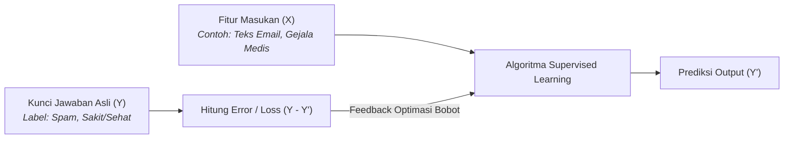
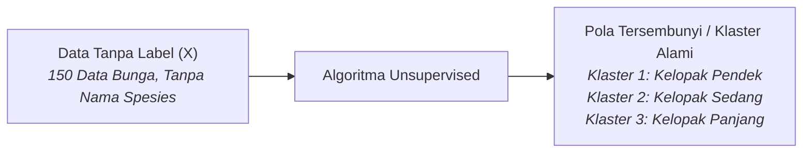
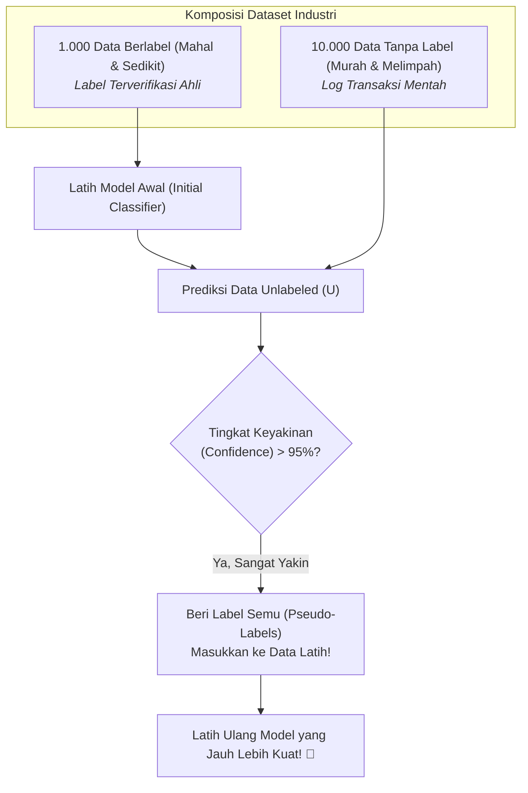
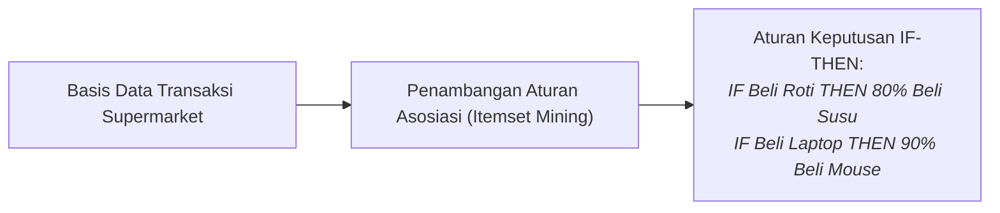
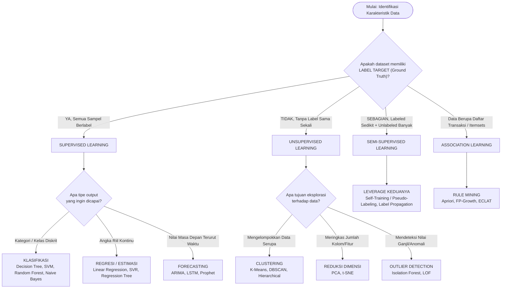

# 3. Kategorisasi Algoritma dan Paradigma Pembelajaran Data Mining

Navigasi: Modul Sebelumnya: [[02_Memahami_Data_dan_Eksplorasi_Statistik]] | [[Konsep_Data_Mining]] | Modul Berikutnya: [[04_Data_Preprocessing_Pembersihan_dan_Integrasi]]

---

## 3.1. Mengapa Mengkategorisasi Berdasarkan Ketersediaan Label?

Dalam implementasi praktis data science dan data mining, keputusan pemilihan algoritma tidak dimulai dari rumus matematika yang rumit, melainkan dari pertanyaan mendasar: **"Data seperti apa yang kita miliki saat ini?"**

### 💰 Realita Industri: Biaya Anotasi Data
- **Data Mentah (*Unlabeled*) Sangat Murah & Melimpah**: Log klik website, histori transaksi perbankan, rekaman sensor IoT, rekaman rontgen faskes.
- **Data Berlabel (*Labeled Ground Truth*) Sangat Mahal & Terbatas**: Memerlukan dokter radiologi untuk melabeli citra TBC, analis forensik untuk memverifikasi transaksi penipuan (*fraud*), atau tim kurasi teks manual.
- Oleh karena itu, memahami **4 paradigma pembelajaran** ini sangat krusial agar kita tidak salah menerapkan teknik.

---

## 3.2. 1. Supervised Learning (Pembelajaran Terbimbing) 👨‍🏫

**Prinsip Dasar**: Model belajar layaknya seorang murid yang didampingi oleh **"Guru"**. Guru memberikan soal sekaligus kunci jawaban (*ground truth labels*). Model memprediksi jawaban, mengukur seberapa jauh kesalahannya dari kunci jawaban, lalu memperbaiki dirinya.

### 🎓 Analogi Dunia Nyata:
> Kamu sedang latihan pengucapan (*pronunciation*) bahasa Inggris bersama guru penutur asli (*native speaker*).
> - **Guru**: *"Pengucapan kata ini yang benar adalah X!"*
> - **Kamu**: *"Oh, lidah saya tadi salah, harusnya seperti X!"*
> $\rightarrow$ Terdapat umpan balik (*feedback*) langsung karena jawaban yang benar sudah diketahui secara pasti.

### 📌 Karakteristik Utama:
- ✅ Data memiliki **LABEL TARGET** ($Y$) yang jelas untuk setiap sampel ($X$).
- ✅ Pemetaan fungsi input ke output bersifat terarah: $f(X) \rightarrow Y$.
- ✅ Akurasi model dapat diuji secara objektif dengan membandingkan prediksi terhadap label asli data uji (*Test Set*).

### 🛠️ Cabang & Algoritma Utama:
1. **Klasifikasi (*Classification*)**:
   - **Tipe Target**: Kategori / Nilai Diskrit (*Nominal / Ordinal*).
   - **Algoritma**: Decision Tree (ID3, C4.5, CART), Logistic Regression, Support Vector Machine (SVM), Random Forest, Naive Bayes, k-Nearest Neighbors (k-NN).
   - **Contoh Use Case**: Deteksi email Spam vs Non-Spam, diagnosis penyakit (Kanker / Jinak / Sehat), penilaian kelayakan kredit (Lancar / Macet).
2. **Regresi / Estimasi (*Regression*)**:
   - **Tipe Target**: Nilai Numerik Kontinu (*Float / Integer*).
   - **Algoritma**: Linear Regression, Polynomial Regression, Ridge/Lasso, Support Vector Regression (SVR), Regression Tree (CART), Gradient Boosting Regressor.
   - **Contoh Use Case**: Prediksi harga rumah berdasarkan luas tanah, estimasi suhu lingkungan, prediksi lama waktu rawat inap pasien.
3. **Forecasting (Peramalan Deret Waktu)**:
   - **Tipe Target**: Nilai kontinu masa depan berdasarkan urutan waktu historis.
   - **Algoritma**: ARIMA, SARIMA, Prophet, LSTM/GRU.

---

## 3.3. 2. Unsupervised Learning (Pembelajaran Tak Terbimbing) 🚶‍♂️

**Prinsip Dasar**: Model belajar **tanpa guru** dan **tanpa kunci jawaban**. Model dibiarkan mengeksplorasi data mentah secara mandiri untuk menemukan struktur intrinsik, keteraturan, kelompok alami, atau representasi yang lebih ringkas.

### 🧸 Analogi Dunia Nyata:
> Kamu memasuki ruangan gelap yang penuh dengan ratusan boneka berserakan. Tidak ada label nama atau petunjuk milik siapa boneka-boneka tersebut.
> - **Tindakanmu**: *"Baiklah, karena tidak ada petunjuk, aku akan mengelompokkan boneka ini berdasarkan ukuran fisiknya: kecil, sedang, dan besar."*
> $\rightarrow$ Kamu menemukan sendiri struktur kelompok (*clustering*) berdasarkan kemiripan atribut fisik tanpa ada yang mengajari benar atau salah.

### 📌 Karakteristik Utama:
- ❌ Data **TIDAK MEMILIKI LABEL** target ($Y = \emptyset$). Hanya ada himpunan fitur masukan ($X$).
- ❌ Model bertugas mengekstrak pola (*pattern discovery*), bukan memprediksi jawaban.
- ❌ Evaluasi performa lebih menantang (*tidak ada metrik akurasi mutlak*), melainkan menggunakan metrik homogenitas internal (misal: *Silhouette Score*, *Inertia/WCSS*).

### 🛠️ Cabang & Algoritma Utama:
1. **Klusterisasi (*Clustering*)**:
   - Mengelompokkan objek serupa ke dalam kelompok (*cluster*) yang sama, dan memisahkan objek yang berbeda ke kelompok lain.
   - **Algoritma**: K-Means, K-Medoids (PAM), Hierarchical Agglomerative Clustering (Dendrogram), DBSCAN (Density-Based).
   - **Contoh Use Case**: Segmentasi profil belanja nasabah (*Customer Segmentation*), zonasi tingkat kerawanan gizi wilayah.
2. **Reduksi Dimensi (*Dimensionality Reduction*)**:
   - Memadatkan data bervolume fitur tinggi (misal 100 kolom) menjadi fitur esensial (misal 5 kolom) tanpa kehilangan variasi informasi utama.
   - **Algoritma**: Principal Component Analysis (PCA), t-SNE, UMAP.
   - **Contoh Use Case**: Kompresi data gambar, visualisasi data multidimensi ke dalam grafik 2D.
3. **Deteksi Anomali / Outlier Unsupervised**:
   - Mengidentifikasi titik data ganjil yang tidak mengikuti pola kelompok mayoritas.
   - **Algoritma**: Isolation Forest, Local Outlier Factor (LOF).

---

## 3.4. 3. Semi-Supervised Learning (Pembelajaran Semi-Terbimbing) 🎯

**Prinsip Dasar**: Paradigma hibrida (*hybrid*) yang memanfaatkan **sejumlah kecil data berlabel ($D_L$)** dikombinasikan dengan **sejumlah besar data tanpa label ($D_U$)** untuk melatih model dengan performa tinggi tanpa biaya anotasi yang mahal.

### 📝 Analogi Dunia Nyata:
> Seorang guru memberikan $100$ lembar soal latihan kepada murid.
> Namun, guru hanya menyertakan kunci jawaban untuk $20$ soal pertama, sedangkan $80$ soal sisanya dibiarkan tanpa kunci jawaban.
> - **Instruksi Guru**: *"Pahami prinsip dasar penyelesaian dari 20 soal yang ada kuncinya, lalu gunakan pemahaman logikamu untuk memecahkan 80 soal sisanya!"*
> $\rightarrow$ Menggunakan informasi parsial untuk menyimpulkan (*infer*) pola pada data yang belum berlabel.

### 📌 Mengapa Semi-Supervised Begitu Populer di Industri?
Bayangkan Anda memiliki $11.000$ email:
- **$1.000$ email berlabel**: Sudah diverifikasi manual oleh tim kepatuhan (*Spam / Not Spam*).
- **$10.000$ email tanpa label**: Menumpuk di server karena tim tidak sanggup memeriksa satu per satu.
- **Pilihan Pendekatan**:
  - *Pure Supervised*: Hanya menggunakan $1.000$ email $\rightarrow$ Membuang $10.000$ data berharga (*data waste*).
  - *Pure Unsupervised*: Mengabaikan $1.000$ email berlabel $\rightarrow$ Tidak memanfaatkan pengetahuan pakar.
  - *Semi-Supervised*: **Memanfaatkan keduanya secara optimal!**

### 🛠️ Teknik & Algoritma Populer:
1. **Self-Training (Pseudo-Labeling)**: Model supervised dilatih pada data berlabel, kemudian memprediksi data unlabeled. Sampel dengan probabilitas tertinggi diberi label semu (*pseudo-labels*) dan dimasukkan kembali ke set data latih.
2. **Co-Training**: Dua model berbeda dilatih pada subset fitur yang berbeda, lalu saling mengecek dan melabeli data tanpa label rekannya.
3. **Label Propagation & Label Spreading**: Algoritma berbasis graf (*graph-based*) yang mengalirkan label dari simpul yang berlabel ke simpul terdekat yang belum berlabel.
4. **Semi-Supervised SVM ($S^3\text{VM}$)**: Mencari bidang pembatas (*hyperplane*) yang memaksimalkan margin pemisah baik pada data berlabel maupun data tanpa label.

---

## 3.5. 4. Association-Based Learning (Aturan Asosiasi) 🔗

**Prinsip Dasar**: Pendekatan yang berfokus bukan untuk memprediksi nilai target $Y$ ataupun membuat klaster objek, melainkan untuk **menemukan keteraturan hubungan probabilitas (*co-occurrence rules*) antar item** dalam transaksi multi-item.

### 🛒 Analogi Dunia Nyata:
> Anda mengamati kebiasaan belanja pengunjung di kasir supermarket:
> - Pengunjung yang meletakkan **Roti Tawar** di keranjang belanja, dalam $8$ dari $10$ kasus ($80\%$) juga mengambil botol **Susu Cair**.
> - Pengunjung yang membeli **Laptop Baru**, dalam $9$ dari $10$ kasus ($90\%$) juga membeli **Mouse Komputer**.
> $\rightarrow$ Menghasilkan aturan asosiasi: $\text{Roti} \rightarrow \text{Susu}$ dan $\text{Laptop} \rightarrow \text{Mouse}$.

### 📌 Karakteristik Utama:
- 📊 Beroperasi pada struktur data **Transaksi Himpunan Item (*Itemsets*)**, bukan matriks fitur-target konvensional.
- 📜 Luaran (*output*) berupa aturan implikasi berbentuk **`IF (Antecedent) THEN (Consequent)`** ($X \rightarrow Y$).
- 📐 Dievaluasi menggunakan tiga metrik probabilitas:
  1. **Support**: Seberapa sering kombinasi item muncul di seluruh transaksi.
  2. **Confidence**: Tingkat kepastian item $Y$ dibeli jika item $X$ dibeli.
  3. **Lift**: Seberapa kuat asosiasi tersebut dibandingkan jika kedua item terjadi secara kebetulan/independen ($\text{Lift} > 1$ = korelasi positif kuat).

### 🛠️ Algoritma & Penerapan Utama:
- **Algoritma**: **Apriori**, **FP-Growth** (*Frequent Pattern Growth*), **ECLAT** (*Equivalence Class Clustering and Transformation*).
- **Penerapan Nyata**:
  - *Market Basket Analysis* & Penataan Tata Letak Rak Toko Fisik.
  - Sistem Rekomendasi E-Commerce (*"Pelanggan yang membeli produk ini juga membeli..."*).
  - Penjualan Silang (*Cross-Selling*) dan Paket Bundling Produk Promo.

---

## 3.6. Matriks Perbandingan Komprehensif 4 Paradigma

| Kriteria Pembanding | Supervised Learning 👨‍🏫 | Unsupervised Learning 🚶‍♂️ | Semi-Supervised Learning 🎯 | Association-Based Learning 🔗 |
| :--- | :--- | :--- | :--- | :--- |
| **Ketersediaan Label** | ✅ Lengkap 100% | ❌ Tidak Ada Sama Sekali | 🟢 Parsial (Sebagian Kecil Berlabel) | ⚠️ Berbasis Item Transaksi |
| **Bentuk Input Data** | Matriks Fitur ($X$) + Target ($Y$) | Matriks Fitur ($X$) saja | Campuran ($X_L, Y_L$) dan ($X_U$) | Keranjang Belanja (*Transaction Lists*) |
| **Format Luaran** | Nilai Diskrit atau Angka Kontinu | Label Klaster (*ID Group*) / Komponen | Prediksi Kelas / Label Lengkap | Aturan Atribut (*IF-THEN Rules*) |
| **Tujuan Utama** | **Memprediksi** (*Predict*) | **Menemukan Pola** (*Discover Patterns*) | **Meningkatkan Prediksi** dengan data murah | **Menemukan Keterkaitan** (*Discover Rules*) |
| **Kemudahan Validasi**| Sangat Mudah (Ground truth jelas) | Sulit (Subjektif / Domain Expert) | Cukup Mudah (Validasi di Data Labeled) | Mudah (Berdasarkan Nilai Lift & Support) |
| **Algoritma Populer** | Decision Tree, SVM, Linear Reg, k-NN | K-Means, DBSCAN, PCA, Hierarchical | Pseudo-Labeling, S3VM, Label Propagation | Apriori, FP-Growth, ECLAT |
| **Contoh Kasus** | Deteksi Penipuan Kredit, Filter Spam | Segmentasi Profil Pasar Pelanggan | Klasifikasi Dokumen Teks Skala Besar | Rekomendasi Belanja Bundling E-Commerce |

---

## 3.7. Diagram Alur Panduan Memilih Algoritma

Gunakan diagram pohon keputusan berikut untuk menentukan algoritma yang paling tepat untuk proyek data mining Anda:

---

## 3.8. Analisis Skenario Dunia Nyata

### Skenario 1: Deteksi Email Spam
- **Data**: $10.000$ email. $1.000$ email sudah diberi label oleh pakar, $9.000$ email mentah belum dilabeli.
- **Tinjauan Pendekatan**:
  - *Pure Supervised*: Hanya melatih model dengan $1.000$ email $\rightarrow$ Membuang $90\%$ data yang ada.
  - *Unsupervised*: Mengelompokkan kata tanpa label $\rightarrow$ Sulit memastikan kelompok mana yang merupakan penipuan jahat.
  - *Semi-Supervised*: **Pilihan Terbaik!** Latih classifier awal pada $1.000$ email, inferensi $9.000$ sisanya, lalu ambil yang memiliki confidence $>95\%$ untuk memperkuat model.

### Skenario 2: Segmentasi Pelanggan E-Commerce
- **Data**: Riwayat frekuensi belanja dan rata-rata pengeluaran $50.000$ pelanggan (tanpa label kategori VIP/Reguler).
- **Tinjauan Pendekatan**:
  - *Unsupervised (K-Means)*: Mengelompokkan pelanggan menjadi $4$ persona segmen: *Sultan*, *Pemburu Diskon*, *Pelanggan Baru*, dan *Pelanggan Pasif*.
  - *Association (Apriori)*: Melanjutkan analisis pada keranjang belanja segmen *Pemburu Diskon* untuk mengetahui produk apa saja yang sering diborong bersamaan.

### Skenario 3: Prediksi Harga Rumah
- **Data**: $5.000$ rumah dengan spesifikasi luas tanah, jumlah kamar, lokasi, dan **harga jual riil**.
- **Tinjauan Pendekatan**:
  - *Supervised Regression*: Model seperti *Random Forest Regressor* atau *Multiple Linear Regression* sangat tepat karena label target berupa angka numerik kontinu sudah tersedia lengkap.

---

## 3.9. Checkpoint Penguasaan Materi

Sebelum melanjutkan ke modul berikutnya, pastikan Anda telah memahami:
1. [x] **Perbedaan Supervised vs Unsupervised**: Terletak pada ketersediaan **label target** (*jawaban terverifikasi*).
2. [x] **Kapan Semi-Supervised Digunakan**: Ketika data berlabel sedikit karena mahal/sulit didapat, sedangkan data tanpa label sangat melimpah.
3. [x] **Fokus Association-Based Learning**: Menemukan **aturan keterkaitan item** (*IF-THEN rules*), bukan memprediksi kelas baris data.
4. [x] **Pemetaan 5 Peran Data Mining ke Paradigma**:
   - Klasifikasi & Regresi/Estimasi $\rightarrow$ **Supervised**
   - Forecasting $\rightarrow$ **Supervised (Time-Series)**
   - Klusterisasi $\rightarrow$ **Unsupervised**
   - Aturan Asosiasi $\rightarrow$ **Association-Based**

---

Navigasi: Modul Sebelumnya: [[02_Memahami_Data_dan_Eksplorasi_Statistik]] | [[Konsep_Data_Mining]] | Modul Berikutnya: [[04_Data_Preprocessing_Pembersihan_dan_Integrasi]]
