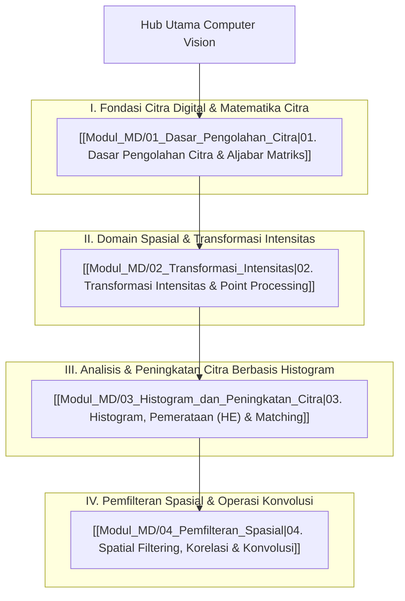

# Panduan Komprehensif Computer Vision (Computer Vision & Digital Image Processing Hub)

Dokumen ini merupakan berkas utama (*Knowledge Hub*) yang memetakan seluruh modul pembelajaran **Computer Vision (Pengolahan Citra Digital)** pada program studi Informatika UNS (Ganjil 2026/2027). Seluruh materi disusun secara bertahap, matematis, dan sistematis berdasarkan catatan perkuliahan dan literatur standar industri, serta dikorelasikan dengan [[../../Riset_Edge_AI_3T/edge-ai-untuk-3t|Riset Edge AI 3T]], [[../09_Kecerdasan_Buatan/Konsep_Kecerdasan_Buatan|Kecerdasan Buatan (AI & Deep Learning)]], [[../02_Struktur_Data_dan_Algoritma/Konsep_Struktur_Data_dan_Algoritma|Struktur Data & Algoritma]], dan [[../01_Konsep_Pemrograman/Konsep_Pemrograman|Konsep Pemrograman]].

> [!NOTE]
> Seluruh modul pada hub ini saling terhubung secara dua arah (*bidirectional links*) menggunakan Obsidian Wiki-Links `[[...]]`. Berkas asli materi slide kuliah tersimpan rapi di dalam subfolder `Materi_Asli/`. Seluruh berkas dari `vault-teman` **dikecualikan 100%**.

---

## 📋 Informasi Mata Kuliah & Referensi Utama

- **Program Studi**: S1 Informatika – Universitas Sebelas Maret (UNS)
- **Mata Kuliah**: Pengolahan Citra Digital / Computer Vision (Semester Ganjil 2026/2027)
- **Komponen Evaluasi**:
  - 🛠️ **Final Project**: 50%
  - 📝 **Ujian Akhir Semester (UAS)**: 50%
- **Buku Acuan / Referensi Otoritatif**:
  1. **Gonzalez, R.C. & Woods, R.E. (2018)**. *Digital Image Processing*. 4th Edition, Pearson Education, New York. *(Referensi utama bidang pengolahan citra digital sedunia)*.
  2. **Géron, Aurélien (2019)**. *Hands-on Machine Learning with Scikit-Learn, Keras and TensorFlow: Concepts, Tools, and Techniques to Build Intelligent Systems*. 2nd Edition, O'Reilly Media.
  3. **Anton, Howard & Rorres, Chris (2019)**. *Elementary Linear Algebra: Applications Version*. 12th Edition, Wiley. *(Fondasi aljabar linier matriks citra)*.
  4. **Munir, Rinaldi (2022–2025)**. *Diktat & Slide Kuliah IF4073 Pemrosesan Citra Digital*. STEI Institut Teknologi Bandung (ITB).

---

## 🗺️ Peta Pembelajaran Computer Vision (Mindmap)

---

## 📚 Daftar Lengkap Modul Pembelajaran Computer Vision

### Part I: Fondasi Citra Digital & Matematika Citra
1. **[[Modul_MD/01_Dasar_Pengolahan_Citra|01. Dasar Pengolahan Citra & Aljabar Matriks]]**:
   - **Konsep Citra 2D**: Fungsi intensitas spasial $f(x, y)$, representasi matriks numerik berukuran $M \times N$, dan titik pusat citra (*center coordinates*).
   - **Akuisisi Citra**: Proses penginderaan sensor fisik, digitalisasi citra kontinu ke diskrit.
   - **Sampling vs Kuantisasi**: Sampling (digitalisasi koordinat spasial $x, y$) vs Kuantisasi (digitalisasi amplitudo intensitas keabuan / *gray-level*).
   - **Topologi Ketetanggaan Piksel**: 4-neighbors ($N_4$), Diagonal neighbors ($N_D$), dan 8-neighbors ($N_8$).
   - **Linearitas Operator**: Pengujian formal operator linier vs non-linier ($\Sigma$ linier vs $\max$ non-linier).
   - **Aritmatika & Logika Citra**: Penjumlahan citra (*image averaging* pereduksi derau), pengurangan (*image subtraction* pendeteksi perbedaan), serta penanganan *overflow* ($>255$) dan *underflow* ($<0$).
   - **Metrik Jarak Piksel**: Syarat fungsi metrik, Euclidean Distance ($D_e$), City-block / Manhattan Distance ($D_4$), dan Chessboard Distance ($D_8$) beserta kontur jarak dan latihan soal.
   - **Aljabar Linier untuk Citra**: Transpose, Minor, Kofaktor, Matriks Adjoin, Determinan $2 \times 2$ & $3 \times 3$, dan Invers Matriks (metode adjoin & OBE Gauss-Jordan).
   - **Transformasi Geometri (Affine Transformation)**: Matriks koordinat homogen 2D, Translasi, Skalasi (zooming out/in), Shearing, Rotasi (berlawanan vs searah jarum jam), serta pemetaan balik (*backward mapping*) invers matriks.
   - **Representasi Vektor Citra**: Vektor piksel RGB $z = [R, G, B]^T$, piksel multispektral $n$-dimensi, Dot product, Cross product, dan Euclidean Vector Norm $\|z\|$.

---

### Part II: Domain Spasial & Transformasi Intensitas
2. **[[Modul_MD/02_Transformasi_Intensitas|02. Transformasi Intensitas & Point Processing]]**:
   - **Prinsip Domain Spasial**: Bidang piksel citra langsung (*image plane*) dengan formulasi pemetaan $g(x, y) = T[f(x, y)]$.
   - **Point Processing ($1 \times 1$ Neighborhood)**: Pemetaan tunggal intensitas $s = T(r)$.
   - **Transformasi Citra Negatif**: $s = L - 1 - r$, analisis kegunaan deteksi lesi pada mammogram digital, dan latihan soal matriks keabuan.
   - **Transformasi Logaritma & Invers Log**: $s = c \log(1 + r)$, kompresi rentang dinamis (*dynamic range compression*), dan pemetaan spektrum Fourier.
   - **Transformasi Power-Law (Gamma Correction)**: $s = c \cdot r^\gamma$, perbandingan karakteristik kurva $\gamma < 1$ vs $\gamma > 1$, dan standarisasi gamma display monitor.
   - **Piecewise Linear Transformation**:
     - *Contrast Stretching*: Peregangan rentang kontras rendah $[r_{\min}, r_{\max}] \rightarrow [0, L-1]$ dan varian batas ekstrem *Thresholding*.
     - *Intensity-Level Slicing*: Penyorotan rentang keabuan tertentu $[A, B]$ dengan atau tanpa mempertahankan latar belakang.
     - *Bit-Plane Slicing*: Dekomposisi citra 8-bit menjadi 8 bidang bit biner, pemisahan informasi visual (MSB) vs derau acak (LSB), serta aplikasi kompresi dan *watermarking*.
     - *Rekonstruksi Citra Bit-Plane*: Perhitungan manual kombinasi bidang bit terpenting dengan pengali bobot $2^{n-1}$.

---

### Part III: Analisis & Peningkatan Citra Berbasis Histogram
3. **[[Modul_MD/03_Histogram_dan_Peningkatan_Citra|03. Histogram, Pemerataan (HE) & Matching]]**:
   - **Karakteristik Histogram**: Distribusi frekuensi kemunculan intensitas keabuan pada citra gelap, terang, kontras rendah, dan kontras tinggi.
   - **Histogram Grayscale vs RGB**: Analisis histogram kanal tunggal 8-bit vs multi-kanal 24-bit.
   - **Normalisasi Histogram**: Probabilitas kemunculan intensitas $p_r(r_k) = \frac{n_k}{M \cdot N}$ dengan total probabilitas bernilai 1.
   - **Histogram Equalization (HE)**:
     - Formulasi fungsi transformasi kumulatif (CDF): $s_k = (L - 1) \sum_{j=0}^k p_r(r_j)$.
     - Pembulatan ke tingkat diskrit terdekat (*nearest integer*).
     - Studi kasus komprehensif langkah-demi-langkah perhitungan tabel citra 3-bit ukuran $64 \times 64$ piksel.
     - Keterbatasan HE global: Risiko *over-enhancement* dan amplifikasi noise pada citra latar belakang gelap (citra kawah bulan Phobos).
   - **Histogram Matching (Specification)**:
     - Mengubah distribusi intensitas citra agar presisi mengikuti bentuk histogram yang dispesifikasikan pengguna.
     - Algoritma 4 langkah: Penentuan $s_k$, perhitungan kumulatif target $G(z_q)$, pencocokan nilai terdekat $G(z_q) \approx s_k$, dan pemetaan akhir intensitas.
     - Studi kasus numerik detail berdasarkan data slide perkuliahan.
   - **Local Histogram Enhancement**: Peningkatan kualitas kontras berbasis jendela ketetanggaan bergeser (*moving window* $3 \times 3$) untuk menonjolkan detail tersembunyi.

---

### Part IV: Pemfilteran Spasial & Operasi Konvolusi
4. **[[Modul_MD/04_Pemfilteran_Spasial|04. Spatial Filtering, Korelasi & Konvolusi]]**:
   - **Dasar-dasar Pemfilteran Spasial**: Modifikasi piksel berdasarkan respons nilai piksel tetangga (*neighborhood operation*), klasifikasi filter linier vs non-linier.
   - **Mekanisme Filter Spasial Linier**: Penjumlahan hasil kali (*sum of products*) antara citra $f$ dan mask/kernel $w$ berukuran ganjil $m \times n$ ($m = 2a+1, n = 2b+1$).
   - **Korelasi Spasial ($w \star f$) vs Konvolusi Spasial ($w * f$)**: Perbedaan rotasi kernel $180^\circ$, perlakuan batas citra, padding nol (*zero-padding*), perhitungan numerik langkah-demi-langkah kernel $3 \times 3$, dimensi korelasi penuh ($S_v \times S_h$), dan terminologi konvolusi pada framework Deep Learning modern.
   - **Separable Filter Kernels**: Dekomposisi kernel matriks 2D menjadi perkalian luar (*outer product*) dua vektor 1D ($w = v \cdot w^T$) dan penghematan kompleksitas komputasi dari $\mathcal{O}(m \cdot n)$ ke $\mathcal{O}(m + n)$.
   - **Smoothing (Lowpass) Filters**:
     - *Box Filter (Averaging)*: Kernel seragam terstandarisasi $\frac{1}{m \cdot n}$, trade-off antara reduksi derau vs pengaburan tepi (*blurring*).
     - *Gaussian Filter*: Model kurva lonceng Gauss 2D $G(s, t) = K e^{-\frac{s^2+t^2}{2\sigma^2}}$, sifat terpisahkan (*separable*), dan keunggulan visual dibanding box filter (bebas bias arah tegak lurus).
   - **Order-Statistic (Non-linear) Filters**:
     - *Median Filter*: Perangkingan piksel lokal pengganti nilai tengah, keunggulan superior menyingkirkan derau impuls (*salt-and-pepper noise*) tanpa mengorbankan ketajaman tepi.
     - *Min Filter & Max Filter*: Penurunan dan kenaikan intensitas ekstrem lokal.
     - Solusi lengkap latihan soal manual perhitungan filter median, min, dan max pada matriks $7 \times 7$ dengan zero-padding.

---

## 🔗 Hubungan Antar Berkas Catatan Utama & Riset

- 🔗 **[[../../Riset_Edge_AI_3T/edge-ai-untuk-3t|Riset Edge AI 3T]]**: 
  - *Preprocessing Citra Medis*: Transformasi kontras, pemerataan histogram lokal (CLAHE), dan reduksi derau (Gaussian/Median filter) pada citra rontgen dada (TBC/Pneumonia) dan fundus retina sebelum diproses oleh arsitektur AI terkuantisasi (int8).
  - *Efisiensi Komputasi*: Pemanfaatan kernel terpisahkan (*separable filters*) dan representasi bit-plane untuk mempercepat inferensi pada komputer faskes dengan sumber daya terbatas.
- 🔗 **[[../09_Kecerdasan_Buatan/Konsep_Kecerdasan_Buatan|Kecerdasan Buatan (AI)]]**:
  - Konsep konvolusi spasial domain citra menjadi dasar utama lapisan konvolusi (*Convolutional Layer*) pada Convolutional Neural Networks (CNN) untuk ekstraksi fitur visual otomatis.
- 🔗 **[[../02_Struktur_Data_dan_Algoritma/Konsep_Struktur_Data_dan_Algoritma|Struktur Data & Algoritma]]**:
  - Representasi data citra sebagai array 2 dimensi (grayscale) dan 3 dimensi (RGB/multispektral).
  - Algoritma pengurutan (*sorting algorithms*) efisien untuk menghitung median pada order-statistic filtering.
- 🔗 **[[../01_Konsep_Pemrograman/Konsep_Pemrograman|Konsep Pemrograman]]**:
  - Implementasi komputasi numerik matriks cepat menggunakan Python `numpy`, manipulasi array `scipy`, dan pustaka Computer Vision industri `opencv-python` (`cv2`).

---

*Hub catatan ini disusun secara terintegrasi dan dapat diakses menggunakan navigasi tautan `[[...]]` pada setiap modul.*
