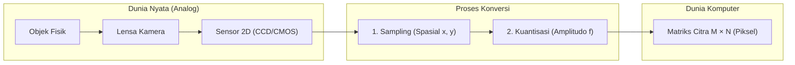
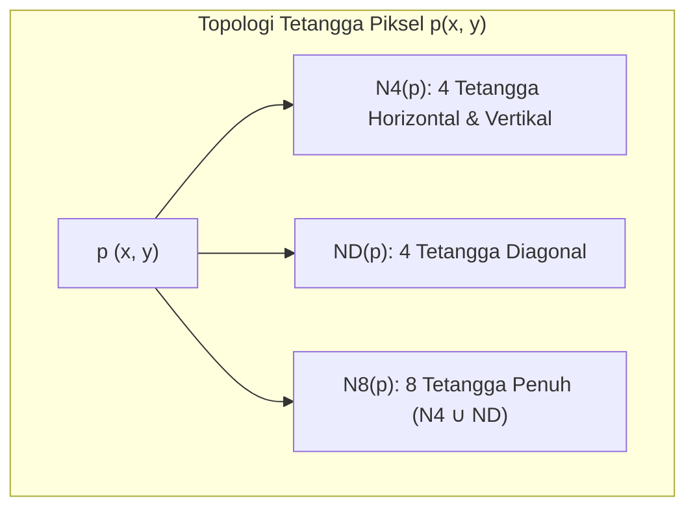
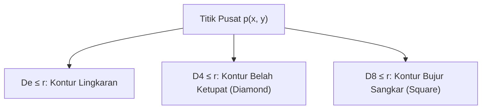

# 1. Dasar Pengolahan Citra dan Fondasi Matematika Citra

Navigasi: [[../Konsep_Computer_Vision|Hub Computer Vision]] | Modul Berikutnya: [[02_Transformasi_Intensitas]]

---

> *"One picture is worth more than ten thousand words."*  
> — Pepatah kuno (*dikutip dari Gonzalez & Woods, Digital Image Processing*)

Pengolahan Citra Digital (*Digital Image Processing*) adalah pemrosesan citra dua dimensi menggunakan komputer digital untuk menghasilkan citra dengan kualitas lebih baik atau mengekstraksi informasi berharga darinya. Dokumen ini membahas konsep fundamental pembentukan citra digital, topologi piksel, operasi aritmatika, serta landasan aljabar linier dan transformasi geometri.

---

## 1.1. Representasi Citra Digital

Secara matematis, sebuah citra kontinu dimodelkan sebagai fungsi intensitas cahaya dua dimensi:

$$f(x, y)$$

di mana:
- $x$ dan $y$ adalah koordinat spasial pada bidang 2D (*image plane*).
- Nilai $f(x, y)$ pada koordinat $(x, y)$ menyatakan **intensitas**, **kecerahan** (*brightness*), atau **tingkat keabuan** (*gray level*) pada titik tersebut.



### Struktur Matriks Citra
Pada komputer digital, citra berukuran $M$ baris (*rows*) dan $N$ kolom (*columns*) direpresentasikan sebagai matriks numerik berukuran $M \times N$:

$$f(x, y) = \begin{bmatrix}
f(0, 0) & f(0, 1) & f(0, 2) & \cdots & f(0, N-1) \\
f(1, 0) & f(1, 1) & f(1, 2) & \cdots & f(1, N-1) \\
f(2, 0) & f(2, 1) & f(2, 2) & \cdots & f(2, N-1) \\
\vdots & \vdots & \vdots & \ddots & \vdots \\
f(M-1, 0) & f(M-1, 1) & f(M-1, 2) & \cdots & f(M-1, N-1)
\end{bmatrix}$$

Setiap elemen individual di dalam matriks tersebut dinamakan **piksel** (*picture element* / *pel*).

> [!NOTE]
> - Pada sistem koordinat citra standar: baris berjalan dari $0$ hingga $M-1$ (sumbu $x$ ke bawah), dan kolom berjalan dari $0$ hingga $N-1$ (sumbu $y$ ke kanan).
> - Koordinat titik pusat (*center*) dari citra berukuran $M \times N$ dengan titik awal $(0, 0)$ dihitung menggunakan:
>   $$x_c = \left\lfloor \frac{M - 1}{2} \right\rfloor, \quad y_c = \left\lfloor \frac{N - 1}{2} \right\rfloor$$

### Rentang Dinamis Intensitas (Bit Depth)
- Rentang intensitas citra diskrit biasanya dinormalisasi ke interval $[0, 1]$ atau direpresentasikan dalam bilangan bulat tak bertanda (*unsigned integer*):
  $$[0, L - 1]$$
  di mana $L = 2^k$ ($k$ adalah kedalaman bit / *bit depth*).
- Untuk citra **8-bit** grayscale ($k = 8$):
  $$L = 2^8 = 256 \implies \text{rentang intensitas } [0, 255]$$
  - Nilai `0`: Hitam mutlak (*black*).
  - Nilai `255`: Putih sempurna (*white*).
  - Nilai di antara `1` s.d. `254`: Derajat keabuan (*shades of gray*).

---

## 1.2. Sampling dan Kuantisasi Citra

Untuk mengonversi sinyal optik kontinu dari sensor fisik ke format biner komputer, diperlukan dua tahapan fundamental:

| Tahapan | Definisi | Objek yang Didiskritisasi | Dampak Resolusi |
| :--- | :--- | :--- | :--- |
| **Sampling** (*Pencuplikan*) | Mendigitalkan nilai koordinat spasial bidang citra. | Sumbu koordinat spasial $(x, y)$. | **Resolusi Spasial** (jumlah piksel, misal $1920 \times 1080$). Jika sampling terlalu rendah $\rightarrow$ muncul efek *pixelation* / tangga (*aliasing*). |
| **Kuantisasi** | Mendigitalkan nilai amplitudo intensitas energi cahaya. | Nilai amplitudo fungsi $f(x, y)$. | **Resolusi Intensitas / Gray-level** (kedalaman bit, misal 8-bit, 10-bit). Jika kuantisasi terlalu rendah $\rightarrow$ muncul batas kontur semu (*false contouring*). |

---

## 1.3. Hubungan Ketetanggaan Antar Piksel (Pixel Adjacency)

Misalkan sebuah piksel $p$ berada pada koordinat $(x, y)$. Hubungan spasial dengan piksel-piksel di sekitarnya dikelompokkan menjadi:



1. **4-Neighbors $N_4(p)$**:
   Empat tetangga terdekat yang tegak lurus horizontal dan vertikal:
   $$N_4(p) = \{(x+1, y), (x-1, y), (x, y+1), (x, y-1)\}$$

2. **Diagonal Neighbors $N_D(p)$**:
   Empat tetangga yang berada pada sudut miring (diagonal):
   $$N_D(p) = \{(x+1, y+1), (x+1, y-1), (x-1, y+1), (x-1, y-1)\}$$

3. **8-Neighbors $N_8(p)$**:
   Kombinasi lengkap tetangga horizontal, vertikal, dan diagonal:
   $$N_8(p) = N_4(p) \cup N_D(p)$$

---

## 1.4. Operasi Aritmatika dan Logika Citra

### 1. Operasi Aritmatika Dasar
Diberikan dua citra berukuran sama $f(x, y)$ dan $g(x, y)$:
- **Penjumlahan**: $s(x, y) = f(x, y) + g(x, y)$  
  *Aplikasi Utama*: **Image Averaging** untuk menghilangkan derau (*noise reduction*). Jika citra riil $f(x, y)$ terkontaminasi noise aditif acak $\eta(x, y)$ sehingga teramati $g_i(x, y) = f(x, y) + \eta_i(x, y)$, maka rata-rata dari $K$ citra tangkapan:
  $$\bar{g}(x, y) = \frac{1}{K} \sum_{i=1}^K g_i(x, y)$$
  akan mendekati citra asli tanpa derau karena nilai ekspektasi $E\{\eta\} = 0$.
- **Pengurangan**: $d(x, y) = f(x, y) - g(x, y)$  
  *Aplikasi Utama*: **Image Subtraction** untuk deteksi perbedaan visual, deteksi gerakan (*motion detection*), atau *mask mode radiography* (angiografi medis). Nilai piksel nol (hitam) menunjukkan tidak ada perbedaan antara kedua citra.
- **Perkalian & Pembagian**: $p(x, y) = f(x, y) \cdot g(x, y)$  
  *Aplikasi Utama*: Koreksi pencahayaan yang tidak merata (*shading correction*) dan *Region of Interest (ROI) masking*.

> [!WARNING]
> **Masalah Underflow dan Overflow pada Aritmatika Citra 8-bit**:
> Citra 8-bit hanya dapat menampung rentang intensitas $0 \le f(x, y) \le 255$.
> - **Underflow**: Terjadi saat hasil operasi bernilai negatif ($< 0$), misal $50 - 120 = -70$.
> - **Overflow**: Terjadi saat hasil operasi melebihi batas ($> 255$), misal $200 + 100 = 300$.
> 
> **Solusi Standar (Clamping / Saturation)**:
> $$f_{\text{clamped}}(x, y) = \max(0, \min(255, f(x, y)))$$
> - Nilai $< 0$ diubah menjadi $0$.
> - Nilai $> 255$ diubah menjadi $255$.

### 2. Operasi Logika (Citra Biner)
Operasi biner piksel-demi-piksel (*pixel-wise logical operations*) seperti **AND**, **OR**, dan **NOT** digunakan untuk operasi morfologi dan segmentasi citra menggunakan masker biner (*binary mask*).

---

## 1.5. Operator Linier vs Non-Linier

Sebuah operator citra $\mathcal{H}$ menerima masukan citra $f(x, y)$ dan menghasilkan citra luaran $g(x, y) = \mathcal{H}[f(x, y)]$.

### Definisi Linearitas:
Operator $\mathcal{H}$ dikatakan **Linier** jika dan hanya jika untuk sembarang konstanta skalar $a$ dan $b$ serta citra $f_1(x, y)$ dan $f_2(x, y)$ berlaku:

$$\mathcal{H}[a \cdot f_1(x, y) + b \cdot f_2(x, y)] = a \cdot \mathcal{H}[f_1(x, y)] + b \cdot \mathcal{H}[f_2(x, y)]$$

Jika persamaan di atas tidak terpenuhi, maka operator bersifat **Non-Linier**.

### Pembuktian Matematis:
1. **Sum Operator ($\Sigma$) adalah Operator Linier**:
   $$\Sigma[a f_1 + b f_2] = \sum (a f_1 + b f_2) = a \sum f_1 + b \sum f_2 = a \Sigma[f_1] + b \Sigma[f_2] \quad \text{(Terbukti Linier!)}$$

2. **Max Operator ($\max$) adalah Operator Non-Linier**:
   Ambil contoh penyangkal (*counterexample*):
   Misal $a = 1, b = -1$, serta citra:
   $$f_1 = \begin{bmatrix} 10 & 20 \\ 5 & 15 \end{bmatrix}, \quad f_2 = \begin{bmatrix} 2 & 30 \\ 1 & 10 \end{bmatrix}$$
   - **Ruas Kiri**:
     $$a f_1 + b f_2 = f_1 - f_2 = \begin{bmatrix} 8 & -10 \\ 4 & 5 \end{bmatrix} \implies \max(f_1 - f_2) = 8$$
   - **Ruas Kanan**:
     $$a \max(f_1) + b \max(f_2) = 1 \cdot (20) - 1 \cdot (30) = 20 - 30 = -10$$
   - **Kesimpulan**: Karena ruas kiri ($8$) $\neq$ ruas kanan ($-10$), maka $\max$ operator terbukti **Non-Linier**!

---

## 1.6. Pengukuran Jarak Antar Piksel (Distance Metrics)

Misalkan terdapat tiga piksel $p(x, y)$, $q(u, v)$, dan $s(w, z)$. Suatu fungsi $D$ disebut fungsi metrik jarak yang sah jika memenuhi 3 aksioma metrik:
1. **Non-negatif**: $D(p, q) \ge 0$, dan $D(p, q) = 0 \iff p = q$.
2. **Simetri**: $D(p, q) = D(q, p)$.
3. **Ketidaksamaan Segitiga (*Triangle Inequality*)**: $D(p, s) \le D(p, q) + D(q, s)$.

### Tiga Metrik Jarak Utama:

| Metrik Jarak | Formula Matematis | Karakteristik Kontur |
| :--- | :--- | :--- |
| **Euclidean Distance ($D_e$)** | $D_e(p, q) = \sqrt{(x - u)^2 + (y - v)^2}$ | Berbentuk lingkaran (*circular*). Mengukur garis lurus terpendek di ruang kontinu. |
| **City-Block / Manhattan Distance ($D_4$)** | $D_4(p, q) = \|x - u\| + \|y - v\|$ | Berbentuk belah ketupat (*diamond*). Hanya bergerak pada 4 arah mata angin (horizontal/vertikal). |
| **Chessboard Distance ($D_8$)** | $D_8(p, q) = \max(\|x - u\|, \|y - v\|)$ | Berbentuk bujur sangkar (*square*). Sesuai langkah bidak raja pada catur (bebas ke 8 arah tetangga). |



---

### ✍️ Pembahasan Latihan Soal Jarak Piksel (Slide 29)
**Soal**: Diberikan dua piksel $p(1, 3)$ dan $q(4, 7)$. Tentukan:
1. Euclidean distance ($D_e$)
2. $D_4$ distance (City-block)
3. $D_8$ distance (Chessboard)

**Penyelesaian**:
Diketahui: $x = 1, y = 3, u = 4, v = 7$.
Selisih koordinat:
$$|x - u| = |1 - 4| = |-3| = 3$$
$$|y - v| = |3 - 7| = |-4| = 4$$

1. **Euclidean Distance**:
   $$D_e(p, q) = \sqrt{3^2 + 4^2} = \sqrt{9 + 16} = \sqrt{25} = \mathbf{5.0}$$
2. **$D_4$ Distance**:
   $$D_4(p, q) = |x - u| + |y - v| = 3 + 4 = \mathbf{7}$$
3. **$D_8$ Distance**:
   $$D_8(p, q) = \max(|x - u|, |y - v|) = \max(3, 4) = \mathbf{4}$$

---

## 1.7. Fondasi Aljabar Linier Matriks untuk Citra

Pengolahan citra digital sangat bertumpu pada operasi matriks (*Elementary Linear Algebra*):

### 1. Elementwise Product vs Matrix Multiplication
- **Elementwise Product (Hadamard Product)**: Disimbolkan $\odot$ atau $\otimes$. Mengalikan setiap elemen pada indeks yang sama:
  $$(A \odot B)_{i, j} = A_{i, j} \cdot B_{i, j}$$
- **Matrix Multiplication**: Perkalian baris dengan kolom:
  $$(A \cdot B)_{i, j} = \sum_{k} A_{i, k} \cdot B_{k, j}$$

### 2. Minor, Kofaktor, dan Adjoin
Diberikan matriks bujur sangkar $A$:
- **Minor ($M_{ij}$)**: Determinan dari submatriks yang tersisa setelah baris ke-$i$ dan kolom ke-$j$ dihapus.
- **Kofaktor ($C_{ij}$)**:
  $$C_{ij} = (-1)^{i+j} M_{ij}$$
- **Matriks Adjoin ($\operatorname{adj}(A)$)**: Transpose dari matriks kofaktor $C$:
  $$\operatorname{adj}(A) = C^T$$

### 3. Determinan dan Invers Matriks
- Untuk matriks $2 \times 2$:
  $$A = \begin{bmatrix} a & b \\ c & d \end{bmatrix} \implies \det(A) = ad - bc, \quad A^{-1} = \frac{1}{\det(A)} \begin{bmatrix} d & -b \\ -c & a \end{bmatrix}$$
- Untuk matriks $3 \times 3$ (Metode Adjoin):
  $$A^{-1} = \frac{1}{\det(A)} \operatorname{adj}(A) \quad (\text{syarat } \det(A) \neq 0)$$
- Dapat juga diselesaikan menggunakan **Operasi Baris Elementer (OBE / Eliminasi Gauss-Jordan)** dengan mengaugmentasikan matriks $[A \mid I] \xrightarrow{\text{OBE}} [I \mid A^{-1}]$.

---

## 1.8. Transformasi Geometri (Affine Transformation)

Transformasi geometri mengubah hubungan spasial antar piksel pada citra.

### Representasi Koordinat Homogen 2D
Transformasi titik asal $(x, y)$ menjadi titik baru $(x', y')$ dinyatakan dalam bentuk matriks homogen $3 \times 3$:

$$\begin{bmatrix} x' \\ y' \\ 1 \end{bmatrix} = A \begin{bmatrix} x \\ y \\ 1 \end{bmatrix} = \begin{bmatrix} a_{11} & a_{12} & a_{13} \\ a_{21} & a_{22} & a_{23} \\ 0 & 0 & 1 \end{bmatrix} \begin{bmatrix} x \\ y \\ 1 \end{bmatrix}$$

### Matriks Transformasi Standar:
1. **Translasi (Pergeseran $t_x, t_y$)**:
   $$A_{\text{trans}} = \begin{bmatrix} 1 & 0 & t_x \\ 0 & 1 & t_y \\ 0 & 0 & 1 \end{bmatrix}$$
2. **Skalasi (Scaling $s_x, s_y$)**:
   $$A_{\text{scale}} = \begin{bmatrix} s_x & 0 & 0 \\ 0 & s_y & 0 \\ 0 & 0 & 1 \end{bmatrix}$$
3. **Rotasi Sudut $\theta$ Berlawanan Arah Jarum Jam (*Counter-Clockwise*)**:
   $$A_{\text{rot}} = \begin{bmatrix} \cos\theta & -\sin\theta & 0 \\ \sin\theta & \cos\theta & 0 \\ 0 & 0 & 1 \end{bmatrix}$$
4. **Rotasi Searah Jarum Jam (*Clockwise*, sudut $-\theta$)**:
   Karena $\cos(-\theta) = \cos\theta$ dan $\sin(-\theta) = -\sin\theta$:
   $$A_{\text{rot-cw}} = \begin{bmatrix} \cos\theta & \sin\theta & 0 \\ -\sin\theta & \cos\theta & 0 \\ 0 & 0 & 1 \end{bmatrix}$$
5. **Shearing (Pergeseran Miring)**:
   $$A_{\text{shear-x}} = \begin{bmatrix} 1 & s_h & 0 \\ 0 & 1 & 0 \\ 0 & 0 & 1 \end{bmatrix}, \quad A_{\text{shear-y}} = \begin{bmatrix} 1 & 0 & 0 \\ s_v & 1 & 0 \\ 0 & 0 & 1 \end{bmatrix}$$

---

### ✍️ Pembahasan Latihan Transformasi Geometri (Slide 51)
**Soal**: Diberikan piksel pada koordinat $(4, 6)$. Tentukan koordinat baru hasil transformasi jika dilakukan:
1. Flip horizontal
2. Flip vertikal
3. Rotasi $90^\circ$ searah jarum jam

**Penyelesaian**:
Vektor koordinat asal: $\mathbf{v} = \begin{bmatrix} 4 \\ 6 \\ 1 \end{bmatrix}$.

1. **Flip Horizontal** (Pencerminan terhadap sumbu Y):
   Matriks transformasi: $A = \begin{bmatrix} -1 & 0 & 0 \\ 0 & 1 & 0 \\ 0 & 0 & 1 \end{bmatrix}$
   $$\begin{bmatrix} x' \\ y' \\ 1 \end{bmatrix} = \begin{bmatrix} -1 & 0 & 0 \\ 0 & 1 & 0 \\ 0 & 0 & 1 \end{bmatrix} \begin{bmatrix} 4 \\ 6 \\ 1 \end{bmatrix} = \begin{bmatrix} -4 \\ 6 \\ 1 \end{bmatrix} \implies \mathbf{(-4, 6)}$$
   *(Catatan: Pada citra berukuran lebar $W$, flip horizontal internal bernilai $x' = W - 1 - x$)*.

2. **Flip Vertikal** (Pencerminan terhadap sumbu X):
   Matriks transformasi: $A = \begin{bmatrix} 1 & 0 & 0 \\ 0 & -1 & 0 \\ 0 & 0 & 1 \end{bmatrix}$
   $$\begin{bmatrix} x' \\ y' \\ 1 \end{bmatrix} = \begin{bmatrix} 1 & 0 & 0 \\ 0 & -1 & 0 \\ 0 & 0 & 1 \end{bmatrix} \begin{bmatrix} 4 \\ 6 \\ 1 \end{bmatrix} = \begin{bmatrix} 4 \\ -6 \\ 1 \end{bmatrix} \implies \mathbf{(4, -6)}$$

3. **Rotasi $90^\circ$ Searah Jarum Jam ($\theta = -90^\circ$ / $-\frac{\pi}{2}$)**:
   $\cos(-90^\circ) = 0$ dan $\sin(-90^\circ) = -1$:
   $$A = \begin{bmatrix} 0 & 1 & 0 \\ -1 & 0 & 0 \\ 0 & 0 & 1 \end{bmatrix}$$
   $$\begin{bmatrix} x' \\ y' \\ 1 \end{bmatrix} = \begin{bmatrix} 0 & 1 & 0 \\ -1 & 0 & 0 \\ 0 & 0 & 1 \end{bmatrix} \begin{bmatrix} 4 \\ 6 \\ 1 \end{bmatrix} = \begin{bmatrix} 0(4) + 1(6) + 0(1) \\ -1(4) + 0(6) + 0(1) \\ 0(4) + 0(6) + 1(1) \end{bmatrix} = \begin{bmatrix} 6 \\ -4 \\ 1 \end{bmatrix} \implies \mathbf{(6, -4)}$$

---

### Pemetaan Balik (*Backward Mapping*) dengan Invers Matriks
Dalam implementasi komputasi citra, transformasi koordinat maju (*forward mapping*) sering menghasilkan piksel berlubang (*holes/gaps*) akibat pembulatan koordinat integer.
Solusinya adalah menggunakan **Backward Mapping**:

$$\begin{bmatrix} x \\ y \\ 1 \end{bmatrix} = A^{-1} \begin{bmatrix} x' \\ y' \\ 1 \end{bmatrix}$$

Komputer mengiterasi setiap piksel pada citra tujuan $(x', y')$, lalu mencari nilai intensitas dari koordinat asal $(x, y)$ pada citra input menggunakan interpolasi spasial (*Nearest Neighbor* atau *Bilinear Interpolation*).

---

## 1.9. Representasi Vektor Citra

Setiap piksel citra berwarna RGB (Red, Green, Blue) dimodelkan sebagai vektor kolom 3-dimensi:

$$\mathbf{z} = \begin{bmatrix} z_1 \\ z_2 \\ z_3 \end{bmatrix} = \begin{bmatrix} R \\ G \\ B \end{bmatrix}$$

Untuk citra multispektral (misalnya satelit Landsat / citra hiperspektral medis), setiap piksel dimodelkan sebagai vektor $n$-dimensi: $\mathbf{z} = [z_1, z_2, \dots, z_n]^T$.

### Operasi Vektor Utama:
- **Inner Product (Dot Product)**:
  $$\mathbf{a}^T \mathbf{b} = \sum_{i=1}^n a_i b_i$$
- **Euclidean Vector Norm (Panjang Vektor)**:
  $$\|\mathbf{z}\| = \sqrt{\mathbf{z}^T \mathbf{z}} = \sqrt{z_1^2 + z_2^2 + \dots + z_n^2}$$
- **Jarak Antar Vektor Citra**:
  $$D(\mathbf{z}, \mathbf{a}) = \|\mathbf{z} - \mathbf{a}\| = \sqrt{\sum_{i=1}^n (z_i - a_i)^2}$$

---

## 1.10. Implementasi Python (OpenCV & NumPy)

Berikut adalah kode Python standar untuk mempraktikkan konsep dasar pengolahan citra:

```python
import cv2
import numpy as np

# 1. Membuat citra grayscale sintetis 5x5
img = np.array([
    [10,  20,  30,  40,  50],
    [60,  70,  80,  90, 100],
    [110, 120, 130, 140, 150],
    [160, 170, 180, 190, 200],
    [210, 220, 230, 240, 250]
], dtype=np.uint8)

# 2. Pengukuran Jarak Piksel
p = np.array([1, 3])
q = np.array([4, 7])

de = np.linalg.norm(p - q)                   # Euclidean
d4 = np.sum(np.abs(p - q))                   # City-Block
d8 = np.max(np.abs(p - q))                   # Chessboard

print(f"Jarak Euclidean (De) : {de:.4f}")      # Output: 5.0000
print(f"Jarak City-Block (D4): {d4}")          # Output: 7
print(f"Jarak Chessboard (D8): {d8}")          # Output: 4

# 3. Penanganan Overflow & Underflow (Clamping)
citra_a = np.array([200, 50], dtype=np.uint8)
citra_b = np.array([100, 120], dtype=np.uint8)

# Menggunakan cv2.add dan cv2.subtract (otomatis saturasi 0 - 255)
overflow_safe = cv2.add(citra_a, citra_b)       # [255, 170]
underflow_safe = cv2.subtract(citra_a, citra_b) # [100, 0]

# 4. Transformasi Geometri (Affine Rotation 90 deg searah jarum jam)
height, width = img.shape
center = (width // 2, height // 2)
# Sudut negatif untuk searah jarum jam
rot_matrix = cv2.getRotationMatrix2D(center=center, angle=-90, scale=1.0)
img_rotated = cv2.warpAffine(img, rot_matrix, (width, height))
```

---

Navigasi: [[../Konsep_Computer_Vision|Hub Computer Vision]] | Modul Berikutnya: [[02_Transformasi_Intensitas]]
