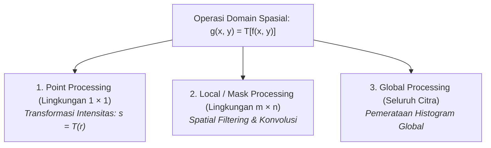
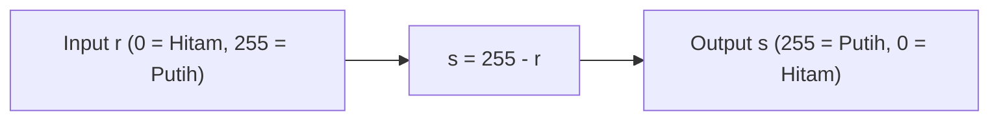
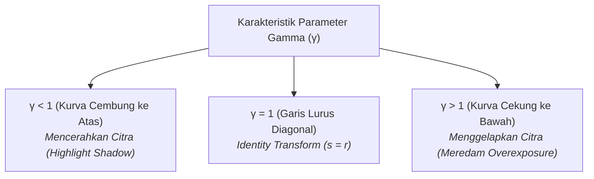
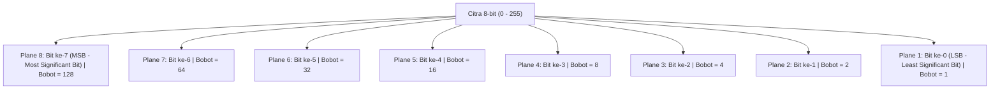

# 2. Domain Spasial dan Transformasi Intensitas

Navigasi: [[../Konsep_Computer_Vision|Hub Computer Vision]] | Modul Sebelumnya: [[01_Dasar_Pengolahan_Citra]] | Modul Berikutnya: [[03_Histogram_dan_Peningkatan_Citra]]

---

Pemrosesan citra pada **domain spasial** (*spatial domain*) merujuk pada manipulasi langsung terhadap piksel-piksel pada bidang citra itu sendiri (*image plane*). Teknik ini berbeda dengan pemrosesan domain frekuensi (seperti Transformasi Fourier) yang memproses citra setelah ditransformasikan ke representasi frekuensi.

Secara matematis, operasi domain spasial dirumuskan sebagai:

$$g(x, y) = T[f(x, y)]$$

di mana:
- $f(x, y)$ adalah citra masukan (*input image*).
- $g(x, y)$ adalah citra luaran (*output image*).
- $T$ adalah operator transformasi yang didefinisikan pada suatu lingkungan ketetanggaan (*neighborhood*) di sekitar titik $(x, y)$.



Jika ukuran lingkungan tetangga dipilih sekecil mungkin, yaitu **$1 \times 1$**, maka nilai piksel luaran $g(x, y)$ hanya bergantung murni pada nilai piksel masukan $f(x, y)$ pada koordinat itu sendiri. Operasi ini dinamakan **Transformasi Intensitas** (*Intensity / Gray-Level Transformation*) atau **Point Processing**:

$$s = T(r)$$

di mana:
- $r$ melambangkan intensitas piksel input $f(x, y)$.
- $s$ melambangkan intensitas piksel output $g(x, y)$.
- Nilai $r$ dan $s$ berada dalam rentang $[0, L - 1]$ (untuk citra 8-bit: $[0, 255]$).

---

## 2.1. Transformasi Citra Negatif (Image Negative)

Transformasi negatif membalikkan intensitas keabuan piksel, serupa dengan lembar klise negatif pada fotografi analog.

### Formula Matematis:
$$s = L - 1 - r$$

Untuk citra grayscale 8-bit ($L = 256$):
$$s = 255 - r$$



### Karakteristik & Aplikasi Praktis:
- Membalikkan warna: piksel gelap ($r \approx 0$) berubah menjadi terang ($s \approx 255$), sedangkan piksel terang berubah menjadi gelap.
- **Aplikasi Medis**: Sangat efektif untuk menganalisis detail struktur mikrokalsifikasi dan lesi putih kecil pada jaringan mamografi digital payudara (*digital mammogram*) yang dikelilingi oleh area jaringan dominan hitam pekat.

---

### ✍️ Pembahasan Latihan Soal Citra Negatif (Slide 12)
**Soal**: Diberikan matriks citra grayscale 8-bit berikut:
$$A = \begin{bmatrix}
55 & 165 & 110 \\
110 & 165 & 55 \\
220 & 55 & 220
\end{bmatrix}$$
Tentukan matriks hasil citra negatifnya!

**Penyelesaian**:
Gunakan formula $s = 255 - r$ untuk setiap elemen matriks:
- **Baris 1**:
  - $s(0, 0) = 255 - 55 = \mathbf{200}$
  - $s(0, 1) = 255 - 165 = \mathbf{90}$
  - $s(0, 2) = 255 - 110 = \mathbf{145}$
- **Baris 2**:
  - $s(1, 0) = 255 - 110 = \mathbf{145}$
  - $s(1, 1) = 255 - 165 = \mathbf{90}$
  - $s(1, 2) = 255 - 55 = \mathbf{200}$
- **Baris 3**:
  - $s(2, 0) = 255 - 220 = \mathbf{35}$
  - $s(2, 1) = 255 - 55 = \mathbf{200}$
  - $s(2, 2) = 255 - 220 = \mathbf{35}$

**Matriks Hasil Akhir**:
$$A_{\text{neg}} = \begin{bmatrix}
200 & 90 & 145 \\
145 & 90 & 200 \\
35 & 200 & 35
\end{bmatrix}$$

---

## 2.2. Transformasi Logaritma (Log Transformation)

Transformasi logaritma digunakan untuk memetakan rentang sempit nilai keabuan rendah (area gelap) menjadi rentang luaran yang jauh lebih luas.

### Formula Matematis:
$$s = c \cdot \log(1 + r)$$

di mana:
- $c$ adalah konstanta penskala (*scaling constant*), umumnya dipilih agar nilai maksimum $s$ mencapai $L - 1$:
  $$c = \frac{L - 1}{\log(1 + r_{\max})}$$
- Penjumlahan angka $1$ pada argumen $(1 + r)$ bertujuan mencegah terjadinya nilai $\log(0) = -\infty$ saat piksel input bernilai $0$.

### Transformasi Invers Logaritma (Eksponensial):
Kebalikan dari transformasi log, fungsi eksponensial mengompresi area gelap dan memperlebar area terang:
$$s = e^{r/c} - 1$$

### Karakteristik & Aplikasi: Kompresi Dynamic Range
- Karakteristik utama fungsi logaritma adalah **mengompresi rentang dinamis** (*dynamic range compression*) yang sangat masif.
- **Aplikasi Spektrum Fourier**: Spektrum frekuensi Fourier suatu citra memiliki variasi nilai intensitas ekstrem, misalnya dari $0$ hingga $1.5 \times 10^6$. Jika nilai ini langsung diskalakan secara linier pada monitor 8-bit $[0, 255]$, hanya segelintir piksel dengan nilai jutaan yang terlihat putih, sedangkan jutaan piksel lainnya tampak hitam pekat. Dengan mengaplikasikan $s = \log(1 + r)$, rentang dinamis $[0, 1.5 \times 10^6]$ dimampatkan menjadi rentang terukur $[0, 6.2]$, sehingga seluruh spektrum pola frekuensi dapat terlihat jelas oleh mata manusia.

---

## 2.3. Transformasi Power-Law (Gamma Correction)

Transformasi hukum perpangkatan (*Power-Law*) adalah fungsi non-linier paling populer dalam sistem akuisisi, display, dan grafika komputer modern.

### Formula Matematis:
$$s = c \cdot r^\gamma$$

di mana $c$ dan $\gamma$ (*gamma*) adalah konstanta riil positif. Jika dinormalisasi ke rentang $[0, 1]$:

$$s = c \cdot \left(\frac{r}{L - 1}\right)^\gamma \cdot (L - 1)$$



### Analisis Efek Parameter $\gamma$:
1. **Nilai $\gamma < 1$ (misal $\gamma = 0.4$ atau $0.67$)**:
   - Menghasilkan kurva yang melengkung ke atas (mirip transformasi log).
   - Memperlebar interval intensitas gelap dan merapatkan intensitas terang.
   - **Efek visual**: Citra yang terlalu gelap (*underexposed*) menjadi lebih terang, memunculkan detail tersembunyi pada bayangan.
2. **Nilai $\gamma > 1$ (misal $\gamma = 1.5$ atau $2.5$)**:
   - Menghasilkan kurva yang melengkung ke bawah.
   - Memperlebar interval intensitas terang dan merapatkan intensitas gelap.
   - **Efek visual**: Citra yang terlalu silau / memudar (*washed out / overexposed*) dikoreksi menjadi lebih pekat dan berbobot.
3. **Gamma Correction pada Perangkat (Hardware)**:
   - Layar tabung sinar katoda (CRT) zaman dahulu memiliki respons tegangan ke intensitas dengan karakteristik power-law alami $\gamma \approx 2.2$ (sehingga tampilan layar cenderung gelap).
   - Agar gambar terlihat natural, sinyal citra dari kamera harus diberi pra-koreksi gamma (*gamma pre-encoding*) sebesar $\gamma = 1 / 2.2 \approx 0.45$.

---

## 2.4. Fungsi Transformasi Linier Sepotong-sepotong (Piecewise Linear)

Fungsi linier sepotong-sepotong memungkinkan manipulasi kontras secara selektif pada pita intensitas tertentu.

### 1. Contrast Stretching (Peregangan Kontras)
Citra dengan pencahayaan buruk sering kali menghasilkan rentang keabuan yang sangat sempit, misalnya terpusat di antara $[r_1, r_2]$. Peregangan kontras memetakan rentang sempit tersebut agar memenuhi keseluruhan rentang $[0, L - 1]$.

$$s = \begin{cases}
\alpha \cdot r & 0 \le r < r_1 \\
\beta \cdot (r - r_1) + s_1 & r_1 \le r \le r_2 \\
\gamma \cdot (r - r_2) + s_2 & r_2 < r \le L - 1
\end{cases}$$

- Jika dipilih $(r_1, s_1) = (r_{\min}, 0)$ dan $(r_2, s_2) = (r_{\max}, L - 1)$, maka seluruh rentang dinamis citra akan terisi penuh.
- **Bentuk Khusus: Thresholding (Citra Biner)**:
  Jika kita menetapkan $r_1 = r_2 = m$ (ambang batas tertentu), maka fungsi menghasilkan citra biner hitam-putih:
  $$s = \begin{cases} 0 & r < m \\ L - 1 & r \ge m \end{cases}$$

### 2. Intensity-Level Slicing (Pemotongan Tingkat Intensitas)
Digunakan untuk menyoroti (*highlight*) pita keabuan tertentu $[A, B]$ yang diminati (misalnya mendeteksi massa tumor pada citra medis atau massa air pada citra satelit).

- **Skema 1 (Hanya Menampilkan Rentang Pilihan)**:
  Piksel dalam rentang $[A, B]$ disetel ke nilai maksimum ($L-1$), sedangkan semua piksel lain disetel ke nilai minimum ($0$). Menghasilkan citra biner fokus.
- **Skema 2 (Mempertahankan Latar Belakang)**:
  Piksel dalam rentang $[A, B]$ disetel ke nilai maksimum ($L-1$), namun piksel di luar rentang tetap mempertahankan nilai intensitas aslinya.

---

## 2.5. Bit-Plane Slicing (Pemotongan Bidang Bit)

Setiap piksel pada citra digital 8-bit bernilai antara $0$ hingga $255$ dan dapat direpresentasikan oleh 8 bit biner:

$$b_7 b_6 b_5 b_4 b_3 b_2 b_1 b_0$$

Citra 8-bit dapat dipandang sebagai tumpukan **8 bidang citra biner berukuran 1-bit (*1-bit planes*)**:



### Karakteristik Signifikansi Visual:
- **Bit-Plane 8 (MSB)** dan **Bit-Plane 7**: Menyimpan kontur utama, tepi objek, serta mayoritas informasi visual esensial citra.
- **Bit-Plane 1 (LSB)** dan **Bit-Plane 2**: Nyaris tidak memuat kontur objek visual, melainkan sebagian besar berisi derau acak (*random noise*).
- **Aplikasi Penting**:
  1. **Kompresi Citra (*Lossy Compression*)**: Citra dapat disimpan atau ditransmisikan hanya dengan menggunakan 4 bit plane teratas (plane 8, 7, 6, 5) tanpa kehilangan informasi visual yang signifikan, sehingga menghemat ukuran berkas sebesar 50%.
  2. **Watermarking & Steganografi**: Bit plane 1 (LSB) dapat diganti dengan bit data rahasia tanpa membuat mata manusia menyadari adanya perubahan visual pada gambar.

---

### ✍️ Pembahasan Latihan Rekonstruksi Citra Bit-Plane (Slide 31–32)
**Soal**: Diberikan matriks citra 8-bit berikut:
$$A = \begin{bmatrix}
167 & 133 & 111 \\
144 & 140 & 135 \\
159 & 154 & 148
\end{bmatrix}$$
Rekonstruksilah citra tersebut hanya menggunakan **Bit Plane 8** dan **Bit Plane 7**!

**Penyelesaian**:
Formula rekonstruksi untuk bit-plane ke-$n$ adalah:
$$\text{Nilai} = \sum_{n} b_{n-1} \cdot 2^{n-1}$$
Untuk Plane 8 ($2^{8-1} = 128$) dan Plane 7 ($2^{7-1} = 64$):
$$\text{Nilai Rekonstruksi} = (\text{Bit } 8 \times 128) + (\text{Bit } 7 \times 64)$$

Mari kita konversikan setiap piksel ke dalam biner 8-bit dan ambil Bit 8 dan Bit 7:

| Nilai Desimal | Biner 8-Bit ($b_7 b_6 b_5 b_4 b_3 b_2 b_1 b_0$) | Bit 8 ($b_7$) | Bit 7 ($b_6$) | Rekonstruksi: $(b_7 \times 128) + (b_6 \times 64)$ |
| :---: | :---: | :---: | :---: | :---: |
| **167** | $10100111_2$ | 1 | 0 | $(1 \times 128) + (0 \times 64) = \mathbf{128}$ |
| **133** | $10000101_2$ | 1 | 0 | $(1 \times 128) + (0 \times 64) = \mathbf{128}$ |
| **111** | $01101111_2$ | 0 | 1 | $(0 \times 128) + (1 \times 64) = \mathbf{64}$ |
| **144** | $10010000_2$ | 1 | 0 | $(1 \times 128) + (0 \times 64) = \mathbf{128}$ |
| **140** | $10001100_2$ | 1 | 0 | $(1 \times 128) + (0 \times 64) = \mathbf{128}$ |
| **135** | $10000111_2$ | 1 | 0 | $(1 \times 128) + (0 \times 64) = \mathbf{128}$ |
| **159** | $10011111_2$ | 1 | 0 | $(1 \times 128) + (0 \times 64) = \mathbf{128}$ |
| **154** | $10011010_2$ | 1 | 0 | $(1 \times 128) + (0 \times 64) = \mathbf{128}$ |
| **148** | $10010100_2$ | 1 | 0 | $(1 \times 128) + (0 \times 64) = \mathbf{128}$ |

**Hasil Matriks Citra Rekonstruksi**:
$$A_{\text{reconstructed}} = \begin{bmatrix}
128 & 128 & 64 \\
128 & 128 & 128 \\
128 & 128 & 128
\end{bmatrix}$$

---

## 2.6. Implementasi Python (OpenCV & Matplotlib)

Berikut skrip lengkap untuk mempraktikkan transformasi intensitas pada citra nyata:

```python
import cv2
import numpy as np

# Membaca citra dalam format grayscale (8-bit)
img = cv2.imread('input.jpg', cv2.IMREAD_GRAYSCALE)

# 1. Citra Negatif
img_negative = 255 - img

# 2. Transformasi Logaritma
# c = 255 / log(1 + max_pixel)
c_log = 255 / np.log(1 + np.max(img))
img_log = np.array(c_log * np.log(1 + img.astype(np.float32)), dtype=np.uint8)

# 3. Transformasi Power-Law (Gamma Correction)
def adjust_gamma(image, gamma=1.0):
    invGamma = 1.0 / gamma
    table = np.array([((i / 255.0) ** invGamma) * 255 for i in range(256)]).astype("uint8")
    return cv2.LUT(image, table)

img_gamma_bright = adjust_gamma(img, gamma=0.5)  # Mencerahkan
img_gamma_dark   = adjust_gamma(img, gamma=2.0)  # Menggelapkan

# 4. Bit-Plane Slicing (Ekstraksi Plane ke-8 dan ke-7)
plane_8 = ((img >> 7) & 1) * 128
plane_7 = ((img >> 6) & 1) * 64
img_reconstructed = plane_8 + plane_7
```

---

Navigasi: [[../Konsep_Computer_Vision|Hub Computer Vision]] | Modul Sebelumnya: [[01_Dasar_Pengolahan_Citra]] | Modul Berikutnya: [[03_Histogram_dan_Peningkatan_Citra]]
