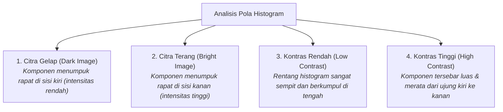
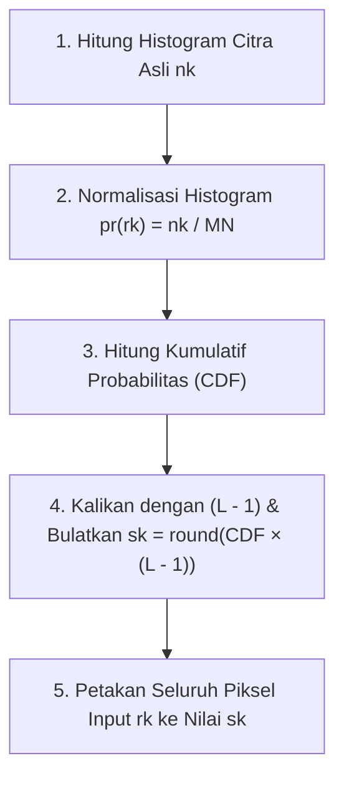
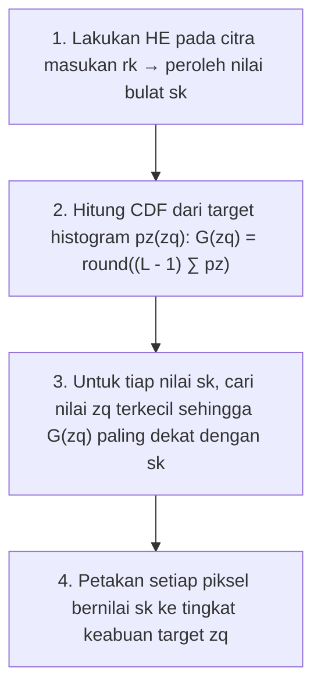

# 3. Analisis dan Peningkatan Citra Berbasis Histogram

Navigasi: [[../Konsep_Computer_Vision|Hub Computer Vision]] | Modul Sebelumnya: [[02_Transformasi_Intensitas]] | Modul Berikutnya: [[04_Pemfilteran_Spasial]]

---

Histogram citra adalah grafik statistik fundamental yang menunjukkan distribusi frekuensi kemunculan setiap tingkat intensitas keabuan (*gray level*) pada suatu citra. Analisis histogram memungkinkan kita mendiagnosis kondisi pencahayaan, kontras, serta menentukan strategi peningkatan mutu (*image enhancement*) yang paling tepat.

---

## 3.1. Definisi dan Karakteristik Histogram Citra

Misalkan sebuah citra digital memiliki tingkat keabuan dalam interval $[0, L - 1]$ (untuk citra 8-bit, rentangnya adalah $[0, 255]$). Histogram tak ternormalisasi didefinisikan sebagai fungsi diskrit:

$$h(r_k) = n_k$$

di mana:
- $r_k$ adalah intensitas tingkat keabuan ke-$k$.
- $n_k$ adalah jumlah total piksel di dalam citra yang memiliki intensitas sebesar $r_k$.



### Histogram Citra Berwarna (RGB 24-bit)
Pada citra berwarna RGB, histogram dihitung secara independen untuk masing-masing dari 3 kanal warna:
- **Kanal Merah (Red)**: Menunjukkan distribusi intensitas komponen $R \in [0, 255]$.
- **Kanal Hijau (Green)**: Menunjukkan distribusi intensitas komponen $G \in [0, 255]$.
- **Kanal Biru (Blue)**: Menunjukkan distribusi intensitas komponen $B \in [0, 255]$.

---

## 3.2. Normalisasi Histogram

Histogram yang dinormalisasi menyatakan estimasi probabilitas kemunculan intensitas keabuan $r_k$ pada citra:

$$p_r(r_k) = \frac{n_k}{M \cdot N}, \quad k = 0, 1, 2, \dots, L - 1$$

di mana:
- $M$ adalah jumlah baris citra.
- $N$ adalah jumlah kolom citra ($M \cdot N$ adalah total seluruh piksel citra).
- $p_r(r_k)$ memenuhi sifat probabilitas: $\sum_{k=0}^{L-1} p_r(r_k) = 1$ dan $0 \le p_r(r_k) \le 1$.

---

### ✍️ Contoh Perhitungan Normalisasi Histogram (Slide 10)
Diberikan citra 3-bit ($L = 2^3 = 8$, rentang $[0, 7]$) berukuran $4 \times 4$ ($MN = 16$ piksel):

$$\begin{bmatrix}
1 & 2 & 1 & 3 \\
0 & 5 & 4 & 4 \\
7 & 7 & 2 & 4 \\
6 & 5 & 6 & 5
\end{bmatrix}$$

**Langkah Perhitungan**:
Hitung jumlah kemunculan $n_k$ untuk tiap intensitas $r_k \in [0, 7]$, lalu bagi dengan $MN = 16$:

| Intensitas $r_k$ | Jumlah Piksel $n_k$ | Probabilitas Ternormalisasi $p_r(r_k) = n_k / 16$ |
| :---: | :---: | :---: |
| $r_0 = 0$ | 1 | $1 / 16 = \mathbf{0.0625}$ |
| $r_1 = 1$ | 2 | $2 / 16 = \mathbf{0.1250}$ |
| $r_2 = 2$ | 2 | $2 / 16 = \mathbf{0.1250}$ |
| $r_3 = 3$ | 1 | $1 / 16 = \mathbf{0.0625}$ |
| $r_4 = 4$ | 3 | $3 / 16 = \mathbf{0.1875}$ |
| $r_5 = 5$ | 3 | $3 / 16 = \mathbf{0.1875}$ |
| $r_6 = 6$ | 2 | $2 / 16 = \mathbf{0.1250}$ |
| $r_7 = 7$ | 2 | $2 / 16 = \mathbf{0.1250}$ |
| **Total** | **16** | **1.0000** |

---

## 3.3. Pemerataan Histogram (Histogram Equalization / HE)

**Histogram Equalization (HE)** adalah metode otomatis untuk meratakan persebaran intensitas piksel sehingga menghasilkan citra dengan distribusi intensitas yang seragam (*uniform distribution*) dan rentang kontras yang maksimal.

### Formulasi Matematis (Cumulative Distribution Function / CDF):
Pemetaan intensitas input $r_k$ menjadi intensitas baru $s_k$ dirumuskan sebagai:

$$s_k = T(r_k) = (L - 1) \sum_{j=0}^k p_r(r_j) = \frac{L - 1}{M \cdot N} \sum_{j=0}^k n_j$$

Nilai pecahan $s_k$ kemudian dibulatkan ke bilangan bulat terdekat (*nearest integer*):

$$s_k = \text{round}(s_k)$$



---

### ✍️ Studi Kasus Lengkap Perhitungan Histogram Equalization (Slide 15–17)
**Kasus**: Citra 3-bit ($L = 8$, rentang $[0, 7]$) berukuran $64 \times 64$ piksel ($M \cdot N = 4096$).

#### Tabel Distribusi Data Awal:
| $r_k$ | $n_k$ | $p_r(r_k) = n_k / 4096$ | Perhitungan $s_k = 7 \sum_{j=0}^k p_r(r_j)$ | Nilai Pecahan | $s_k$ (Bulat) |
| :---: | :---: | :---: | :--- | :---: | :---: |
| $r_0 = 0$ | 790 | 0.19 | $7 \times (0.19)$ | 1.33 | **1** |
| $r_1 = 1$ | 1023 | 0.25 | $7 \times (0.19 + 0.25) = 7 \times 0.44$ | 3.08 | **3** |
| $r_2 = 2$ | 850 | 0.21 | $7 \times (0.44 + 0.21) = 7 \times 0.65$ | 4.55 | **5** |
| $r_3 = 3$ | 656 | 0.16 | $7 \times (0.65 + 0.16) = 7 \times 0.81$ | 5.67 | **6** |
| $r_4 = 4$ | 329 | 0.08 | $7 \times (0.81 + 0.08) = 7 \times 0.89$ | 6.23 | **6** |
| $r_5 = 5$ | 245 | 0.06 | $7 \times (0.89 + 0.06) = 7 \times 0.95$ | 6.65 | **7** |
| $r_6 = 6$ | 122 | 0.03 | $7 \times (0.95 + 0.03) = 7 \times 0.98$ | 6.86 | **7** |
| $r_7 = 7$ | 81 | 0.02 | $7 \times (0.98 + 0.02) = 7 \times 1.00$ | 7.00 | **7** |

#### Distribusi Histogram Luaran Hasil Equalization:
Perhatikan bahwa beberapa nilai $r_k$ dipetakan ke nilai $s_k$ yang sama (merger):
- Nilai $s_k = 1$: berasal dari $r_0 \implies 790$ piksel.
- Nilai $s_k = 3$: berasal dari $r_1 \implies 1023$ piksel.
- Nilai $s_k = 5$: berasal dari $r_2 \implies 850$ piksel.
- Nilai $s_k = 6$: gabungan $r_3$ dan $r_4 \implies 656 + 329 = \mathbf{985}$ piksel.
- Nilai $s_k = 7$: gabungan $r_5, r_6,$ dan $r_7 \implies 245 + 122 + 81 = \mathbf{448}$ piksel.

| Tingkat Intensitas Baru $s_k$ | Jumlah Piksel $n_k$ | Probabilitas Baru $p_s(s_k) = n_k / 4096$ |
| :---: | :---: | :---: |
| **1** | 790 | $790 / 4096 \approx \mathbf{0.19}$ |
| **3** | 1023 | $1023 / 4096 \approx \mathbf{0.25}$ |
| **5** | 850 | $850 / 4096 \approx \mathbf{0.21}$ |
| **6** | 985 | $985 / 4096 \approx \mathbf{0.24}$ |
| **7** | 448 | $448 / 4096 \approx \mathbf{0.11}$ |

> [!WARNING]
> **Keterbatasan Histogram Equalization Global**:  
> Histogram equalization bekerja secara global pada seluruh citra. Bila suatu citra memiliki latar belakang gelap yang sangat luas (misalnya foto satelit kawah bulan Mars Phobos), HE global akan memaksakan piksel hitam menjadi abu-abu terang sehingga gambar tampak buram (*washed out*), kehilangan kesan alami, dan memperkuat derau latar belakang (*noise amplification*). Solusi untuk masalah ini adalah **Histogram Matching** atau **Local Histogram Equalization**.

---

## 3.4. Pencocokan Histogram (Histogram Matching / Specification)

**Histogram Matching (Specification)** adalah metode untuk mentransformasikan citra sehingga memiliki histogram luaran yang presisi mengikuti bentuk histogram yang dispesifikasikan (*target histogram* $p_z(z)$) oleh pengguna.

### Algoritma 4 Langkah Histogram Matching:



---

### ✍️ Studi Kasus Perhitungan Histogram Matching (Slide 23–30)
Gunakan data citra hasil HE sebelumnya (di mana $s_k$ yang muncul adalah $1, 3, 5, 6, 7$), dan cocokkan dengan bentuk histogram target $p_z(z_q)$ berikut:

#### Langkah 1 & 2: Hitung Nilai Kumulatif Target $G(z_q)$
| $z_q$ | Target $p_z(z_q)$ | Perhitungan $G(z_q) = 7 \sum_{i=0}^q p_z(z_i)$ | Nilai Pecahan | $G(z_q)$ (Bulat) |
| :---: | :---: | :--- | :---: | :---: |
| $z_0 = 0$ | 0.00 | $7 \times (0.00) = 0.00$ | 0.00 | **0** |
| $z_1 = 1$ | 0.00 | $7 \times (0.00 + 0.00) = 0.00$ | 0.00 | **0** |
| $z_2 = 2$ | 0.00 | $7 \times (0.00) = 0.00$ | 0.00 | **0** |
| $z_3 = 3$ | 0.15 | $7 \times (0.15) = 1.05$ | 1.05 | **1** |
| $z_4 = 4$ | 0.20 | $7 \times (0.15 + 0.20) = 7 \times 0.35 = 2.45$ | 2.45 | **2** |
| $z_5 = 5$ | 0.30 | $7 \times (0.35 + 0.30) = 7 \times 0.65 = 4.55$ | 4.55 | **5** |
| $z_6 = 6$ | 0.20 | $7 \times (0.65 + 0.20) = 7 \times 0.85 = 5.95$ | 5.95 | **6** |
| $z_7 = 7$ | 0.15 | $7 \times (0.85 + 0.15) = 7 \times 1.00 = 7.00$ | 7.00 | **7** |

#### Langkah 3: Pencocokan Nilai Terdekat $G(z_q) \approx s_k$
Aturan: Pilih nilai $z_q$ yang menghasilkan selisih terkecil $|G(z_q) - s_k|$. Jika ada lebih dari satu $z_q$ yang sama, pilih $z_q$ dengan indeks terkecil.

- **Untuk $s_k = 1$**:
  $G(z_3) = 1$ (selisih $0$) $\implies s_k = 1 \longrightarrow \mathbf{z_q = 3}$.
- **Untuk $s_k = 3$**:
  Nilai $3$ berada di antara $G(z_4) = 2$ dan $G(z_5) = 5$.
  - Selisih ke $G(z_4)$: $|3 - 2| = 1$.
  - Selisih ke $G(z_5)$: $|3 - 5| = 2$.
  Karena selisih ke $2$ lebih kecil, maka $s_k = 3 \longrightarrow \mathbf{z_q = 4}$.
- **Untuk $s_k = 5$**:
  $G(z_5) = 5$ (selisih $0$) $\implies s_k = 5 \longrightarrow \mathbf{z_q = 5}$.
- **Untuk $s_k = 6$**:
  $G(z_6) = 6$ (selisih $0$) $\implies s_k = 6 \longrightarrow \mathbf{z_q = 6}$.
- **Untuk $s_k = 7$**:
  $G(z_7) = 7$ (selisih $0$) $\implies s_k = 7 \longrightarrow \mathbf{z_q = 7}$.

#### Langkah 4: Pemetaan Akhir dan Hasil Distribusi Aktual
| Intensitas Equalized $s_k$ | Dipetakan ke Target $z_q$ | Jumlah Piksel $n_k$ | Distribusi Aktual $p_z(z_q)$ |
| :---: | :---: | :---: | :---: |
| 1 | **$z_3 = 3$** | 790 | $790 / 4096 \approx \mathbf{0.19}$ |
| 3 | **$z_4 = 4$** | 1023 | $1023 / 4096 \approx \mathbf{0.25}$ |
| 5 | **$z_5 = 5$** | 850 | $850 / 4096 \approx \mathbf{0.21}$ |
| 6 | **$z_6 = 6$** | 985 | $985 / 4096 \approx \mathbf{0.24}$ |
| 7 | **$z_7 = 7$** | 448 | $448 / 4096 \approx \mathbf{0.11}$ |

---

## 3.5. Peningkatan Kontras Lokal (Local Histogram Equalization)

Ketika citra memiliki detail-detail kecil berukuran lokal yang tenggelam oleh area dominan (misalnya bayangan gelap pada citra rontgen), equalization global tidak mampu memunculkan detail tersebut.

### Prinsip Kerja:
1. Tentukan sub-jendela spasial berukuran kecil, misalnya $3 \times 3$ atau $7 \times 7$ piksel.
2. Gerakkan pusat jendela dari piksel ke piksel (*moving / sliding window*).
3. Pada setiap posisi $(x, y)$, hitung histogram lokal di dalam jendela tersebut.
4. Terapkan fungsi transformasi CDF lokal untuk memetakan tingkat keabuan piksel pusat $(x, y)$.
5. Pindahkan jendela ke piksel berikutnya hingga seluruh citra selesai diproses.

> [!TIP]
> **CLAHE (Contrast Limited Adaptive Histogram Equalization)**:  
> Standar industri modern penyempurnaan histogram lokal adalah **CLAHE**. CLAHE membagi citra ke dalam blok-blok grid kecil (*tiles*, misal $8 \times 8$), menghitung equalization lokal, dan menerapkan batas pemotongan (*clip limit*) untuk mencegah amplifikasi noise yang berlebihan.

---

## 3.6. Implementasi Python (OpenCV & Matplotlib)

```python
import cv2
import matplotlib.pyplot as plt
import numpy as np

# Membaca citra grayscale
img = cv2.imread('input.jpg', cv2.IMREAD_GRAYSCALE)

# 1. Global Histogram Equalization
img_he = cv2.equalizeHist(img)

# 2. Contrast Limited Adaptive Histogram Equalization (CLAHE)
clahe = cv2.createCLAHE(clipLimit=2.0, tileGridSize=(8, 8))
img_clahe = clahe.apply(img)

# 3. Menghitung Histogram menggunakan OpenCV
hist_original = cv2.calcHist([img], [0], None, [256], [0, 256])
hist_he       = cv2.calcHist([img_he], [0], None, [256], [0, 256])
hist_clahe    = cv2.calcHist([img_clahe], [0], None, [256], [0, 256])

# 4. Visualisasi Komparasi
fig, axes = plt.subplots(2, 3, figsize=(15, 8))
axes[0, 0].imshow(img, cmap='gray');       axes[0, 0].set_title('Original Image')
axes[0, 1].imshow(img_he, cmap='gray');    axes[0, 1].set_title('Global Equalization')
axes[0, 2].imshow(img_clahe, cmap='gray'); axes[0, 2].set_title('CLAHE (Local)')

axes[1, 0].plot(hist_original, color='black'); axes[1, 0].set_title('Original Histogram')
axes[1, 1].plot(hist_he, color='blue');        axes[1, 1].set_title('Equalized Histogram')
axes[1, 2].plot(hist_clahe, color='green');    axes[1, 2].set_title('CLAHE Histogram')
plt.tight_layout()
plt.show()
```

---

Navigasi: [[../Konsep_Computer_Vision|Hub Computer Vision]] | Modul Sebelumnya: [[02_Transformasi_Intensitas]] | Modul Berikutnya: [[04_Pemfilteran_Spasial]]
