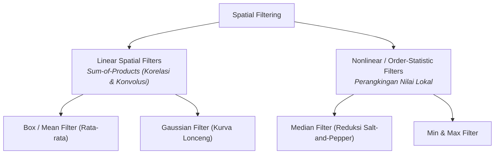
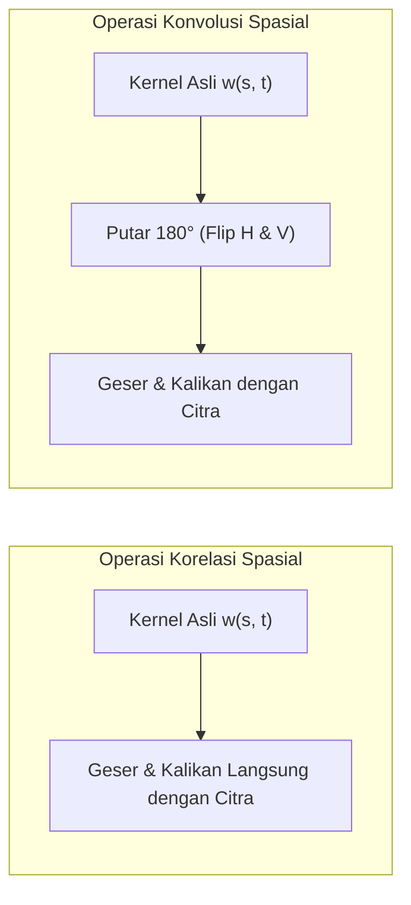
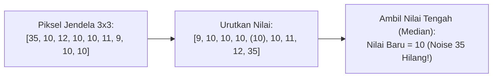

# 4. Pemfilteran Spasial, Korelasi, dan Konvolusi Citra

Navigasi: [[../Konsep_Computer_Vision|Hub Computer Vision]] | Modul Sebelumnya: [[03_Histogram_dan_Peningkatan_Citra]]

---

Pemfilteran spasial (*spatial filtering*) adalah operasi pemrosesan citra pada domain spasial yang memodifikasi nilai setiap piksel berdasarkan fungsi dari nilai piksel itu sendiri dan piksel-piksel tetangganya (*neighborhood*). Istilah *"filter"* dipinjam dari teknik domain frekuensi, di mana penapis melewatkan komponen frekuensi tertentu (*pass*) dan meredam frekuensi lainnya (*reject*).

Operasi pemfilteran spasial dikelompokkan menjadi dua kategori utama:
1. **Linear Spatial Filter**: Respons luaran merupakan kombinasi linier (*sum-of-products*) antara piksel citra dan koefisien filter (misalnya *Box Filter* dan *Gaussian Filter*).
2. **Nonlinear / Order-Statistic Filter**: Respons luaran didasarkan pada operasi non-linier seperti pengurutan (*ranking*) nilai piksel lokal (misalnya *Median Filter*, *Min Filter*, dan *Max Filter*).



---

## 4.1. Mekanisme Pemfilteran Spasial Linier

Filter spasial linier menggunakan sebuah jendela berukuran kecil yang disebut **kernel**, **mask**, atau **koefisien filter** berukuran ganjil:

$$m \times n$$

di mana $m = 2a + 1$ dan $n = 2b + 1$ ($a, b$ adalah bilangan bulat non-negatif). Ukuran ganjil (seperti $3 \times 3, 5 \times 5, 7 \times 7$) memastikan adanya koefisien pusat yang tepat berada di atas piksel target $(x, y)$.

### Persamaan Umum Respons Filter:
$$g(x, y) = \sum_{s=-a}^a \sum_{t=-b}^b w(s, t) \cdot f(x + s, y + t)$$

di mana $w(s, t)$ adalah koefisien bobot kernel pada pergeseran spasial $(s, t)$, dan $f(x + s, y + t)$ adalah nilai piksel citra masukan di sekitar $(x, y)$.

---

## 4.2. Korelasi Spasial vs Konvolusi Spasial

Perbedaan matematis antara operasi **Korelasi (*Correlation*)** dan **Konvolusi (*Convolution*)** terletak pada orientasi kernel sebelum dikalikan dengan citra:

| Karakteristik | Korelasi Spasial ($w \star f$) | Konvolusi Spasial ($w * f$) |
| :--- | :--- | :--- |
| **Notasi Matematis** | $(w \star f)(x, y) = \sum_{s=-a}^a \sum_{t=-b}^b w(s, t) f(x + s, y + t)$ | $(w * f)(x, y) = \sum_{s=-a}^a \sum_{t=-b}^b w(s, t) f(x - s, y - t)$ |
| **Perlakuan Kernel** | Kernel digeser langsung di atas citra tanpa diubah. | Kernel **diputar sebesar $180^\circ$** (*flipped*) sebelum digeser di atas citra. |
| **Sifat Simetris** | Jika kernel simetris horizontal dan vertikal ($w(s, t) = w(-s, -t)$), maka Korelasi $\equiv$ Konvolusi. |
| **Konvensi Deep Learning** | Framework AI modern (PyTorch, TensorFlow) menyebut lapisan mereka *"Convolutional Layer"*, namun secara komputasi mengimplementasikan **Korelasi Spasial** karena bobot kernel dipelajari (*learned parameters*) secara otomatis. |



---

## 4.3. Isu Batas Citra & Teknik Zero-Padding

Ketika kernel bergeser ke tepi citra, sebagian koefisien kernel akan jatuh di luar batas bidang citra.
Solusi standar industri adalah **Zero-Padding**, yaitu membungkus sekeliling tepi citra dengan lapisan piksel bernilai nol ($0$).

### Dimensi Hasil Korelasi Penuh (*Full Correlation*):
Jika citra berukuran $M \times N$ dan kernel berukuran $m \times n$, padding elemen adalah $(m - 1)$ baris pada atas-bawah dan $(n - 1)$ kolom pada kiri-kanan. Dimensi larik luaran penuh adalah:

$$S_v = M + m - 1, \quad S_h = N + n - 1$$

---

### ✍️ Pembahasan Perhitungan Korelasi Kernel 3x3 (Slide 9–10)
**Kasus**: Diberikan kernel penajaman $3 \times 3$ ($a = 1, b = 1$):
$$w = \begin{bmatrix}
0 & -1 & 0 \\
-1 & 5 & -1 \\
0 & -1 & 0
\end{bmatrix}$$
dan area piksel citra pada koordinat tepi dengan zero-padding:
$$f_{\text{neighborhood}} = \begin{bmatrix}
0 & 0 & 0 \\
0 & 60 & 113 \\
0 & 73 & 121
\end{bmatrix}$$

**Langkah Perhitungan Perkalian & Penjumlahan (*Sum of Products*)**:
$$(w \star f)(x, y) = \sum_{s=-1}^1 \sum_{t=-1}^1 w(s, t) \cdot f(x + s, y + t)$$

$$\begin{aligned}
(w \star f) &= (0)(0) + (-1)(0) + (0)(0) \\
&\quad + (-1)(0) + (5)(60) + (-1)(113) \\
&\quad + (0)(0) + (-1)(73) + (0)(121) \\
&= 0 + 0 + 0 + 0 + 300 - 113 + 0 - 73 + 0 \\
&= 300 - (113 + 73) = 300 - 186 = \mathbf{114}
\end{aligned}$$

Hasil perhitungan membuktikan secara presisi nilai respons filter bernilai **$114$** seperti yang tertera pada slide perkuliahan.

---

## 4.4. Kernel Terpisahkan (Separable Filter Kernels)

Sebuah fungsi 2-D $G(x, y)$ disebut **terpisahkan (*separable*)** jika dapat difaktorkan menjadi hasil kali dua fungsi 1-D:

$$G(x, y) = G_1(x) \cdot G_2(y)$$

Pada representasi matriks, kernel filter $w$ berukuran $m \times n$ dikatakan *separable* jika merupakan hasil perkalian luar (*outer product*) dua vektor kolom 1-D:

$$w = \mathbf{v} \cdot \mathbf{w}^T$$

di mana $\mathbf{v}$ berukuran $m \times 1$ dan $\mathbf{w}$ berukuran $n \times 1$.

### Efisiensi Komputasi Spektakuler:
Berdasarkan sifat asosiatif konvolusi:
$$f * w = f * (\mathbf{v} * \mathbf{w}^T) = (f * \mathbf{v}) * \mathbf{w}^T$$

- **Kompleksitas Kernel 2D Biasa**: Membutuhkan $m \times n$ operasi perkalian dan penjumlahan per piksel $\implies \mathcal{O}(m \cdot n)$.
- **Kompleksitas Kernel Separable**: Memfilter kolom dengan vektor $m \times 1$, lalu memfilter baris dengan vektor $1 \times n \implies \mathcal{O}(m + n)$.

> [!TIP]
> **Contoh Penghematan Komputasi**:  
> Untuk kernel Gaussian berukuran $21 \times 21$:
> - Metode langsung: $21 \times 21 = \mathbf{441}$ operasi per piksel.
> - Metode separable: $21 + 21 = \mathbf{42}$ operasi per piksel.
> - **Penghematan komputasi mencapai lebih dari 90%!** Sangat krusial untuk implementasi Edge AI pada perangkat berdaya komputasi rendah.

---

## 4.5. Filter Pelembutan Linier (Smoothing / Lowpass Filters)

Filter pelembutan (*smoothing*) digunakan untuk menekan transisi tajam intensitas, mereduksi derau acak, dan menyamarkan detail kasar yang tidak relevan.

### 1. Box Filter (Averaging Filter)
Box filter adalah filter rata-rata sederhana di mana setiap elemen kernel bernilai sama (yaitu $1$), dinormalisasi dengan konstanta di depannya:

$$w_{\text{box}} = \frac{1}{m \cdot n} \begin{bmatrix}
1 & 1 & \cdots & 1 \\
1 & 1 & \cdots & 1 \\
\vdots & \vdots & \ddots & \vdots \\
1 & 1 & \cdots & 1
\end{bmatrix}$$

Untuk kernel $3 \times 3$:
$$w = \frac{1}{9} \begin{bmatrix}
1 & 1 & 1 \\
1 & 1 & 1 \\
1 & 1 & 1
\end{bmatrix}$$

- **Kelemahan Box Filter**: Menghasilkan efek pengaburan yang cenderung kaku dan memiliki bias arah pada garis-garis tegak lurus horizontal dan vertikal (*perpendicular directionality bias*).

---

### ✍️ Pembahasan Latihan Box Filter 3x3 (Slide 20)
**Soal**: Diberikan matriks citra 8-bit $7 \times 7$:
$$\begin{bmatrix}
0 & 0 & 0 & 0 & 9 & 18 & 27 \\
0 & 18 & 9 & 180 & 27 & 9 & 108 \\
9 & 18 & 27 & 180 & 27 & 9 & 180 \\
27 & 252 & 27 & 9 & 180 & 90 & 54 \\
0 & 0 & 0 & 0 & 216 & 0 & 81 \\
0 & 252 & 108 & 0 & 0 & 0 & 81 \\
27 & 180 & 54 & 81 & 108 & 0 & 0
\end{bmatrix}$$
Hitung nilai piksel pada baris 4 kolom 4 (nilai $9$) jika dilakukan penyaringan dengan Box Filter $3 \times 3$!

**Penyelesaian**:
Ambil jendela tetangga $3 \times 3$ yang berpusat pada piksel target (baris 3 s.d. 5, kolom 3 s.d. 5):
$$Sub = \begin{bmatrix}
27 & 180 & 27 \\
27 & \mathbf{9} & 180 \\
0 & 0 & 216
\end{bmatrix}$$

Jumlahkan ke-9 nilai piksel:
$$\text{Total} = 27 + 180 + 27 + 27 + 9 + 180 + 0 + 0 + 216 = 666$$

Bagi dengan $9$:
$$\text{Nilai Baru} = \frac{666}{9} = \mathbf{74}$$

---

### 2. Gaussian Lowpass Filter
Gaussian filter memodelkan fungsi distribusi probabilitas kurva lonceng Gauss 2-D:

$$G(s, t) = K \cdot e^{-\frac{s^2 + t^2}{2\sigma^2}} = K \cdot e^{-\frac{r^2}{2\sigma^2}}$$

di mana:
- $r = \sqrt{s^2 + t^2}$ adalah jarak Euclidean dari titik pusat kernel.
- $\sigma$ (*standar deviasi*) mengontrol tingkat sebaran pelebaran kurva (derajat kelembutan).
- $K$ adalah konstanta normalisasi agar jumlah total bobot kernel sama dengan $1$.

#### Karakteristik Unggul Gaussian Filter:
1. Bersifat simetris sirkular (*isotropic*), tidak membiaskan pengaburan pada arah tegak lurus seperti box filter.
2. Bersifat *separable*, sangat efisien dihitung sebagai dua konvolusi 1-D berturut-turut.
3. Memberikan bobot tertinggi pada piksel pusat dan menurun secara halus menuju tepi jendela.

---

## 4.6. Filter Statistik Urutan (Order-Statistic / Non-linear Filters)

Filter statistik urutan adalah filter spasial non-linier yang responsnya didasarkan pada pengurutan (*ranking*) nilai-nilai piksel di dalam jendela lokal.

### 1. Median Filter (Penapis Median)
Menggantikan nilai piksel tengah dengan nilai median dari tetangga terurut.

$$\hat{f}(x, y) = \text{median}\{f(s, t)\}, \quad (s, t) \in S_{xy}$$



> [!IMPORTANT]
> **Keunggulan Superior Median Filter**:  
> Sangat efektif membersihkan derau impuls (**Salt-and-Pepper Noise**, yaitu titik putih/hitam acak akibat transmisi sinyal yang rusak) tanpa mengorbankan ketajaman tepi objek (*edge preservation*) secara berlebihan, berbeda dengan filter rata-rata (box filter) yang akan menyebarkan noise tersebut menjadi noda kabur.

### 2. Min Filter & Max Filter
- **Min Filter**: Mengganti piksel tengah dengan nilai terkecil di dalam lingkungan tetangga. Berfungsi menemukan titik gelap atau mengikis area terang (*erosi*).
  $$\hat{f}(x, y) = \min_{(s, t) \in S_{xy}} \{f(s, t)\}$$
- **Max Filter**: Mengganti piksel tengah dengan nilai terbesar. Berfungsi menemukan titik terang atau memperluas area terang (*dilatasi*).
  $$\hat{f}(x, y) = \max_{(s, t) \in S_{xy}} \{f(s, t)\}$$

---

### ✍️ Pembahasan Latihan Filter Statistik Urutan (Slide 30)
**Soal**: Diberikan matriks citra 3-bit ukuran $7 \times 7$:
$$\begin{bmatrix}
4 & 1 & 3 & 4 & 6 & 2 & 2 \\
0 & 1 & 2 & 7 & 1 & 4 & 4 \\
5 & 5 & 6 & 6 & 1 & 5 & 5 \\
2 & 1 & 5 & \mathbf{1} & 5 & 0 & 1 \\
3 & 2 & 1 & 2 & 4 & 0 & 3 \\
0 & 2 & 3 & 7 & 4 & 2 & 2 \\
3 & 2 & 5 & 6 & 2 & 3 & 1
\end{bmatrix}$$
Hitunglah nilai baru dari piksel pusat pada baris 4 kolom 4 (nilai $\mathbf{1}$) jika dilakukan:
1. $3 \times 3$ Median Filter
2. $5 \times 5$ Min Filter
3. $3 \times 3$ Max Filter

**Penyelesaian**:

1. **$3 \times 3$ Median Filter**:
   Ambil sub-matriks $3 \times 3$ di sekitar baris 4 kolom 4:
   $$\begin{bmatrix} 6 & 6 & 1 \\ 5 & \mathbf{1} & 5 \\ 1 & 2 & 4 \end{bmatrix}$$
   Kumpulkan nilainya: $\{6, 6, 1, 5, 1, 5, 1, 2, 4\}$.
   Urutkan dari terkecil ke terbesar:
   $$1, 1, 1, 2, \mathbf{4}, 5, 5, 6, 6$$
   Elemen tengah (indeks ke-5 dari 9 nilai) adalah **$4$**.
   $$\text{Respons Filter Median} = \mathbf{4}$$

2. **$5 \times 5$ Min Filter**:
   Ambil sub-matriks $5 \times 5$ di sekitar baris 4 kolom 4 (baris 2 s.d. 6, kolom 2 s.d. 6):
   $$\begin{bmatrix}
   1 & 2 & 7 & 1 & 4 \\
   5 & 6 & 6 & 1 & 5 \\
   1 & 5 & \mathbf{1} & 5 & 0 \\
   2 & 1 & 2 & 4 & 0 \\
   2 & 3 & 7 & 4 & 2
   \end{bmatrix}$$
   Cari nilai terkecil (*minimum*) dari ke-25 piksel:
   $$\min(\text{elemen di atas}) = \mathbf{0}$$
   $$\text{Respons Min Filter} = \mathbf{0}$$

3. **$3 \times 3$ Max Filter**:
   Gunakan sub-matriks $3 \times 3$ yang sama: $\{6, 6, 1, 5, 1, 5, 1, 2, 4\}$.
   Cari nilai terbesar (*maksimum*):
   $$\max(\{6, 6, 1, 5, 1, 5, 1, 2, 4\}) = \mathbf{6}$$
   $$\text{Respons Max Filter} = \mathbf{6}$$

---

## 4.7. Implementasi Python (OpenCV)

```python
import cv2
import numpy as np

# Membaca citra grayscale
img = cv2.imread('input.jpg', cv2.IMREAD_GRAYSCALE)

# 1. Box / Averaging Filter (3x3)
img_box = cv2.blur(img, ksize=(3, 3))

# 2. Gaussian Filter (Ukuran kernel 5x5, sigma=1.0)
img_gaussian = cv2.GaussianBlur(img, ksize=(5, 5), sigmaX=1.0)

# 3. Median Filter (Sangat ampuh mereduksi Salt-and-Pepper Noise)
img_median = cv2.medianBlur(img, ksize=3)

# 4. Operasi Konvolusi Manual Menggunakan Kernel Bebas (Penajaman Tepi)
sharpen_kernel = np.array([
    [ 0, -1,  0],
    [-1,  5, -1],
    [ 0, -1,  0]
], dtype=np.float32)

# cv2.filter2D menerapkan korelasi spasial linier dengan penanganan zero-padding
img_sharpened = cv2.filter2D(src=img, ddepth=-1, kernel=sharpen_kernel)
```

---

Navigasi: [[../Konsep_Computer_Vision|Hub Computer Vision]] | Modul Sebelumnya: [[03_Histogram_dan_Peningkatan_Citra]]
