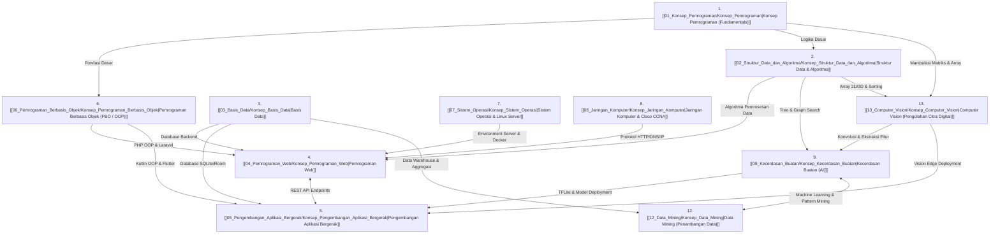

# 📚 Overview & Hub Utama Materi Kuliah

Halaman ini memetakan seluruh mata kuliah yang telah dirangkum ke dalam format catatan Markdown `.md` yang mudah dipelajari, saling terhubung (*interconnected*), dan terstruktur rapi.

Navigasi Utama: [[../INDEX_UTAMA_CATATAN_OBSIDIA|Master Index Catatan Obsidian]]

---

## 🗺️ Peta Keterkaitan Lintas Mata Kuliah

---

## 🗂️ Direktori Mata Kuliah

| No | Mata Kuliah | Folder Root | Berkas Hub | Jumlah Modul |
| :--- | :--- | :--- | :--- | :--- |
| 1 | **Konsep Pemrograman** | [`01_Konsep_Pemrograman/`](file:///c:/Users/user/Documents/Catatan%20Obsidia/Materi_Kuliah/01_Konsep_Pemrograman) | [[01_Konsep_Pemrograman/Konsep_Pemrograman]] | 1 Modul |
| 2 | **Struktur Data & Algoritma** | [`02_Struktur_Data_dan_Algoritma/`](file:///c:/Users/user/Documents/Catatan%20Obsidia/Materi_Kuliah/02_Struktur_Data_dan_Algoritma) | [[02_Struktur_Data_dan_Algoritma/Konsep_Struktur_Data_dan_Algoritma]] | 10 Praktikum |
| 3 | **Basis Data** | [`03_Basis_Data/`](file:///c:/Users/user/Documents/Catatan%20Obsidia/Materi_Kuliah/03_Basis_Data) | [[03_Basis_Data/Konsep_Basis_Data]] | 11 Modul |
| 4 | **Pemrograman Web** | [`04_Pemrograman_Web/`](file:///c:/Users/user/Documents/Catatan%20Obsidia/Materi_Kuliah/04_Pemrograman_Web) | [[04_Pemrograman_Web/Konsep_Pemrograman_Web]] | 11 Modul |
| 5 | **Pengembangan Aplikasi Bergerak** | [`05_Pengembangan_Aplikasi_Bergerak/`](file:///c:/Users/user/Documents/Catatan%20Obsidia/Materi_Kuliah/05_Pengembangan_Aplikasi_Bergerak) | [[05_Pengembangan_Aplikasi_Bergerak/Konsep_Pengembangan_Aplikasi_Bergerak]] | 10 Modul |
| 6 | **Pemrograman Berbasis Objek** | [`06_Pemrograman_Berbasis_Objek/`](file:///c:/Users/user/Documents/Catatan%20Obsidia/Materi_Kuliah/06_Pemrograman_Berbasis_Objek) | [[06_Pemrograman_Berbasis_Objek/Konsep_Pemrograman_Berbasis_Objek]] | 1 Modul |
| 7 | **Sistem Operasi** | [`07_Sistem_Operasi/`](file:///c:/Users/user/Documents/Catatan%20Obsidia/Materi_Kuliah/07_Sistem_Operasi) | [[07_Sistem_Operasi/Konsep_Sistem_Operasi]] | 10 Modul |
| 8 | **Jaringan Komputer** | [`08_Jaringan_Komputer/`](file:///c:/Users/user/Documents/Catatan%20Obsidia/Materi_Kuliah/08_Jaringan_Komputer) | [[08_Jaringan_Komputer/Konsep_Jaringan_Komputer]] | 10 Modul |
| 9 | **Kecerdasan Buatan** | [`09_Kecerdasan_Buatan/`](file:///c:/Users/user/Documents/Catatan%20Obsidia/Materi_Kuliah/09_Kecerdasan_Buatan) | [[09_Kecerdasan_Buatan/Konsep_Kecerdasan_Buatan]] | 8 Modul |
| 11 | **Manajemen Jaringan** | [`11_Manajemen_Jaringan/`](file:///c:/Users/user/Documents/Catatan%20Obsidia/Materi_Kuliah/11_Manajemen_Jaringan) | [[11_Manajemen_Jaringan/Konsep_Manajemen_Jaringan]] | 2 Modul |
| 12 | **Data Mining** | [`12_Data_Mining/`](file:///c:/Users/user/Documents/Catatan%20Obsidia/Materi_Kuliah/12_Data_Mining) | [[12_Data_Mining/Konsep_Data_Mining]] | 3 Modul (Aktif) |
| 13 | **Computer Vision** | [`13_Computer_Vision/`](file:///c:/Users/user/Documents/Catatan%20Obsidia/Materi_Kuliah/13_Computer_Vision) | [[13_Computer_Vision/Konsep_Computer_Vision]] | 4 Modul (Aktif) |

---
*Gunakan wiki-links `[[...]]` untuk bernavigasi ke modul yang ingin dipelajari.*
